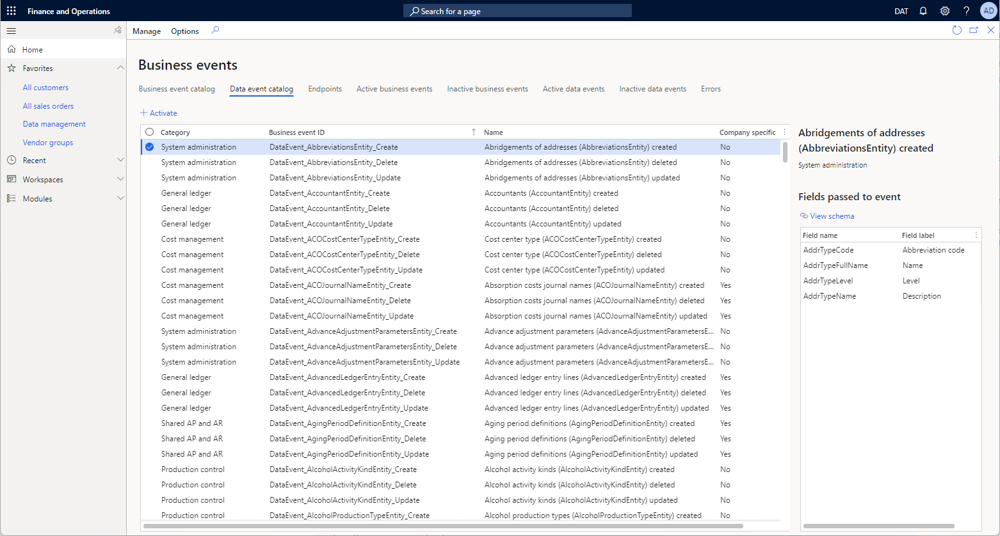

---
# required metadata

title: Data events
description: This topic provides steps for enabling Finance and Operations virtual entities in Dataverse.
author: jaredha
ms.date: 10/15/2021
ms.topic: article
ms.prod:
ms.technology: 

# optional metadata

# ms.search.form:
audience: Developer, IT Pro
# ms.devlang: 
ms.reviewer: sericks
# ms.tgt_pltfrm: 
# ms.custom: NotInToc
ms.search.region: Global
# ms.search.industry:
ms.author: jaredha
ms.search.validFrom: 2021-10-15
ms.dyn365.ops.version: 10.0.22
---

# Data events

Data events are events based on changes to data in Finance and Operations. Create, update, and delete (CUD) events can be enabled for each entity. For example, if the Create event is enabled on the "Purchase order headers V2" entity, an event notification is emitted each time a new purchase order is created in the database.

All OData-enabled entities in Finance and Operations, both standard and custom, are able to emit data events. In the data events catalog, each of the events for an entity is listed as a data event to which subscriptions can be established. The concept of activa6ting the data event and associating a data event to an endpoint is like the concepts with business events. When a data event happens, the payload of teh event will contain the corresponding entity record.

> [!NOTE]
> Data events are only available for Finance and Operations environments for which the Power Platform integration has been enabled. See [Enabling the Power Platform integration](enable-power-platform-integration.md) for more information.

## Data events catalog

The data events catalog is accessed from the **Business events** page in Finance and Operations (System administration > Setup > Business events). The data events catalog lists the data events that are available in the Finance and Operations environment. The catalog displays the full list of available data events. For each data event, the catalog shows the category, event ID, name, and whether the event is company-specific. The catalot allows you to filter the list by category and data event ID.

[!include[banner](../includes/banner.md)]

[!include [rename-banner](~/includes/cc-data-platform-banner.md)]
