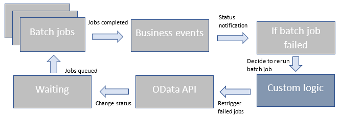

---
# required metadata

title: Batch OData API
description: This topic provides information about Batch OData API and explains how you can use OData to reschedule a job.
author: matapg007
ms.date: 10/18/2021
ms.topic: article
audience: Developer, IT Pro
ms.reviewer: sericks
ms.search.region: Global
ms.author: matgupta
ms.search.validFrom: 2021-10-21
---

# Batch OData API

[!include[banner](../includes/banner.md)]

This topic provides information about Batch OData API and explains how you can use OData to reschedule a job.

## Overview

In the existing Finance and Operations [batch processing](batch-processing-overview.md) functionality, if there are certain types of job errors that can be retried (with or without any changes, based on the interpretation of the error), they must be manually rerun from the batch. For jobs which are scheduled to be run during off-peak times (to avoid active business hours for customers), monitoring failures and re-triggering the jobs either requires 24x7 support or a wait time until users resume work during normal business hours.

## Current available automation (business events integration)
Business events capabilities allow customers to configure notification on state changes for batch jobs (started, failed, finished, cancelled). Integrating this with [Power Autotomate](../business-events/business-events-flow.md) allows the customer to capture information about concerned jobs without logging into the system. However, it requires manual intervention if any action is to be taken based on these business events.

To learn how to configure batch events, see [Batch business events](../business-events/system-business-events.md)

## End-to-end automation
With the release of version 10.0.22, the batch functionality now exposes an OData API that can be used to requeue the batch job. Customers can use the OData endpoint to requeue the jobs which are in a terminal state. This can be integrated with any automation using Power Automate, custom APIs, etc.

## Automate requeuing of failed batch jobs using Odata API
The Batch OData endpoint enables end users to consume and automate end-to-end process to reschedule a batch job using Power Automate or custom API. It supports updating batch job status from started, failed, finished, or cancelled to a waiting state based on business requirements.

Service endpoint: 
`https://<org url>/data/BatchJobs/Microsoft.Dynamics.DataEntities.SetBatchJobToWaiting`

  Method type: POST
  Header: 
  Authorization: Bearer <Bearer token for authentication>
  Content-Type: application/json

  Body:
    {
    "batchJobId":<BatchJobId>
    }
  Sample response:
  {
  "ResponseStatusCode":200,
  "IsSuccess":true,
  "Batch JobId":<BatchJobId>,
  "ExceptionDetails":"",
  "reponseMessage":"Status of supplied BatchJobId: *********** is Successfully updated to waiting state"
  }
  
  Output Description: 
  ResponseStatusCode: Standard HTTP response codes depending on the execution of the action.
  IsSuccess: Boolean value indicating overall success or failure
  BatchJobId: Input batch job id 
  ExceptionDetails: Any exception during execution
  ReponseMessage: Success Message
