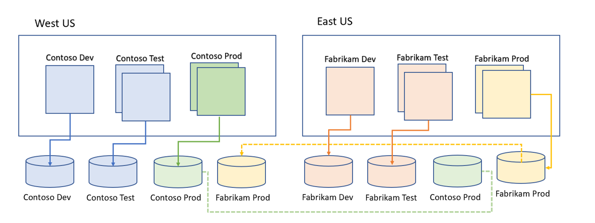
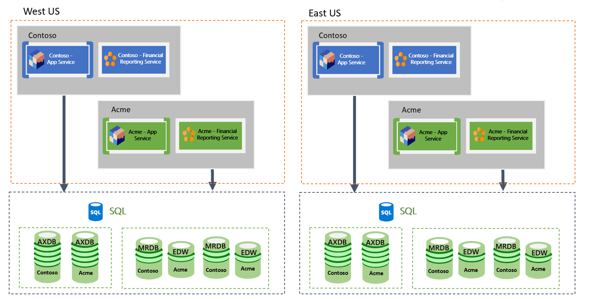

---
# required metadata

title: Business continutiy and disaster recovery
description: Microsoft provides business continuity and disaster recovery for production instances of Dynamics 365 SaaS applications, in the event of an Azure region wide outage. 
author: MicroSri
ms.date: 07/13/2021
ms.topic: article
audience: IT Pro
ms.reviewer: sericks
ms.search.region: Global
ms.author: sriknair
ms.search.validFrom: 2021-07-31
---

# Business continutiy and disaster recovery

[!include[banner](../includes/banner.md)]

Microsoft provides business continuity and disaster recovery for production instances of Dynamics 365 software-as-a-service (SaaS) applications, in the event of an Azure region wide outage. 

## Dataverse and customer engagement apps 
Customer engagement apps like  Dynamics 365 Sales, Customer Service, Field Service, Marketing and  Project Service Automation run on the Dataverse platform. Tenant admins can deploy a production instance of a Dynamics 365 customer engagement app and/or Dataverse with the purchase of appropriate licenses. For more information, see [Create and manage environments in the Power Platform admin center](/power-platform/admin/create-environment).

For production environments, a replica of the different storage services (Azure SQL and file storage) is established in the secondary region for each environment at the time of deployment. For more information, see [Environments](/power-platform/admin/environments-overview). These replicas are referred to as geo-secondary replicas. The geo-secondary replicas are kept synchronized with the primary instance through continuous data replication. There is a small replication latency or lag, typically less than a few minutes, between the primary data sources and their corresponding geo-secondary replicas. For more information, see [Ensure business continuity amd disaster recovery (BCDR): Azure Paired Regions](/azure/best-practices-availability-paired-regions).

As seen in the preceding diagram, similar to data storage services, compute infrastructure is also provisioned in both regions in such a way that it can handle the traffic volume in case of an environment or region-level failover. See the following sections on the different types of failovers that are possible and how Microsoft manages service continuity in either of these situations.

To learn more about data protection in non-production environments, see [Back up and restore environments](/power-platform/admin/backup-restore-environments).

### Unplanned failover
Dataverse is built for high availability and reliability, which ensures that in the event of underlying Azure platform issues, the platform automatically leverages resources in other zones within the same regions to ensure availability isn’t impacted. For more information about Azure availability zones, see [Regions and Availability Zones in Azure](/azure/availability-zones/az-overview).

In the event of an unanticipated region wide outage, such as a natural disaster which affects the entire Azure region, and Microsoft determines that the region will not become available within a reasonable amount of time, Microsoft will notify customers and switch over the traffic to route to the secondary instances. In this case, it possible that customers may experience a data loss of up to 15 minutes, depending on the nature and timing of the outage. 

### Planned failover
In the event that Microsoft determines there is a risk to the availability of the primary Azure region, for example if there is an impending hurricane, Microsoft will notify customers and switch over the traffic to route to the secondary replica instances. Users connected to customer engagement and Dataverse apps at the time of the failover will experience a brief disruption. There will be no data loss as both Azure regions are online and data is replicated fast enough on the secondary replica.

> ![Important]
> During the time the environment is operating out of the secondary region, there may be service degradation of non-production instances. It is possible that deployments of new non-production environments will also be affected.

### Failback
Microsoft will notify customers and switch back the environments to operate out of the primary region, when it determines the primary region is back online and is fully operational. Users connected to the systems will experience a brief interruption of up to one minute. The service is fully restored including all non-production instances. There is no data loss.

Dataverse for Teams environments do not support secondary replicas and hence this feature of providing business continuity is not available until such Dataverse for Teams environments are converted to Dataverse production instances using the upgrade process described in [Upgrade process](/power-platform/admin/about-teams-environment#upgrade-process).

For more information about Dataverse for Teams environments, see [About the Microsoft Dataverse for Teams environment](/power-platform/admin/about-teams-environment).

## Finance and Operations apps
Customers can deploy a production instance of a Finance and Operations app with the purchase of appropriate licenses. For more information, see [Cloud deployment overview](../deployment/cloud-deployment-overview.md).

For production environments, replicas of the different storage services (Azure SQL and file storage) are established in the secondary region at the time of deployment. These replicas are called geo-secondaries. 

The geo-secondaries are kept synchronized with the primary instance through continuous data replication. There is a small replication latency or lag, up to 15 minutes, between the geo-secondary and primary. For more information, see [Business continuity and disaster recovery (BCDR): Azure Paired Regions](/azure/best-practices-availability-paired-regions).

  
To learn more about data protection in non-production environments, see [Database movement operations home page](../database/dbmovement-operations.md).

### Planned failover
In the event that Microsoft determines there is a risk to the availability of the primary Azure region, for example if there is an impending hurricane, Microsoft will notify customers and switch over the environment to operate out of the secondary region. There will be a short outage while the environment is configured to the secondary region. There will be no data loss as both Azure regions are online and the replication will be caught up.

### Unplanned failover
In the event of an unanticipated region-wide outage, for example, a natural disaster such as an earthquake--and Microsoft determines the region will not become available within a reasonable amount of time--Microsoft will notify customers and switch the environment to operate out of the secondary region. In this case, it possible that customers may experience a data loss of up to 15 minutes, depending on the nature and timing of the outage.

> ![Important]
> During the time the environment is operating out of the secondary region, the Finance and Operations app environment will operate with reduced functionality. Financial Reporting and Power BI reporting will not be available. In the event, the timing of the disaster is such that Financial Reporting is critical for the customer, they can request the restore of the service to Microsoft through a support ticket.
> 
> Additionally, there may be service degradation of non-production instances. It is possible that deployments of new non-production environments will be blocked.

### Failback
Microsoft will notify customers and switch back the environments to operate out of the primary region when it determines the primary region is back online and is fully operational. The service is fully restored including all non-production instances. There is no data loss.
