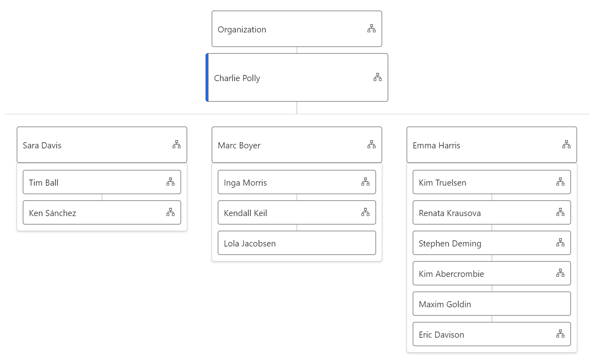

# HierarchyViewer control

[!include [banner](../includes/banner.md)]

This article provides information about the HierarchyViewer control, which lets you represent hierarchical relationships for people, products, or organizations.

## Overview

The HierarchyViewer control lets you represent hierarchical relationships for people, products, or organizations. It's used primarily as a graphical means to help you understand hierarchical relationships in a traditional top-down manner, and as way to navigate to the entity that is represented by the focused node. The HierarchyViewer control lets you walk through deeply nested, multilevel content in a compact space. The control expands and collapses nodes to control the parts of the tree structure that are shown. Because it's an unbound control, the HierarchyViewer data is managed by an abstraction class and is used primarily as a way to visualize data in a simple tree relationship. For hierarchy data in a traditional tree, there is a standard tree control. 



> [!NOTE]
> This visual is available starting with [platform updates for version 10.0.21 of Finance and Operations](../get-started/whats-new-platform-updates-10-0-21.md).

The HierarchyViewer control shows four levels of information at any given time. The current node is the current focus of the tree, which is not necessarily the root node. The current node is represented by the largest physical node in the current view and it has a colored bar on the left. Above the current node is a trail of smaller parent nodes from the root node down to the current node. Below the current node is a level of children nodes, and there can be an indefinite number of nodes at this level. By default, three children nodes are shown at a time on each page, but that can changed by adjusting the **Number of children** property. The **Next** and **Previous** link buttons allow the user to page to other nodes at the child level. Finally, there is a level of grandchildren nodes that are showon for each child node. Each child can have an indefinite number of grandchild nodes, and the number of grandchildren shown at one time for each child node is controlled by the **Number of Grandchildren** property. Users can use the **Next** and **Previous** arrow buttons to page up and down through members at the grandchild level. The interactive display of nodes requires no business logic.

## Business logic interaction
The HierarchyViewer control offers data visualization and navigation. The HierarchyViewer control is a read-only control. It can be used to select an entity (employee, product, or organization), and corresponding data can then be managed though other display and input fields on the form, outside the HierarchyViewer control. This is accomplished by a selection event that is raised on each user focus on each node.

```xpp
public void init(){
    …    
    // HierarchyViewer is the auto-declared name for the control.
    // handleNodeSelected is your event handler.
    HierarchyViewer.notfiyNodeSelected += eventhandler(element.handleNodeSelected);
}
public void handeNodeSelected(int _nodeId)
{
    // do something
}
```

## Authoring a HierarchyViewer instance
To create a HierarchyViewer instance:

1.  In the form designer, add an instance of HierarchyViewer to your form.
2.  In the **Properties** pane, accept the default number of visible children and grandchildren, or set new values. 


The HierarchyViewer control is primarily a visually interactive way of navigating or interrogating nodes in a static manner. The HierarchyViewer control isn't bound to a data source. Instead, the control is managed by a corresponding controller class that extends the base **HierarcyDesignerBase**. You initialize that class with data, and bind to the control instance and the visible fields of the HierarchyViewer node.

A typical use of the control is to initialize a server-side “in-memory” map of the hierarchy and then dynamically update the control as the user interactively explores the hierarchy by using load-on-demand semantics.

```xpp
public void init()
{
    HcmPositionNode node;
    nodeMap = new Map(Types::Int64, Types::Class);
    hierarchyMap = new Map(Types::Int64, Types::Int64);
    firstNodeId = 0;
    // Initialize the organization node
    node = HcmPositionNode::newParameters(this.getNextNodeId(), HcmPositionNodeType::Enterprise, -1, 0, "@SYS317690", "");
    rootNode = node;
    if (selectedNode == null)
    {
        selectedNode = rootNode;
    }
    this.insertNewNodeAndUpdateParent(node);
}
```

Override the **applyBuild** method of the control. This is where you will pass the instance of your controller class.

```xpp
    public void applyBuild()
{
    super();
    YourControllerClass controller = new YourControllerClass();
    this.initControl(controller);
}
```

You don’t have to populate the whole node structure. Instead, you can populate nodes on demand.

```xpp
public void initHcmPositionFromCurrentNode(HcmPosition _hcmPosition)
protected void insertNewNodeAndLoadDescendants(HcmPositionNode _node, int _depth, HcmPositionNode _parentNode = null, Common _common = null)
protected void loadNodeDescendants(HcmPositionNode _node, int _depth, Common _common = null)
```

## Changing node visuals
You can't change node visuals. The design presents a consistent visual and user interaction. 

[!INCLUDE[footer-include](../../../includes/footer-banner.md)]
