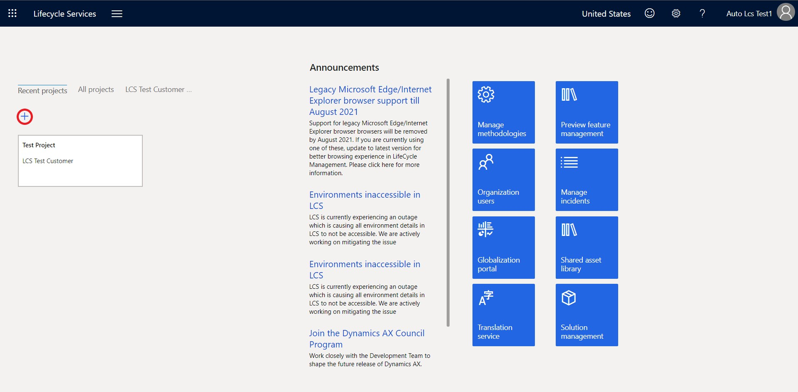

---
# required metadata

title: Multiple LCS projects and environments on one Azure AD tenant
description: This topic explains how to implement multiple LCS projects and production environments on the same Azure Active Directory tenant.
author: ClaudiaBetz-Haubold
ms.date: 06/21/2021
ms.topic: article
ms.prod: 
ms.technology: 

# optional metadata

# ms.search.form:  
audience: IT Pro
# ms.devlang: 
ms.reviewer: sericks
# ms.tgt_pltfrm: 
# ms.custom: 
ms.search.region: Global
# ms.search.industry: 
ms.author: chaubold
ms.search.validFrom: 2018-05-30 
ms.dyn365.ops.version: AX 7.0
---

# Multiple LCS projects and environments on one Azure AD tenant

[!include [banner](../includes/banner.md)]

For any new cloud project, one Microsoft Dynamics Lifecycle Services (LCS) Implementation project is instantiated on a Microsoft Azure Active Directory (Azure AD) tenant that provides access to one production instance. In rare cases, to handle the requirements of a specific implementation, you might require multiple production instances that run in parallel. By creating multiple LCS projects against the same Azure AD tenant, you can have multiple production instances. Here are the most common scenarios where multiple production instances might be required:

- A global implementation's requirements for data residency, latency, or data volume can't be met by one instance.
- Different business units in an organization are implementing the product separately as independent applications.

## Disadvantages of multiple LCS projects

The following are some disadvantages to having multiple LCS projects:

- Master data isn't shared.
- Intercompany transactions aren't supported.
- Integrations must be configured in each LCS project.
- Each LCS project requires a separate Bring your own database (BYOD) instance
- User acceptance testing (UAT) must be done on each instance, even if the code is the same. UAT is required on each instance, because differences can occur across the LCS projects, even if they share a code base. One source of differences can be the integration setup and BYOD configuration that must be done separately in each LCS project and therefore must be tested in each LCS project. Additionally, there might be data variations, different application configurations per region might affect functionality, and different data centers might support a different set of Azure services.
- Microsoft Azure DevOps must be configured in each LCS project. When customizations and code are shared, it makes sense to use the same Azure DevOps project.

## Advantages of multiple LCS projects

There are also advantages to having multiple LCS projects. Here are some of them:

- Data centers can be selected per LCS project to provide the best latency experience.
- Data centers can be selected per LCS project to satisfy statutory requirements for data residency.
- There is more flexibility to schedule servicing operations, such as code deployments and upgrades.

## Licensing requirements

Every LCS Implementation project that runs on the same Azure AD tenant must satisfy the minimum licensing requirements. For example, if there are three LCS Implementation projects on the same Azure AD tenant, a customer must purchase no less than three times the minimum number of subscription licenses. Currently, the minimum license requirement is 20 full user licenses. Therefore, to run three LCS Implementation projects on the same Azure AD tenant, the customer must purchase at least 60 licenses.

Because the licenses are associated with the Azure AD tenant, the **Subscriptions available** page for every LCS project will show the total number of licenses, even though a given LCS project can use only the portion of licenses that has been allocated to it. This allocation of license to LCS projects must be documented outside the system.

Users who access multiple environments in parallel must be licensed separately for each environment. A user can only be assigned one license for each product for each Azure AD tenant. This allocation of licensing requirements for LCS projects for specific users must be documented outside the system. For additional information about licensing, download the [Licensing guide](https://go.microsoft.com/fwlink/?LinkId=866544&clcid=0x409).

## Create multiple LCS projects

Create a new additional implementation project in your existing organization using the following steps:

1. Select the **+** button on the LCS home page.
    
2. Select **Implementation** as the project type.
    
3. Enter information about the the new implementation project.
    
4. Select **Create** to finish creating your project. A confirmation box might display to ensure that you want create an additional implementation project if you already have an existing implementation project in your organization. If you receive an error message, it might be because your organization does not have the required total license count to support an additional implementation project.
5. After the project is created, the newly created implementation project will display and you will be the owner of the project.

## Edit the licenses allocated to projects

Determine how you want to assign licenses across the implementation projects in your organization in order to ensure that the number of licenses assigned across all projects does not exceed the total license count purchased by the customer.

After the allocation has been determined, visit the [Subscription Estimator](../../dev-itpro/lifecycle-services/subscription-estimator.md) tool for each implementation project and edit the active subscription estimate to apply the desired license allocation for that project.  

## Online deployments in China sovereign cloud

If your implementation includes China deployment/rollout, Dynamics 365 Finance online deployment will be available in mainland China starting in April 2019. For more information, see [Finance and Operations apps - operated by 21Vianet in China](../../dev-itpro/deployment/china-local-deployment.md). This deployment is designed to comply with regulatory requirements in China. The services include a physically separated instance of a cloud service with a different tenant (Azure Active Directory) that is operated and transacted by 21Vianet.

This is a single organization in multiple clouds with different tenant (Azure Active Directory). The advantages and disadvantages of multiple Lifecycle Services projects or production environments described above are still applicable, but the licensing requirements and requesting procedures are different. Work with your Microsoft Account Executive or your implementation partners for any process assistance.

[!INCLUDE[footer-include](../../../includes/footer-banner.md)]
