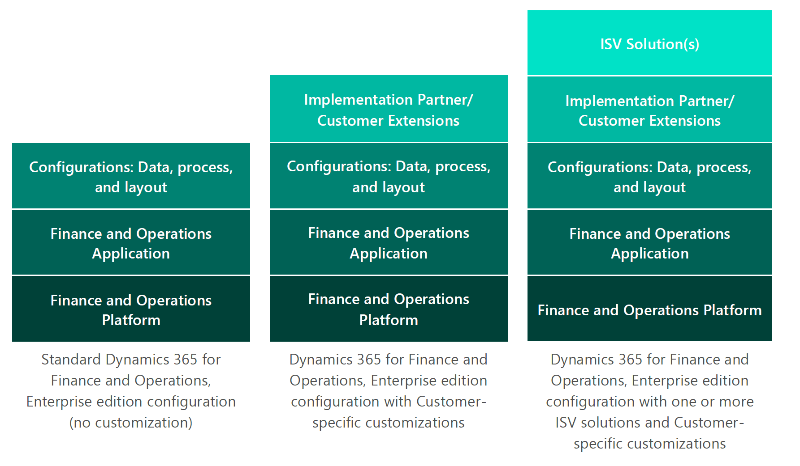

---
# required metadata

title: Service description for Finance and Supply Chain Management apps
description: This topic provides the service description for Dynamics 365 Finance and Dynamics 365 Supply Chain Management.
manager: AnnBe
ms.date: 03/02/2021
ms.topic: article
ms.prod:
ms.service: dynamics-ax-applications
ms.technology: 

# optional metadata

# ms.search.form:
audience: Application User, Developer, IT Pro
# ms.devlang: 
ms.reviewer: sericks
# ms.tgt_pltfrm: 
# ms.custom: NotInTOC
ms.search.region: Global
# ms.search.industry:
ms.author: sericks
ms.search.validFrom: 2021-03-31
ms.dyn365.ops.version: 10.0.18
---

# Service description for Finance and Supply Chain Management apps

[!include[banner](../includes/banner.md)]

## Overview

Microsoft Dynamics 365 Finance and Supply Chain Management is a cloud Enterprise Resource 
Planning (ERP) service for enterprises, built on and for Microsoft Azure. It provides organizations with ERP functionality that supports their unique requirements and helps them adjust to constantly changing business environments, without the hassle of managing infrastructure. Finance and Supply Chain Management brings together a set of ERP, business intelligence, infrastructure, compute, and database services in a single offering that enables organizations to run industry-specific and operational business processes that are extendable with specific solutions from Independent Software Vendors (ISV) (see Microsoft AppSource). Organizations can match their business growth by easily adding users and business processes with a simple, transparent subscription model.  

- [Microsoft AppSource](https://appsource.microsoft.com/partners)
- [Licensing Guide](https://dynamics.microsoft.com/finance-and-operations-to-finance-and-scm/)

The Finance and Supply Chain Management cloud service is comprised of the components illustrated below.

## Operating model

The operating model of Finance and Supply Chain Management distinguishes specific roles and responsibilities for Customer, Implementation Partner, and Microsoft throughout the lifecycle of the service. 

Microsoft maintains the Finance and Supply Chain Management service by deploying, actively monitoring, and servicing the Customer’s production tenants.  This includes allocating the required system infrastructure to run the service and proactive communication to Customers about the service’s health. 

With the support of their Implementation Partner, Customers determine the configuration of the business application logic in Finance and Supply Chain Management to match their unique business processes. Customers can extend Finance and Supply Chain Management with ISV solutions of their choice, unique customizations, or a combination of these. Customers typically choose one of the following configuration scenarios: 

-	**Solution 1:** Standard Finance and Supply Chain Management configuration (no extension) 
-	**Solution 2:** Finance and Supply Chain Management configuration with Customer-specific extensions 
-	**Solution 3:** Finance and Supply Chain Management configuration with one or more ISV solutions and Customer-specific extensions 

For any of these scenarios, the Customer defines, develops, and tests any modifications using Microsoft Dynamics Lifecycle Services (LCS) and tools. 

## System configuration

Finance and Operations scales with transaction volume and User load. Each Customer implementation of Finance and Operations produces a unique solution due to the following variables: 

-	**Data composition:** A unique set of parameters that control behavior, layout of the organization, structure of master data (such as financial and inventory dimensions), and granularity of transaction tracking. 
-	**Extension and configuration:** Extension mechanisms of Finance and Supply Chain Management with code extensions, ISV solutions, and unique configurations including workflows, integrations, and report configurations. 
-	**Usage patterns:** A unique combination of online and batch usage combined with the ability to integrate with upstream and downstream systems for unified data flow and the ability to differentiate based on the information views used by Customers in their business processes. 

Microsoft configures production tenants sized to handle the transaction volumes and user concurrency. Microsoft is responsible for: 

-	Proper allocation of resources of production tenants, based on the Customer’s profiling information in the LCS Subscription Estimator; 
-	Continually monitoring and diagnosing service availability of production tenants; and 
-	Analyzing and troubleshooting system performance issues with Finance and Operations. 

To ensure that an implementation is configured for high performance, Customers must:

-	Provide accurate usage information for the Finance and Supply Chain Management implementation through the LCS Subscription Estimator; • Build and test extensions for performance and scale; and 
-	Test data configurations appropriately for performance. 

## Service operations

Service operations reflect various aspects of provisioning and use of Finance and Supply Chain Management, from onboarding and implementation to updates and monitoring. For each successful implementation of Finance and Supply Chain Management, Microsoft, the Customer, and Implementation Partners or ISVs (when applicable) have specific roles and responsibilities. 

### Onboarding and implementation

Typical onboarding and implementation events and the expected responsibilities for each party are provided in the following table.

