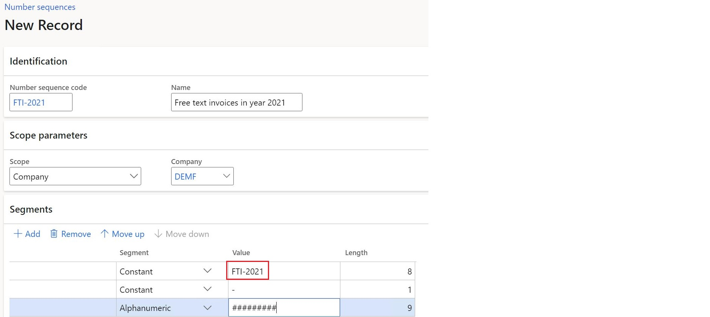

---
# required metadata

title: Chronological numbering of documents and voucher
description: This topic explains how to set up and use chronological numbers for applicable documents and releted vouchers.  
author: Ilya Kondratenko
manager: AnnBe
ms.date: 11/20/2020
ms.topic: article
ms.prod: 
ms.service: dynamics-ax-applications
ms.technology: 

# optional metadata

ms.search.form:  NumberSequenceGroup
# ROBOTS: 
audience: Application User
# ms.devlang: 
ms.reviewer: kfend
ms.search.scope: Core, Operations
# ms.tgt_pltfrm: 
ms.custom: 401195
ms.search.region: Global
# ms.search.industry: 
ms.author: ilyako
ms.search.validFrom: 2021-03-15
ms.dyn365.ops.version: 10.0.17

---

# Chronological numbering of documents and vouchers

[!include [banner](../includes/banner.md)]

[!include [banner](../includes/preview-banner.md)]

In some countries, there is a legal requirement that some documents and related vouchers that are issued be numbered in chronological order. The chronology must be supported by periods. All the numbers that belong to earlier periods must be less than the numbers that belong to later periods. To meet this requirement, chronological numbering functionality has been implemented. 
This article explains how to configure and use chronological numbers for applicable documents and releted vouchers.

## Prerequisites

In the Feature management workspace, turn on the **Chronological numbering** feature. For more information, see [Feature management overview](../../fin-ops-core/fin-ops/get-started/feature-management/feature-management-overview.md).

## Configure chronological numbering

Chronological numbering affects the following documents:

**Accounts receivable**
- Customer invoice
- Customer invoice voucher
- Sales credit note
- Sales credit note voucher
- Free text invoice
- Free text invoice voucher
- Free text credit note
- Free text credit note voucher
- Packing slip
- Packing slip voucher
- Packing slip correction voucher
- Interest note voucher
- Collection letter voucher

**Accounts payable**
- Invoice voucher
- Credit note voucher
- Product receipt voucher

**Project management**
- Invoice
- Invoice voucher
- Credit note
- Credit note voucher 

### Define number sequences
In **Organization administration** > **Number sequences** > **Number sequences**, define as many number sequences as you require to cover the affected periods. You should specify a company for each number sequence. The segments of the number sequences must be defined so that they provide chronological order for periods. For example, the segment names can contain a special prefix that identifies a specific period.

### Define number sequence groups

If different customers use different patterns for numbering, you must set up chronological numbering at the level of the number sequence group. On the **Accounts receivable parameters** page, on the **Number sequences** tab, select one of the supported references, and then click **Group**. On the **Number sequence group** page, select an existing group, or create a new group. In the **Reference** section, select one of the supported references, and then click **Chronological numbering setup**. On the **Chronological numbering setup** page, define date-effective number sequences that have valid periods.

### Configure documents references

On the **Accounts receivable parameters** page, on the **Number sequences** tab, select one of the supported references, such as **Free text invoice**. Then click the **Chronological numbering setup** button that will be available for the supported references. On the **Chronological numbering setup** page, define the date-effective number sequences that have valid periods.

## Invoice posting
When you post an invoice or a credit note, the appropriate number sequence is used to generate a number. This number sequence is selected based on the valid period that contains the invoice date. Customer-specific chronological numbering has higher priority than chronological numbering.
