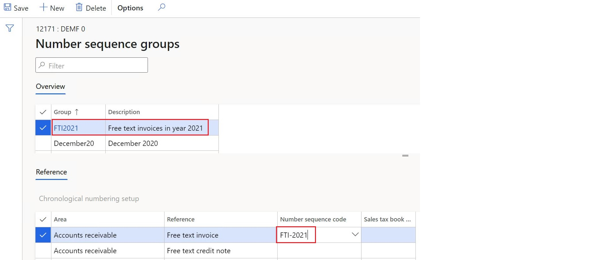

---
# required metadata

title: Chronological numbering of documents and voucher
description: This topic explains how to set up and use chronological numbers for applicable documents and releted vouchers.  
author: Ilya Kondratenko
manager: AnnBe
ms.date: 11/20/2020
ms.topic: article
ms.prod: 
ms.service: dynamics-ax-applications
ms.technology: 

# optional metadata

ms.search.form:  NumberSequenceGroup
# ROBOTS: 
audience: Application User
# ms.devlang: 
ms.reviewer: kfend
ms.search.scope: Core, Operations
# ms.tgt_pltfrm: 
ms.custom: 401195
ms.search.region: Global
# ms.search.industry: 
ms.author: ilyako
ms.search.validFrom: 2021-03-15
ms.dyn365.ops.version: 10.0.17

---

# Chronological numbering of documents and vouchers

[!include [banner](../includes/banner.md)]

[!include [banner](../includes/preview-banner.md)]

In some countries, there is a legal requirement that some documents and related vouchers that are issued be numbered in chronological order. The chronology must be supported by periods. All the numbers that belong to earlier periods must be less than the numbers that belong to later periods. To meet this requirement, chronological numbering functionality has been implemented. 
This article explains how to configure and use chronological numbers for applicable documents and releted vouchers.

## Prerequisites

In the Feature management workspace, turn on the **Chronological numbering** feature. For more information, see [Feature management overview](../../fin-ops-core/fin-ops/get-started/feature-management/feature-management-overview.md).

## Configure chronological numbering

Chronological numbering affects the following documents:

**Accounts receivable**
- Customer invoice
- Customer invoice voucher
- Sales credit note
- Sales credit note voucher
- Free text invoice
- Free text invoice voucher
- Free text credit note
- Free text credit note voucher
- Packing slip
- Packing slip voucher
- Packing slip correction voucher
- Interest note voucher
- Collection letter voucher

**Accounts payable**
- Invoice voucher
- Credit note voucher
- Product receipt voucher

**Project management**
- Invoice
- Invoice voucher
- Credit note
- Credit note voucher 

### Define number sequences
In **Organization administration** > **Number sequences** > **Number sequences**, define as many number sequences as you require to cover the affected periods for required documents. You should specify a company for each number sequence. The segments of the number sequences must be defined so that they provide chronological order for periods. For example, the segment names can contain a special prefix that identifies a specific period.

### Configure number sequence groups

In **Accounts receivable** > **Setup** > **Accounts receivable parameters**, on the **Number sequences** tab, define as many number sequences groups as you require to cover the affected periods. For each group, in the **Reference** section, select one of the supported document references, in the **Number sequence code** field, refer to a number sequence that was previously created for the related period.

Similarly configure number sequence groups in **Accounts payable** and **Project management and accounting** modules.

### Configure number sequence groups chronology

In **Organization administration** > **Number sequences** > **Chronological number sequence groups**, define the applicability conditions for number sequence groups.

| Field            | Description                                                                                                                                                                                                                                                                                                                                                                                   |
|---------------------|------------------------------------------------------------------------------------------------------------------------------------------------------------------------------------------------------------------------------------------------------------------------------------------------------------------------------------------------------------------------------------------------|
| Effective  | The start date of number sequence group applicability. |
| Expiration      | The end date of number sequence group applicability. If no end date applied then use **Never** option. |
| Number sequence group | Number sequence group that will be used for document numbers generation during the period. |
| Original number sequence group | This number sequence group code is used for additional filtering for the cases when documents already have a specific *permanent* number sequence group preliminary assigned. An empty value is also considered as a specific value. If you need to ignore a preliminary assigned group then use **Default** option for this setup. |
| Default | If **turned on** then the system will ignore preliminary assigned document number sequence group and use only periods start and end dates for applicability analysis. If **turned off** the system will use the full combination **Effective** + **Expiration** + **Original number sequence group** for selection. |

## Documents posting
When you post a document, the appropriate number sequence is used to generate a number. This number sequence is selected based on the valid period that contains the invoice date. Customer-specific chronological numbering has higher priority than chronological numbering.

> [!NOTE]
> Countries.
