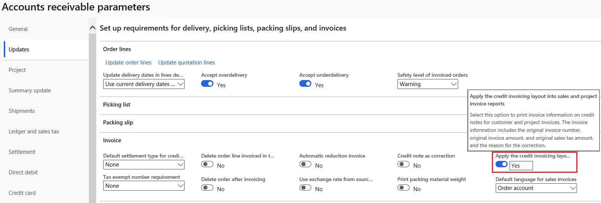

---
# required metadata

title: References to original invoices in credit notes
description: This topic explains how to set up and print original invoice numbers in credit notes.
author: ilkond
manager: AnnBe
ms.date: 01/12/2021
ms.topic: article
ms.prod: 
ms.service: dynamics-ax-applications
ms.technology: 

# optional metadata

ms.search.form: 
audience: Application User
# ms.devlang: 
ms.reviewer: kfend
ms.search.scope: Core, Operations
# ms.tgt_pltfrm: 
# ms.custom: 
ms.search.region: Global
# ms.search.industry: 
ms.author: ilyako
ms.search.validFrom: 2021-03-19
ms.dyn365.ops.version: 10.0.17

---

# References to original invoices in credit notes

[!include [banner](../includes/banner.md)]

[!include [banner](../includes/preview-banner.md)]

In some countries, there is a legal requirement to print the references to original invoices in related credit notes. 
This topic explains how to set up and print the references to original invoices in credit notes.

## Prerequisites

- In the **Feature management** workspace, turn on the feature, **Credit invoicing layout for sales and project invoice reports**. For more information, see [Feature management overview](../../fin-and-ops/get-started/feature-management/feature-management-overview.md).
- The printable formats of required documents are configured in Print management.

The functionality covered in this topic is applicable to the following documents:

**Accounts receivable**
- Customer credit note
- Free text credit note

**Project management and accounting**
- Project credit note

## Configure Accounts receivable parameters

Complete the following steps to activate printing references to original invoices in related credit notes.

1. Go to **Accounts receivable** > **Setup** > **Accounts receivable parameters**.
2. On the **Updates** tab, expand the **Invoice** FastTab. 
3. In the **Apply credit invoicing layout into sales and project invoice reports** field, select **Yes** to activate printing references to original invoices in related credit notes.

## Define references to original invoices

Complete the following steps to define references to original invoices, depending on document type.

### Free text credit note

1. Go to **Accounts receivable** > **Invoices** > **All free text invoices**. 
2. Create a new credit note or select an existing one.
3. Open the invoice and on the Action Pane, select **Functions** > **Credit invoicing**. 
4. Enter the reference to an original invoice and select the reason for correction.

### Customer credit note

1. Go to **Accounts receivable** > **Orders** > **All sales orders**. 
2. Select and open the invoiced sales order to be corrected.
3. On the Action Pane, select **Sell** > **Credit note** > **Credit note**, and enter the reason of correction. The reference to an original invoice is established automatically.

### Project credit note

1. Go to **Project management and accounting** > **Project invoices** > **Project invoices**. 
2. Select and open the project invoice to be corrected.
3. On the Action Pane, select **Functions** > **Select for credit note**.
4. In **Credit invoicing** page, enter the reason of correction. The reference to an original invoice will be established automatically.

## Print credit notes
When you print customer, free text, and project credit notes, the section with the reference to the original invoice and correction reason will be shown.

> [!NOTE]
> Make sure that the documents printable formats are properly configured and assume printing of the references to original invoices.

