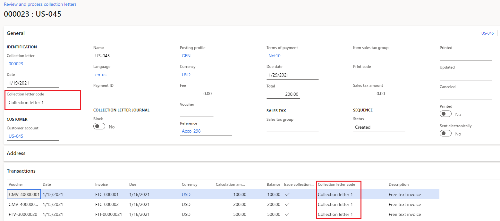
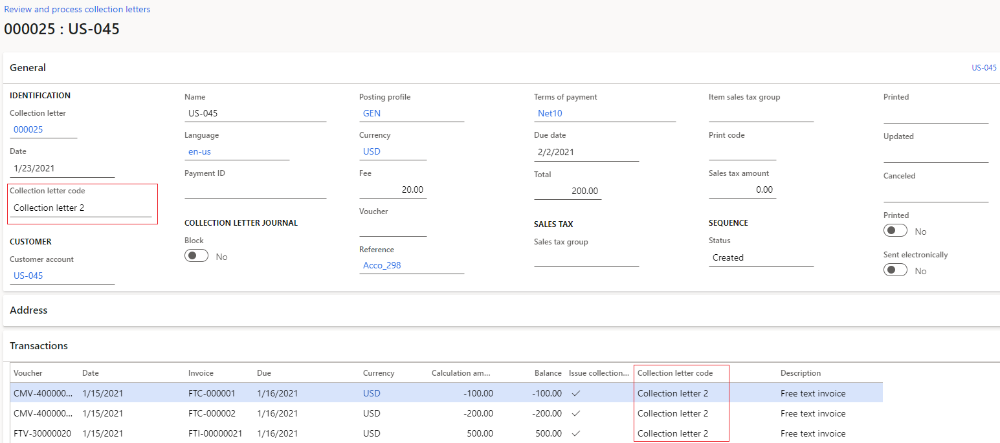

--- 
# required metadata 
 
title: Process collection letters example
description: This topic walks through an example that clarifies the process of creating, printing, and posting collection letters. 
author: JodiChristiansen
manager: AnnBe 
ms.date: 02/03/2021
ms.topic: business-process 
ms.prod:  
ms.service: dynamics-ax-applications 
ms.technology:  
 
# optional metadata 
 
ms.search.form: CustPosting, CustCollectionLetterNote   
audience: Application User 
# ms.devlang:  
ms.reviewer: roschlom
# ms.tgt_pltfrm:  
# ms.custom:  
ms.search.region: Global
# ms.search.industry: 
ms.author: jchrist
ms.search.validFrom: 2021-02-03 
ms.dyn365.ops.version: 10.0.16

---
# Process collection letters example

[!include [banner](../../includes/banner.md)]

This topic walks through an example that clarifies the process of creating, printing, and posting collection letters. The example is based on the Credit and collections parameter **Ignore payments and credit memos when calculating collection letter code**. This example uses data in the USMF demo company with a new customer, US-045. Begin by opening the **All customers** page (**Navigation pane > Modules > Accounts receivable > Customers > All customers**). Click **New** to enter the required information.

1. The following is the collection letter sequence, which is assigned to the customer posting profile. Go to **Navigation pane > Modules > Credit and collections > Collection letter > Setup collection letter sequence**.

 

2. In Credit and collections parameters there are two parameters to set for this example. Go to **Navigation pane > Modules > Credit and collections > Setup > Accounts receivable parameters**. 

  - Click the **Collections** tab. 
 
  - Change the **Ignore payments and credit memos when calculating collection letter code** field to **Yes**.  
 
  - The parameter **Create collection letter per** must be set to **Customer**. 
 
 When you've finished, your screen should look like the following illustration. 

 

3. Go to **Navigation pane > Modules > Accounts receivable > Invoices > All free text invoices**.
 
  - Click **New**.
 
  - In **Customer account** select **US-045**.
 
  - Change the **Invoice date** field to 1/15/2021.
 
  - Change the **Due date** field to 1/16/2021.
 
  - In the **Invoice lines** FastTab, enter 401100 for the **Main account**.
 
  - Enter 500.00 for the **Unit price**.
  
  - Click **Post**.

4. Click **New** to enter two credit notes for the same customer.  

 a. In **Customer account** select US-045.
 
 b. Change **Invoice date** to 1/15/2021.
 
 c. Change **Due date** to 1/16/2021.
 
 d. In **Invoice lines** fastTab enter 401100 for the **Main account**.
 
 e. Enter -100.00 for the **Unit price**.
 
 f. Click **Post**.
 
 g. Repeat steps 4a-4f except in step 4e change the **Unit price** to -200.00.

5. Go to **Navigation pane > Modules > Accounts receivable > Customers > All Customers** and choose US-045. Click **Transactions** under **Transactions** in the Action Pane to review the customer transactions.

 

6. Go to the **Create collection letters** page (**Navigation pane > Modules > Credit and collections > Collection letter > Create collection letters**) to create collection letters for customer US-045.

 a. Mark the **Invoice** and **Credit note** parameters **Yes**.
 
 b. The **Collection letter** parameter should default to **Collection per customer**.
 
 c. Enter 1/19/2021 for **Collection letter date**.
 
 d. Under Records to include, click  **Navigation pane > Modules > Credit and collections > Collection letter > Create collection letters**Filter to add US-045 in Customer account.
 
 e. Click **OK**.
 
 f. Click **OK** to create collection letters.

7. Go to **Navigation pane > Modules > Credit and collections > Collection letter > Review and process collection letters**.
 a. Notice the header and lines Collection letter code (expand Transactions fastTab if needed) displays Collection letter 1 since this is the first collection letter in the sequence. 

 

 b. Click **Post** in the Action bar and enter 1/19/2021 as the **Posting date**.

8. Open the to **Create collection letters** page (**Navigation pane > Modules > Credit and collections > Collection letter > Create collection letters**) to create collection letters again for customer US-045.

 a. Set the **Invoice** and **Credit note** parameters to **Yes**.
 
 b. The **Collection letter** parameter should default to **Collection per customer**.
 
 c. Enter 1/23/2021 for **Collection letter date**.
 
 d. Under **Records to include**, click **Filter** to add customer, US-045, in the **Customer account** field.
 
 e. Click **OK**.
 
 f. Click **OK** again to create the collection letters. 

9. Go to **Navigation pane > Modules > Credit and collections > Collection letter > Review and process collection letters**.

 a. Notice the collection letter code in the header displays **Collection letter 1**, but the transaction lines display **Collection letter 2**, which is shown in the following illustration. 

 

 b. The parameter is set to **Yes** to ignore payments and credit memos when calculating the collection letter code.
 
 c. Do not post this collection letter.

10. Open the **Accounts receivable parameters** page (**Navigation pane > Modules > Credit and collections > Setup > Accounts receivable parameters**).
 
 a. Click the **Collections** tab.
 b. Change **Ignore payments and credit memos when calculating collection letter code** to **No**.

 

11. Open the **Create collection letters** page to create collection letters again for customer US-045.

 a. Set the **Invoice** and **Credit note** parameters to **Yes**.
 
 b. The **Collection letter** parameter should default to **Collection per customer**.
 
 c. Enter 1/23/2021 for **Collection letter date**.
 
 d. Under Records to include, click **Filter** to add US-045 in the **Customer account** field.
 
 e. Click **OK**.
 
 f. Click **OK** again to create collection letters. 

12. Open the **Review and process collection letter** page (**Navigation pane > Modules > Credit and collections > Collection letter > Review and process collection letters**).
    
    a. Notice the collection letter code that's displayed in the header is **Collection letter 2**, while on the transaction lines it's displayed as **Collection letter 2**, as shown in the following illustration.

   b. The parameter is set to **No** to ignore payments and credit memos when calculating the collection letter code. 

