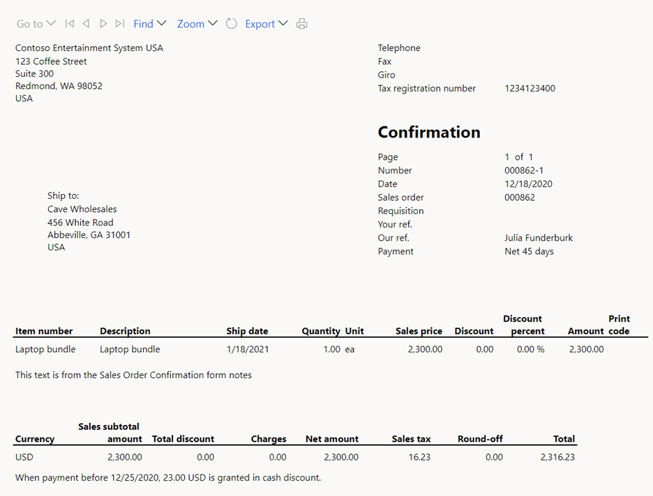
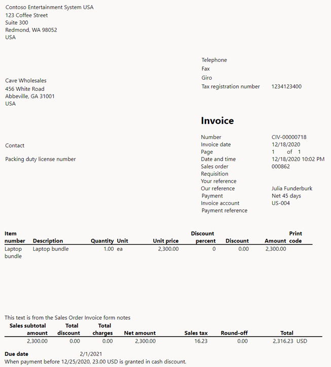

---
# required metadata

title: Revenue recognition bundles
description: This topic describes the bundle functionality that is included in the revenue recognition capability in Accounts receivable. A bundle comprises a parent item and multiple component items.
author: kweekley
manager: aolson
ms.date: 01/04/2021
ms.topic: index-page
ms.prod: 
ms.service: dynamics-ax-applications
ms.technology: 

# optional metadata

ms.search.form: 
audience: Application User
# ms.devlang: 
ms.reviewer: roschlom
# ms.search.scope: Core, Operations
# ms.tgt_pltfrm: 
# ms.custom: 
ms.search.region: Global 
# ms.search.industry: 
ms.author: kweekley
ms.search.validFrom: 2021-01-04
ms.dyn365.ops.version: 10.0.7

---

# Revenue recognition bundles

[!include [banner](../includes/banner.md)]

This topic describes the bundle functionality that is included in the revenue recognition capability in Accounts receivable. A bundle comprises a parent item and multiple component items. The parent item is entered on a sales order, so that order entry is more efficient. However, it's then exploded into the component items. Internal documents, such as the packing slip, will list the component items. However, external documents will show only the parent item.

> [!NOTE]
> Commerce channels, such as e-commerce, the point of sale (POS), and call centers, don't support revenue recognition (including the bundle functionality). Items that are configured to use revenue recognition should not be added to orders or transactions that are created in Commerce channels.

To set up bundles, you must enter the configuration keys for revenue recognition. However, you can use bundles even if revenue recognition isn't set up. Likewise, you can use revenue recognition if bundles aren't set up. If revenue recognition is set up, the component items determine the revenue price and the revenue schedule that is used for revenue recognition or deferral when a sales order is invoiced.

The setup for bundles uses the bill of materials (BOM) functionality. For information about how to set up a bundle item, see [Revenue recognition setup](revenue-recognition-setup.md). If the parent item is flagged as a bundle, it's treated differently than other BOM items. Here is a list of the differences:

- Bundles must be exploded through sales order confirmation, by selecting **Confirm sales order** on the **Sell** tab of the Action Pane on the sales order page. Bundle items must never be exploded by selecting **BOM line** under **Explode** on the **Sales order line** menu on the **Sales order lines** FastTab. Otherwise, the item will be treated as a BOM, not as a bundle.
- A sales order that contains a bundle item must be confirmed before the packing slip or invoice is created.
- When a bundle is exploded through sales order confirmation, the parent item is canceled, and its unit price and discounts are allocated to the component items of the bundle.
- The sum of the component items must always equal the price on the parent item. Therefore, there are limitations on the fields that can be updated or changed for component items. For example, the unit price can't be manually changed. It also can't be indirectly changed by making a new price agreement go into effect. To prevent a new price agreement, inventory dimensions can't be changed on the component items.
- When an external-facing document such as the sales order confirmation or invoice is printed, the parent item is printed, not the component items.

## Bundles on sales orders

The USMF demo company includes the following bundle setup. Note that all setup for revenue recognition, such as the setup of revenue schedules, has been removed from the items that are included in this scenario.

**Parent item:** Laptop bundle

- **Component item:** A quantity of 1 of item 1000
- **Component item:** A quantity of 1 of item S0021
- **Component item:** A quantity of 1 of item Support

The *base sales price* of the component items is an essential part of the setup of the components. The base sales price is defined on the **Sell** FastTab of an item. It's used to calculate the allocation factor when the parent item's unit price is allocated to the component items. The trade agreement sale prices are never used for this purpose.

The following base sales prices are defined for the component items:

- **1000:** $1,900.00
- **S0021:** $150.00
- **Support:** $500.00

A sales order is entered for customer US-004, Cave Wholesales. The only line that is entered is for the Laptop bundle item. The default unit price for the parent line can be taken from numerous places, such as the trade agreement or the base sales price. In this example, $2,300 was manually entered as the unit price.

Because the sales order contains a bundle, it must be confirmed. The confirmation dialog box shows the components of the bundle.

However, the printed confirmation report will show only the parent item of the bundle, because that report is the external-facing document for the customer.

After the sales order is confirmed, the parent item is still shown on the sales order, but its status has been changed to **Canceled**. Additionally, the net amount is tracked in the **Bundle net amount** field. This amount is required to print the invoice, because the invoice shows the parent item, not the component items.

The sum of the component items must equal the **Bundle net amount** value of the parent item, because that value is the amount that is presented to the customer on the printed invoice. To ensure that the invoice matches the amounts that are posted to the general ledger, edits to the component items are limited. For example, the site and Warehouse can't be changed, because those changes might trigger a price change, based on a trade agreement.

The unit price from the line for the parent item is allocated to the components in the following manner:

**Total base sales prices from components:** $1,900 + $500 + $150 = $2,550

- **Component 1:** $2,300 × (1,900 ÷ 2,550) = $1,713.73
- **Component 2:** $2,300 × (500 ÷ 2,550) = $450.98
- **Component 3:** $2,300 × (150 ÷ 2,550) = $135.29

The sum of the components must equal $2,300, and it does ($1,713.73 + $450.98 + $135.29 = $2,300).

If changes are required for all component items, the parent item can be removed. In this case, the component items are also removed. The parent item can then be added again, and the required edits can be completed before the sales order is confirmed.

When the sales order is picked and packed, the documents will include only the components of the bundle. The packing slip and invoice must include a full bundle. Otherwise, they can't be posted. For example, the dialog box shows three component items. If you try to delete one of them, you receive an error message that states that all products in the bundle must be shipped before they can be invoiced.

A bundle must be shipped and invoiced as a full bundle. For example, if you change the quantity of item 1000 to 4, but you leave the quantity of the other component items at 5, the packing slip and invoice can't be posted.

A partial amount can be shipped and invoiced only if the quantity is reduced for all components of the bundle. For example, a quantity of 5 of the Laptop bundle item is entered on a sales order. After the sales order is confirmed, the three component items are shown on the sales order, and the quantity of each is 5. By default, during shipping and invoicing, the quantity will be set to 5 for each component. However, you can adjust the quantity down to 3 for all three component items. In this case, three full bundles will be shipped and invoiced. The remaining two bundle items (a quantity of 2 of each of the three component items) can be shipped and invoiced later.

The final step is to invoice the sales order. During invoicing, the invoice dialog box will show the component items.

However, the printed invoice will show only the parent item.
 

The invoice journal that is created after posting occurs doesn't include the parent item from the bundle, because that item has a status of **Canceled**.

It's important that the invoice journal not include the parent item from the bundle, because any processes that are performed after the invoice is posted are based on that invoice journal. For example, if you create a credit note from the **Sell** tab on the Action Pane, the credit note that is created will include the component items but not the parent item.

