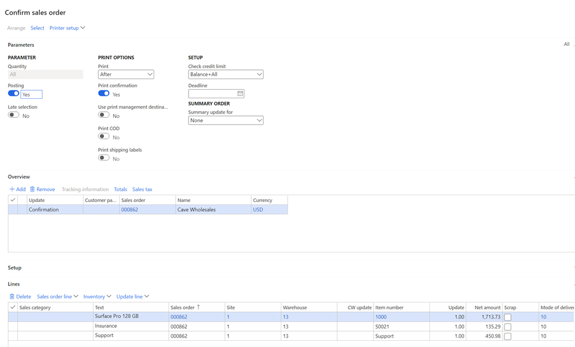
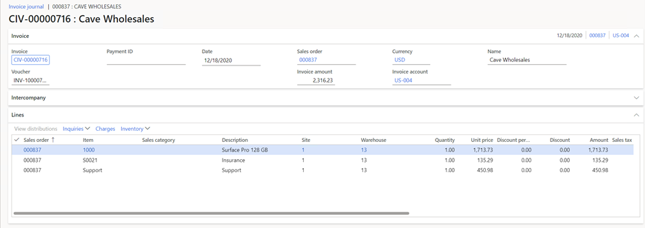
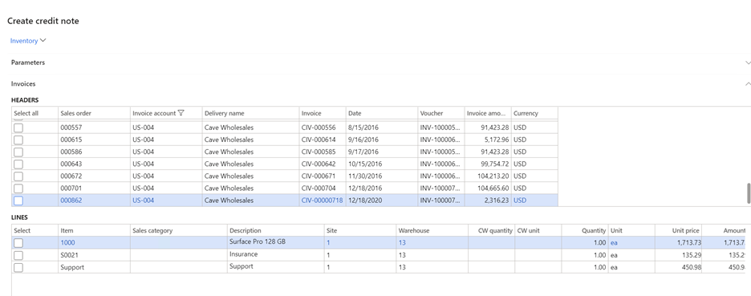

---
# required metadata

title: Revenue recognition bundles 
description: This topic describes the bundle functionality that's included in the revenue recognition capability in Accounts receivable. A bundle comprises a parent item along with multiple component items.
author: kweekley
manager: aolson
ms.date: 01/04/2021
ms.topic: index-page
ms.prod: 
ms.service: dynamics-ax-applications
ms.technology: 

# optional metadata

ms.search.form: 
audience: Application User
# ms.devlang: 
ms.reviewer: roschlom
# ms.search.scope: Core, Operations
# ms.tgt_pltfrm: 
# ms.custom: 
ms.search.region: Global 
# ms.search.industry: 
ms.author: kweekley
ms.search.validFrom: 2021-01-04
ms.dyn365.ops.version: 10.0.7

---

# Revenue recognition bundles

[!include [banner](../includes/banner.md)]

This topic describes the bundle functionality that's included in the revenue recognition capability in Accounts receivable. A bundle comprises a parent item along with multiple component items. The parent item is entered on a sales order, making order entry more efficient, but then is exploded into the component items. Internal documents, such as the packing slip, will list the component items but external documents will show only the parent item. 

> [!NOTE] 
> Revenue recognition, including bundle functionality, isn't supported for use in Commerce channels (including e-commerce, POS, call center). Items configured with revenue recognition shouldn't be added to orders or transactions created in Commerce channels.

The revenue recognition configuration keys must be entered to set up bundles. However, bundles can be used without setting up revenue recognition and vice versa. If revenue recognition is set up, the component items will determine the revenue price and the revenue schedule that's used when recognizing or deferring revenue when a sales order is invoiced.

Bundles use the bill of material (BOM) functionality for setup. For information about setting up a bundle item, see Revenue recognition setup.  If the parent item is flagged as a bundle, it’s treated differently than other BOM items in the following ways:

- Bundles must be exploded through the sales order confirmation found under **Sell – Confirm sales order** on the Action Pane of the sales order.  Bundle items must never be exploded through the **Sales order line – EXPLODE – BOM line** action, which is available on the lines of the sales order.  If you use the **Explode – BOM lines** action, the item will be treated as a BOM and not as a bundle. 
- If a sales order contains a bundle item, the sales order must be confirmed before creating the packing slip or invoice.  
- When the bundle is exploded through confirmation, the parent item is canceled, and the unit price and discounts of the parent item are allocated down to the component items of the bundle. 
- The sum of the component items must always equal the price on the parent item. In order to ensure that, the component items are limited with what fields can be updated or changed. For example, the unit price cannot be changed manually or indirectly through a new price agreement going into effect. To prevent a new price agreement, inventory dimensions cannot be changed either on the component items.  
- When printing an external facing document, such as the sales order confirmation or invoice, the parent item is printed and not the component items. 

## Bundles on sales orders
The following bundle setup exists in USMF.  Note that all revenue recognition setup, such as the revenue schedules, has been removed from the items included in this scenario.

Parent item:  Laptop bundle

- Components: **1000** for a quantity of 1
- Component item: **S0021** for a quantity of 1
- Component item: **Support** for a quantity of 1

The Base sales price on the component items is an essential part of the setup on the components.  The Base sales price, defined on the Sell FastTab of the item, is used to calculate the allocation factor when allocating the parent item’s Unit price down to the components. The trade agreement sale prices are never used for determining the allocation of the parent item’s Unit price to the components. 

The following Base sales prices are defined on the components:

- **1000** - $1,900.00
- **S0021** - $150.00
- **Support** - $500.00

A sales order is entered for customer US-004, Cave Wholesales.  The only line entered is the Laptop bundle item.  The Unit price for the parent line can default from numerous places, such as the trade agreement or base sales price.  In this example, $2,300 was manually entered.

 
Because the sales order contains a bundle, it must be confirmed.  On the confirmation dialog, the components of the bundle are shown, but the printed confirmation report will display only the parent item of the bundle because that is the external facing document for the customer. 
 

The following illustration shows the confirmation report that lists only the bundle item. 

After confirmation of the sales order, the parent item still displays on the sales order but moves to a **Canceled** state.  The net amount is also tracked in the Bundle net amount field.  This amount is necessary for printing the invoice because the invoice displays the parent item and not the components.

The component items must sum to the parent item’s Bundle net amount because that is the amount presented to the customer on the printed invoice. If the component amounts were permitted to change, the invoice would no longer match the amounts posted to general ledger. Because of this, edits to the component items are limited.  For example, the Site and Warehouse cannot be changed because it may trigger a price change based on a trade agreement. 

The Unit price from the parent line is allocated to the components as follows:

Total base sales prices from components = $1,900 + $500 +$150 = $2,550
Component 1:  $2,300 x (1900/2550) = $1,713.73
Component 2:  $2,300 x (500/2550) = $450.98
Component 3:  $2,300 x (150/2550) = $135.29

The sum of the components must equal $2,300, which they do:   $1,713.73 + $450.98 + $135.29 = $2,300

If changes are required on all component items, the parent item can be removed which will also remove the component items. The parent item can then be added again, with the necessary edits prior to confirmation. 

 

When the sales order is picked and packed, the documents will include only the components of the bundle. 
The packing slip and invoice must include a full bundle in order to post.  For example, the three component items are displayed in the dialog. If you try to delete any one of the components, an error indicating that all products within the bundle must be shipped before they can invoiced will display. 
 
A bundle must be shipped and invoiced as a complete bundle. The packing slip and invoice cannot be posted if the quantity is changed to 4 for only item 1000 and the other component quantities remain at 5.   

A partial amount can be shipped and invoiced if the quantity is reduced for all components of the bundle.  For example, assume the Laptop bundle was entered on the sales order with a quantity of 5.  After confirmation, the three components will display on the sales order, each with a quantity of 5. When shipping and invoicing, the quantities will default to 5 for each component but can be adjusted down to 3 for all components.  Then three full bundles are being shipped and invoiced.  The remaining two bundle items (three components with a quantity of 2 each) can be shipped and invoiced later.  

The final step is to invoice the sales order.  When invoicing, the invoice dialog will display the component items but the printed invoice will include the parent item. 

The invoice journal that is created after posting does not include the parent item from the bundle because it is in a canceled state.

 
It's important that the invoice journal doesn't include the parent item from the bundle because any processes performed after the invoice is posted are based on that invoice journal. For example, if a credit note is created from the Sell tab on the Action Pane, the credit note will be created with the components and not the parent item. 

 

The following illustration shows the credit note that will be created with the components, but not the parent item.

