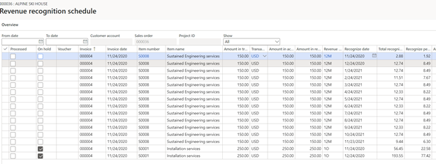
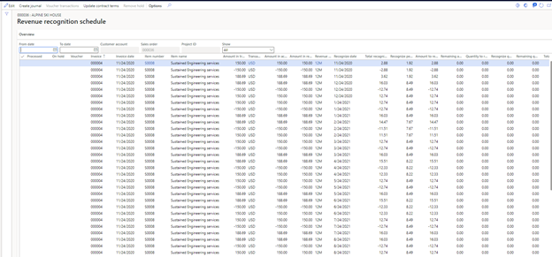

---
# required metadata

title: Revenue recognition reallocation - scenario 2
description: This topic walks through a reallocation example where two sales orders are entered. After first sales order is invoiced, the customer adds an additional item to the contract. When adding the new item to a contract, the new item can also be added to a new sales order or to the existing sales order. 
author: kweekley
manager: aolson
ms.date: 12/21/2020
ms.topic: index-page
ms.prod: 
ms.service: dynamics-ax-applications
ms.technology: 

# optional metadata

ms.search.form: Customer
audience: Application User
# ms.devlang: 
ms.reviewer: roschlom
ms.search.scope: Core, Operations
# ms.tgt_pltfrm: 
# ms.custom: 
ms.search.region: Global 
# ms.search.industry: 
ms.author: kweekley
ms.search.validFrom: 2020-12-21
ms.dyn365.ops.version: 10.0.14

---

# Revenue recognition reallocation - scenario 2

This topic walks through a reallocation example where two sales orders are entered. After first sales order is invoiced, the customer adds an additional item to the contract. When adding the new item to a contract, the new item can also be added to a new sales order or to the existing sales order.
The General ledger parameter, **Post invoice corrections to Accounts receivable**, is set to **No**.

A sales order is created for customer US_SI_0003. The customer is purchasing software installation (S0001) and support (S0008) for a laptop, but they haven’t selected the laptop yet. The software installation’s revenue is deferred until the date the laptop is purchased. The revenue from the support plan will be deferred and recognized over 12 months as defined by the date range in the contract. 

The sales order is confirmed. Both items are set up for revenue price allocation so the revenue price is calculated when the sales order is confirmed.. The revenue to recognize can be seen from the **Sales order** Action Pane (**Manage – Revenue recognition – Revenue price allocation**). The support item will post to a Deferred Revenue account in the amount of $150.00. The software installation will also post to the Deferred Revenue account in the amount of $250.00.  The sum of the revenue prices must equal the sum of the lines’ setup for revenue price allocation, which is equal to $400.00. 

The sales order is fully invoiced.  The following accounting entry is posted.

The Revenue recognition schedule is also created but none of the revenue is recognized yet. 

A few days later the customer selects the laptop, and a second sales order is entered for the customer.

The second sales order is confirmed. Because the sales order only contains one line, revenue price allocation is not performed on confirmation. Revenue price allocation only happens where there are two or more unique items, and the items are setup for revenue price allocation.
If this is the only change to the customer’s contract, the reallocation process can now be run. From either sales order or from Periodic tasks, open **Reallocate price with new order lines**.  Select the two sales orders and the corresponding sales order lines, then select the **Update reallocation** button.  The **Reallocated amount column** displays the new revenue prices for each sales order line.

Next select **Expected voucher** to see the accounting entries that will be posted to General ledger only. Because of the GL parameter, nothing will change in Accounts receivable when the reallocation is processed.
 

The last three lines are reversing the original accounting entry from the posted invoice. 
The top four lines comprise the new accounting entry posted for the invoice. It’s important to understand that the customer is not presented with a new invoice. After the reallocation, the customer still owes $426.00, which is the amount that must post to Accounts receivable in the new accounting entry.  The offsetting tax and deferred revenue is equal to $188.69 + $314.48 + $26.00 = $529.17. The deferred revenue amount has changed due to the reallocation. The difference of $103.17 is posted to a Partial invoice revenue clearing account.  This balance will be cleared when the invoice is posted for the second sales order that was included in the reallocation. 

The reallocation is completed by choosing the **Process** button.  It will prompt for a posting date, even if nothing is posted. After the reallocation is complete, the **Revenue price allocation** page on both sales orders will show the price allocation for all items across both sales orders. This means you will see an item in Revenue price allocation that doesn’t exist on the sales order because it’s part of the same contract, but on a different sales order.  

> [!Hint]
> Additional columns, such as the **Reallocation ID** and **Sales order**, can be added to the grid to give context as to why these additional items are displayed.  

On sales order 00036, the revenue recognition schedule was also updated based on the new revenue reallocation price.  From the sales order, open the **Revenue recognition schedule** page.  Previously there were 13 lines for the item S0008 which was assigned a 12M schedule. Now there are 39 lines: 13 original schedule lines, 13 reversal schedule lines, and 13 lines based on the new revenue price.  

The same is true for item S0001, which originally had 2 schedule lines and now there are 6 schedule lines.

On sales order 000036, the invoice journal displays the original accounting entry when clicking on **Voucher**. To see the reversing and new accounting entry from the sales order, select the **Revenue adjustments** button from the Action Pane, then **Voucher**.  

Next, open the **All customers** age (**Accounts receivable – Customers – All customers**), select customer US_SI_0003, and then choose the **Transactions** button. The open invoice from sales order 000036 will be visible.  If you select the voucher, you can see the original accounting entry, and not the new accounting entry from the reallocation.  The reversing and new accounting entries are not visible from Accounts receivable. 
The second sales order is now invoiced. The total invoice presented to the customer is $1,099.00 + $71.44 tax = $1,170.44.  The following accounting entry will be posted.

Because the sum of the revenue and sales is more than $1,170.44, the difference is posted for -$130.17.  This is clearing the balance from the Partial invoice revenue clearing account, which is posted on the new accounting entry after the reallocation.

