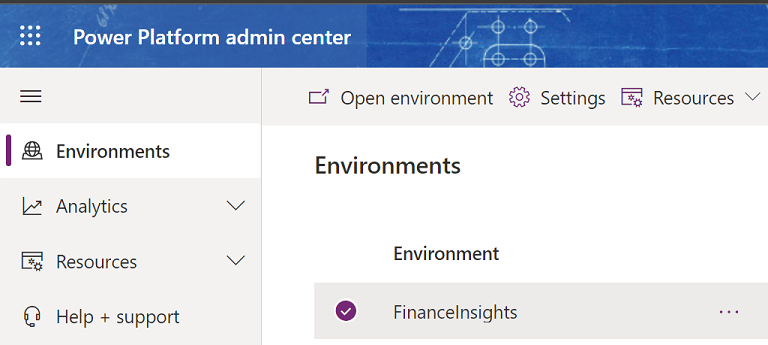

---
# required metadata

title: Configuration for Finance Insights (preview)
description: This topic walks through the configuration steps that will enable your system to the capability that's available in Finance Insights. 
author: ShivamPandey-msft
manager: AnnBe
ms.date: 07/20/2020
ms.topic: article
ms.prod: 
ms.service: dynamics-ax-applications
ms.technology: 

# optional metadata

ms.search.form: 
# ROBOTS: 
audience: Application User
# ms.devlang: 
ms.reviewer: roschlom
ms.search.scope: Core, Operations
# ms.tgt_pltfrm: 
ms.custom: 14151
ms.assetid: 3d43ba40-780c-459a-a66f-9a01d556e674
ms.search.region: Global
# ms.search.industry: 
ms.author: shpandey
ms.search.validFrom: 2020-07-20
ms.dyn365.ops.version: AX 10.0.13

---
# Configuration for Finance Insights (preview)

[!include [banner](../includes/banner.md)]
[!include [preview banner](../includes/preview-banner.md)]

# Configuration for Finance Insights

Finance Insights combines functionality from Microsoft Dynamics 365 Finance, with the Microsoft Common Data Service (CDS), Microsoft Azure, and Microsoft AI Builder to provide powerful forecasting tools for your organizations. This topic walks through the configuration steps that will enable your system to the capability that's available in Finance Insights. 

## Deploy Dynamics 365 Finance

Deploy the environments by completing the following steps.

1. Create or update an F&O environment in Lifecycle Services (LCS). The environment needs App Version 10.0.11/Platform Update 35 or later versions.
  
2. The environment must be an HA environment in Sandbox (also known as a Tier-2 environment).For more information, see [Environment planning](../../fin-ops-core/fin-ops/imp-lifecycle/environment-planning.md).

3. If you are using Contoso demo data, you'll need additional sample data to use Customer payment predictions, Cashflow forecasts, and Budget forecasts. Complete the following steps at <TBD> to add the sample data needed [Sample data instructions](https://microsoft.sharepoint.com/:f:/t/FinancialsRDAll909/Essk-ZaYVvxPrKNIHmbJNS8BWKCMxcMsubO_NVxECcsLfg?e=iwOR9e).

  
## Configure the Common Data Service 

1. Create a new Common data services environment in the same Active Directory Tenant. To do this, open the Environments page on the [Power Platform admin center](https://admin.powerplatform.microsoft.com/).
   
      
   
 2. Click +New environment
  - Select a Sandbox for the environment Type.
  - Set **Create Database** to **Yes**. 
  - Click **Next**.
  - Select the language and currency for your organization.
  - Accept the default values for the other options.
  - Click **Save**.
  - Navigate to the environment page, and then refresh the environments page. When the **State** shows **Ready**, complete the following steps. 
   - Record the CDS Organization ID.
   - Select the environment and click **Settings**.
   - Click **Resources > All Ledgacy Settings**.
   - Click **Settings** on the top bar and select **Customizations**.
  - Click **Developer Resources**.
  - Record the Instance Reference Information ID as the CDS Organization ID.
  - From the address bar in the browser, record the CDS Organization URL, such as &lt;https:/org42b2b3d3.crm.dynamics.com&gt;
  - Record the CDS Directory ID. It is the same ID as your user’s Azure Active Directory ID. 
   - Go to the [Azure portal](https://portal.azure.com). 
   - Log in using the user ID that was used to create the CDS environment. 
   - Copy the Tenant ID and record it as the CDS Dicretory ID. 
  - Record the user's Azure Active Directory object ID.
   - Go to Users and search for the user by email.
   - Click on the user's name. 
   - Copy the Object ID as the CDS Initial User Object ID. 
3. If you plan to use Cash flow forecasts, or Budget forecasts, also update the annotation limit for your organization to at least 50 MB. To do so, complete the following steps. 
  - Go to the [Power Apps](https://make.powerapps.com) portal. Select the environment you created above and click **Advanced settings**.
  - Click **Settings > Email Configuration**.
  - Change the **Maximum file size** (in kilobytes) to 51,200.
  - Click **OK** to save the changes.
     

  
  
