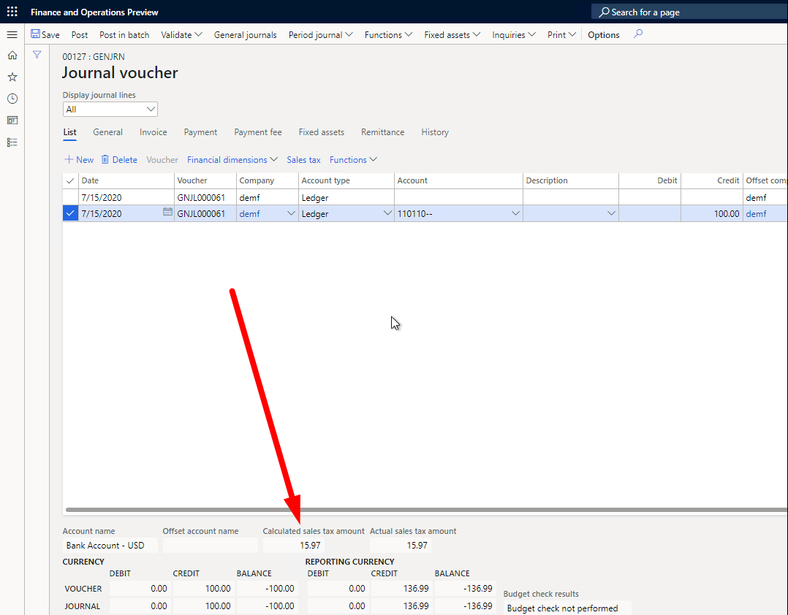

---
# required metadata

title: Tax Calculation performance impacts the transaction
description: This topic provides troubleshooting information related to Tax Calculation performance and the impact on transactions.
author: shtao
manager: beya
ms.date: 04/07/2021
ms.topic: article
ms.prod: 
ms.service: dynamics-ax-applications
ms.technology: 

# optional metadata

# ms.search.form:
audience: Application user
# ms.devlang: 
ms.reviewer: kfend
ms.search.scope: Core, Operations
# ms.tgt_pltfrm: 
# ms.custom: 
ms.search.region: Global
# ms.search.industry: 
ms.author: wangchen
ms.search.validFrom: 2021-04-01
ms.dyn365.ops.version: 10.0.1
---

# Tax Calculation performance impacts the transaction

[!include [banner](../includes/banner.md)]

There are times when a transaction is impacted by Tax Calculation performance issues. Complete the steps in the following sections as needed, to troubleshoot the issue.

## Check the transaction line count
Check whether the transaction has a large number of lines, for example more than several hundred. If the transaction does have several hundred lines, delay the tax calculation. For more information, see [Enable delayed tax calculation on journals](enable-delayed-tax-calculation.md). If the transaction doesn't have that many lines, move to the next section. 

Next, you can check for the following:

  - Import transactions from large files.
  - Multiple sessions that process the same transaction tax calculation at the same time.
  - A transaction has multiple lines and the views refresh in real time. For example, the **Calculated sales tax amount** field on the **General journal** page refreshes in real time when line's fields changed.

If any of these are true, delay the tax calculation. 

   

## Check call stack 
Check the call stack to verify whether tax calculation is called multiple times. If yes, reduce the tax calculation times according to the following steps. If it isn't, skip to the next section.

1. If the journal has considered the transaction, see [Enable delayed tax calculation on journals](enable-delayed-tax-calculation.md) to delay tax calculation.
2. If it's a purchase order and the application version is higher than 10.0.15, enabling the flighting for **PurchTableChangeMgmtDistributionUpdateOnToggle_KillSwitc**h can delay the tax calculation until the final calculation.

## Check the call stack timeline 
Check the call stack timeline to confirm whether the following issues exist. If they do, enable the flighting, **TaxUncommittedDoIsolateScopeFlighting** to resolve the issue.

- The transaction results in the system hanging until the session ends. The transaction can't calculate the tax result.

     

- The **TaxUncommitted** methods cost more time than other methods. For example, **TaxUncommitted::updateTaxUncommitted()** costs 43,347.42 seconds, but other methods cost 0.09 seconds.

     

## Customizing and calling Tax Calculation
When you are customizing, don't call tax calculation at the insert() or update() for each line. Tax calculation should be called at the transaction level.

## Verify customization
If you have completed the steps in the previous sections and no issue is found, check whether customization exists. If it doesn't, create a Microsoft service request for further support.

[!INCLUDE[footer-include](../../includes/footer-banner.md)]
