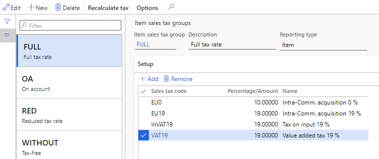
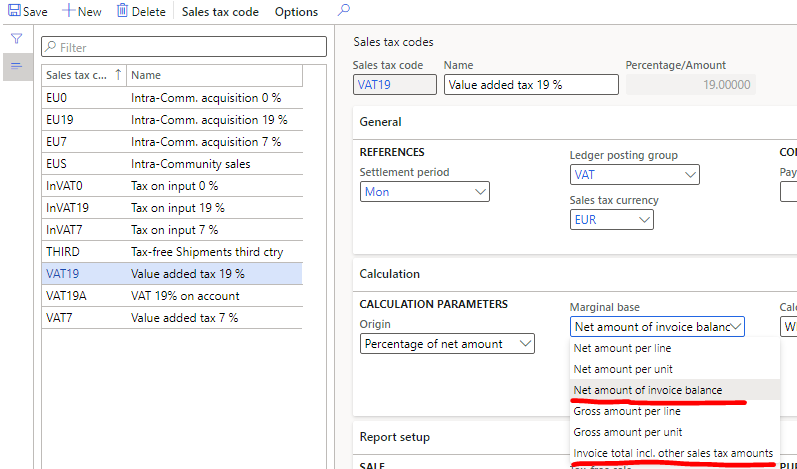

---
# required metadata

title: Tax isn't calculated or the tax amount is zero
description: This topic provides troubleshooting information related to zero tax or tax that isn't calculated.
author: shtao
ms.date: 04/01/2021
ms.topic: article
ms.prod: 
ms.service: dynamics-ax-applications
ms.technology: 

# optional metadata

# ms.search.form:
audience: Application user
# ms.devlang: 
ms.reviewer: kfend
ms.search.scope: Core, Operations
# ms.tgt_pltfrm: 
# ms.custom: 
ms.search.region: Global
# ms.search.industry: 
ms.author: wangchen
ms.search.validFrom: 2021-04-01
ms.dyn365.ops.version: 10.0.1
---

# Tax isn't calculated or the tax amount is zero

[!include [banner](../includes/banner.md)]

A transaction can have a line amount that isn't equal to zero, but the tax isn't calculated, or the calculated tax amount is zero. Complete the steps in the following sections as needed, to troubleshoot the issue. 

## Verify tax codes are selected correctly by the transaction

Check whether the transaction selects the tax codes correctly. If the transaction doesn't pick the correct tax codes, or any tax codes, taxes won't be calculated on the transaction.

  1. On the transaction line, select **Line details** > **Setup** > **Sales tax** and verify that the **Item sales tax group** and **Sales tax group** fields have the correct tax groups selected. If not, select the correct tax groups.

     

  2. Go to **Tax** > **Indirect taxes** > **Sales tax** > **Sales tax groups**.
  3. Select the appropriate sales tax group, expand the **Setup** FastTab, and note the tax code in the **Sales tax code** field.
  5. Go to **Tax** > **Indirect taxes** > **Sales tax** > **Item sales tax groups**. 
  6. Select the appropriate item sales tax group, expand the **Setup** FastTab and verify that the tax code in the **Sales tax code** field is the same as the tax code for the sales tax groups.
  7. If the tax codes aren't the same, update one of the groups with the correct sales tax code.

     

     

## Verify the selected tax codes aren't exempt and have the correct tax rate value
Check whether the selected tax codes are exempt and verify if the codes have the correct tax rate applied. If the tax code is exempt or the tax rate is 0, the tax calculation result is 0.

1. Go to **Tax** > **Indirect taxes** > **Sales tax** > **Sales tax groups**.
2. Select the appropriate sales tax group and on the **Setup** FastTab,, make sure **Exempt** check box isn't selected. If the check box is selected, unmark it.

     

3. Go to **Tax** > **Indirect taxes** > **Sales tax** > **Sales tax codes**.
4. Select the appropriate sales tax code and in the **Value** field, verify that tax rate value is not equal to zero. If the tax rate is zero, update the field with thecorrect tax rate.

     

## Verify whether zero is correct
There are some scenarios where zero tax is the correct result. Verify whether that is the case for your transaction.

  1. Go to **General ledger** > **Ledger setup** > **General ledger parameters** > Sales tax* to check whether the tax calculation method is Total.

     

  2. Go to *Tax > Indirect taxes > Sales tax > Sales tax codes > The sales tax code > Calculation > Marginal base* to check the marginal base is *Net amount of invoice balance* or *Invoice total incl. other sales tax amounts*. Refer to https://docs.microsoft.com/en-us/dynamics365/finance/general-ledger/marginal-base-field#invoice-total-incl-other-sales-tax-amounts 

  3. If one of step 3.a or step 3.b is met, then check whether the transaction's total amount is 0. If yes, the zero tax is the expected result. Because the tax calculation base on the total amount of the invoice balance, not line by line, after the tax calculation, the zero tax will be allocated to each line. So the expected is 0 and 0, not 190 and -190. 

     

## Verify customization 
If you have completed the steps in the previous sections and no issue is found, check whether customization exists. If it doesn't, create a Microsoft service request for further support.

[!INCLUDE[footer-include](../../includes/footer-banner.md)]
