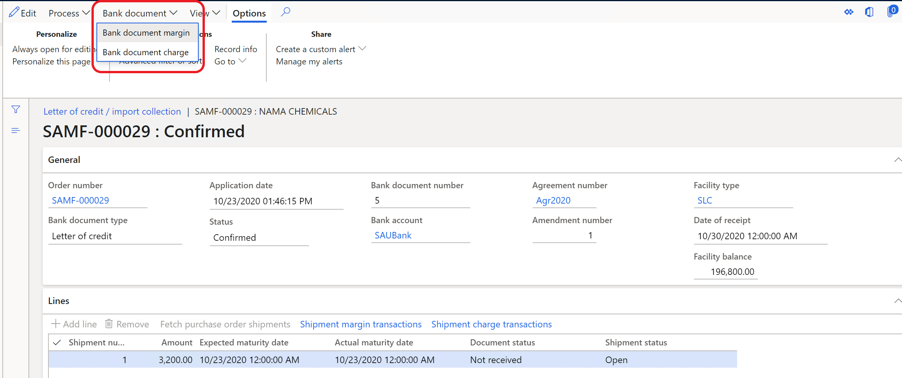

---
# required metadata

title: Allocate bank document charges to shipment.
description: This topic explains how you can allocate document bank charges to shipment in a purchase order
author: v-oloski
manager: 
ms.date: 
ms.topic: article
ms.prod: 
ms.service: dynamics-ax-applications
ms.technology: 

# optional metadata

ms.search.form: 
audience: Application User
# ms.devlang: 
ms.reviewer: 
ms.search.scope: Core, Operations
# ms.tgt_pltfrm: 
# ms.custom: 
ms.search.region: Saudi Arabia
# ms.search.industry: 
ms.author: v-oloski
ms.search.validFrom: 2019-11-29
ms.dyn365.ops.version: 10.0.8

---
 
# Allocate bank document charges to shipment

[!include [banner](../includes/banner.md)]

This functionality allows a user to allocate bank document charges, posted in
the general journal, to purchase order lines. Purchase order should have related
**Credit of letter** or **Import collection**.

Fist you have to go through the procedures, described in [Set up bank facilities
and posting profiles for letter of
credit](https://docs.microsoft.com/en-us/dynamics365/finance/cash-bank-management/tasks/set-up-bank-facilities-posting-profiles-letter-credit).

How to create a purchase order with Letter of credit/Import collection see
[Import letter of
credit](https://docs.microsoft.com/en-us/dynamics365/finance/cash-bank-management/tasks/import-letter-credit).

## Setup of charge code for bank document charges

Before using this functionality set up special charge code (**Accounts payable** \>
**Setup** \> **Charges setup** \> **Charges code**) for bank document charges.

Set **Item** in the **Type** field in the **Debit** group. When you set Item in
the **Type** field the option **Bank document charge code** is available for
edit. Set this option to **Yes** and **Type** in **Credit** group is filled in
automatically and unavailable for editing.

## Allocation of bank document charges

Follow up the procedure, described below:

1.  Create a purchase order with Letter of credit or Import collection (see
    [Import letter of
    credit](https://docs.microsoft.com/en-us/dynamics365/finance/cash-bank-management/tasks/import-letter-credit)).
    Pay attention please that Letter of credit or Import collection should be
    confirmed in order to allocate bank document charges

2.  Create and post bank document charges in a **General journal** (**General
    ledger** \> **Journal entries** \> **General journal**), click **Lines** and
    fill in the fields on Payment tab in **Letter of credit / Import collection**
    group in the line.

   > [!NOTE] The  **Offset account type** and **Offset account** fields are filled in automatically.

    Fill in **Account** and **Debit** fields on **List** tab.

    

3.  Open the Letter of credit/ Import collection that you created in the
    purchase order (**Active panel** \> **Manage** \> **Bank document**) and
    select **Bank document charge** on the **Letter of credit/ Import collection**
    page.

  You can see bank document charge that posted in the general journal for this Letter of credit/ Import collection.

   Select bank document charge transaction in the **Edit** mode and click the **Letter of credit/ Import collection** button to allocate the selected bank document charge to the lines of the Letter of credit/ Import collection.

   You can validate allocation clicking the **Shipment charge transactions** button in the **Lines** FastTab.

4.  To allocate shipment charge transactions to the purchase order lines, open
    **Maintain charges** page (on Action pane click Purchase \> Charges \>
    Maintain charges) and then click **Allocate** button. The Bank document
    charge, allocated to lines Letter of credit/ Import collection, should
    appear in the list.
