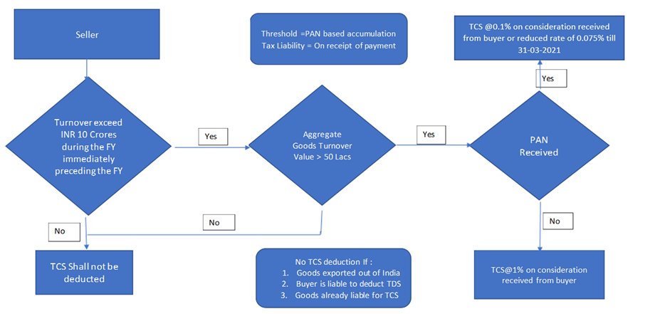
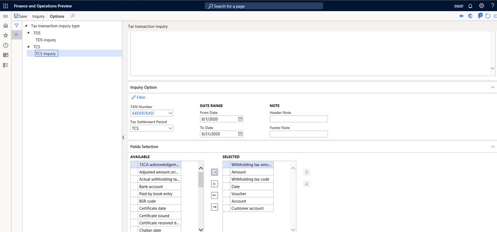

---
# required metadata

title: Create a business vertical
description: This topic explains how to create a business vertical. This task is part of the master data setup that is required to make the India localization solution for Goods and Services Tax (GST) available.
author: prabhatb
manager: EricWang
ms.date: 10/11/2020
ms.topic: article
ms.prod: 
ms.service: dynamics-365-applications
ms.technology: 

# optional metadata

# ms.search.form: 
audience: Application User
# ms.devlang: 
ms.reviewer: kfend
ms.search.scope: Core, Operations
# ms.tgt_pltfrm: 
# ms.custom: 
ms.search.region: India
# ms.search.industry: 
ms.author: kfend
ms.search.validFrom: 2020-09-01
ms.dyn365.ops.version: 10.0.13

---

# TCS on Sale of Goods under Section 206C(1H) 
## Introduction :
This document covers the functionality of the Tax collection at Source (TCS) on sale of goods. This feature describes how to do the basic setup for TCS  deduction on sale of goods transaction, calculate TCS on transactions from customer or on group of customer , TCS on transaction when customer do not have PAN number etc. 

As per section 206C (1H) TCS should be collected at the time of receipt of payment from customer in view of this interim accounting is introduced for this feature. Where TCS amount will be posted to interim account and added to invoice value at the time of issuance of  invoice and liability of TCS will be recorded in the books at the time of receipt of payment. 

Another important aspect of this feature is that if multiple customer have same PAN number than accumulate transaction amount will be taken to compare with threshold limit to determine the eligibility of transaction for TCS deduction. 

## Base amount for TCS deduction: 
No specific clarification is available regarding base amount for TCS deduction on sale of goods, in absence of any specific provision or circular or clarification by CBDT, it is unclear as to whether TCS will be levied on GST charged in invoice or not.

There are two views whether TCS on Sales value including GST or excluding GST. Both views are supported by different analysis. However, till the clarification by CBDT, it will be more appropriate that TCS should be collected on Sales Value including GST.

## PAN based accumulation of transaction of multiple customers: 
In case of TCS on “sale of goods” deduction of TCS will be made based on PAN number. If multiple customers have same PAN number than all transactions executed by different customers have same PAN will be accumulated and compared against threshold limit prescribed by the government. 

User has option to accumulate purchase threshold based on PAN number of vendors like customers. However, accumulation will take place based on vendor or customer within one legal entity. Inter legal entity accumulation will be out of scope. 

## The point of collection of tax 
As per the interpretation of TCS on sales of goods u/s 206C (1H), tax should be collected ‘at the time of receipt’ . It is clarified under law that TCS on sales of goods will be collected when actual payment is received by the seller.
However to collect TCS on sale of goods, the seller needs to raise sale invoice including the amount of TCS, account in the books as a TCS liability even in actual sense it is not payable. Even though the TCS amount is debited to the buyer, the liability under Section 206C (1H) does not arise until the time the amount is collected. In order to cater this requirement new option “Tax liability on payment” is added under “Withholding tax group”. 
On marking this option system will activate “interim account” field under the withholding tax code. At the time of posting of sale of goods invoice Tax amount will be posted to “Interim TCS payable account” and debit to “customer account”. When user receive payment from buyer at that time system generate “Related voucher” for posted invoice transaction to accrue TCS liability on payment.

## TCS on Advance receipt of payment: 

Every time the seller receives part of the sale consideration in advance, the seller is mandated to deduct TCS under Section 206C(1H). The difficulty arises in the calculation of the amount when TCS is deducted on multiple advance payment transaction and when payments transactions are adjusted against Invoice amount. Currently in the system user must manually adjust the TCS amount computed on invoice transaction to ensure that TCS amount on invoice is equal to TCS amount on payment.

## The feature is supported in following or later versions of Finance:
- Dynamics 365 Finance versions:
- 10.0.12
- 10.0.13

## Steps to do setup for TCS on sale of goods: 
** Please note that it is mandatory for user to apply “Advance threshold” feature to enable deduction of TCS on sales of goods scenarios.** 

## Create new withholding tax code “Sale of goods”: 
** Tax>Setup>withholding tax code >Sale of goods **
When user attach “withholding tax component” of type “TCS” new field “Interim account” will enable.
Do not select any account until mark check box “Tax liability on payment” under “Withholding tax group. 
Select “Enable threshold hierarchy”- “Yes”. 
On selection of “Yes” “PAN based accumulation “option will enable
User can mark this option if dealing with customers have same PAN number. 

## Create new withholding tax group “Sale of goods.” 
** Tax>setup>withholding tax group>Sale of goods ** 
Create withholding tax group with tax type “TCS” and mark check box “Tax liability on payment”-Yes.
After this go back to withholding tax code form and select  “ “Interim TCS payable account” in the field “Interim account”  created in the chart of account with posting type “India withholding tax (TCS)
Include GST tax component if part of TCS base amount calculation under field “Include GST tax component for TDS or TCS calculation “
If charges are not part of TCS calculation selection “Yes” under field “Exclude charges for TDS or TCS calculation” 
Click on “Designer” button on action pane and define TCS calculation formula.

## Define Threshold definitions: 
** Navigate to Tax > Setup > Threshold definitions**
Define threshold definition for “Sale of goods.” 
Two threshold slabs have to be defined. 
- 0-Max 
- Max-0 

## TCS Threshold setup for “Sale of goods” 
TCS on sales of goods apply on single customer or multiple customers having same PAN number. 
If customer PAN number is not available higher tax rate will apply after crossing the exempted turnover amount.
If customer have PAN number than lower tax rate will apply. 
Users need to define threshold reference for customers: 

## Click on Threshold designer 

Define two slabs with option:
 -	With PAN number
 - Without PAN number 
Define separate TCS rate for each option. 
When defining calculation basis for exempted slab
  - Calculate tax – No
(Another option Calculate tax – Yes and value – 0)  
  - Calculate previous non-tax transactions-No.
  -  Include in turnover base – Yes. 
When defining calculation basis for Taxable slab
 -	Calculate tax – Yes.
 -  Calculate previous non-tax transactions-No.
 - 	Include in turnover base – Yes. 

## Activate calculation of TCS for customer: 
** Accounts Receivable>Customers > All customers **

## Posting of Invoice: 
** When invoice is posted, and the accumulated transaction cross the threshold limit following accounting entry is posted:**

## TCS rate @ 0.1% (If PAN number is available ) 
** Note : TCS rate would be 0.0750% from 1st October - 31st March,2020 ** 
** Invoice is posted as below:** 

## TCS liability will arise on collection of payment
When user receive payment and attach Invoice with payment transaction, TCS amount is computed on full payment amount and reverse through related voucher. However, one more related voucher is generated with Invoice to show tax liability recognition in books for eligible amount only. 

Related voucher will generate as below: 

** Important:**  
One more related voucher will generate with posted sales Invoice to book actual TCS liability. 
Users have to go to posted sales invoice voucher and check the related voucher entry. 

** Note: In case of purchase transaction where vendor is deducting TCS, user have to create new TCS withholding group **

** TCS on Purchase of goods deducted by vendor: 
In case TCS is deducted against the organization by the selling vendor, user must create separate withholding tax group “TCS on purchase of goods”. In the “Withholding tax group” under field group “Apply threshold” mark check box “PAN based accumulation “. User must define threshold definition for vendor and attach withholding tax group with the¬ respective vendor. On posting purchase order TCS amount deducted by vendor posted to TCS recoverable account. 
Every Organization will claim credit of TCS deduction after reconciling the deduction with Form 26AS. 
** Go to Tax>>Inquiries and reports>TDS/TCS inquiry **
User can select required column fields to generate report. 

