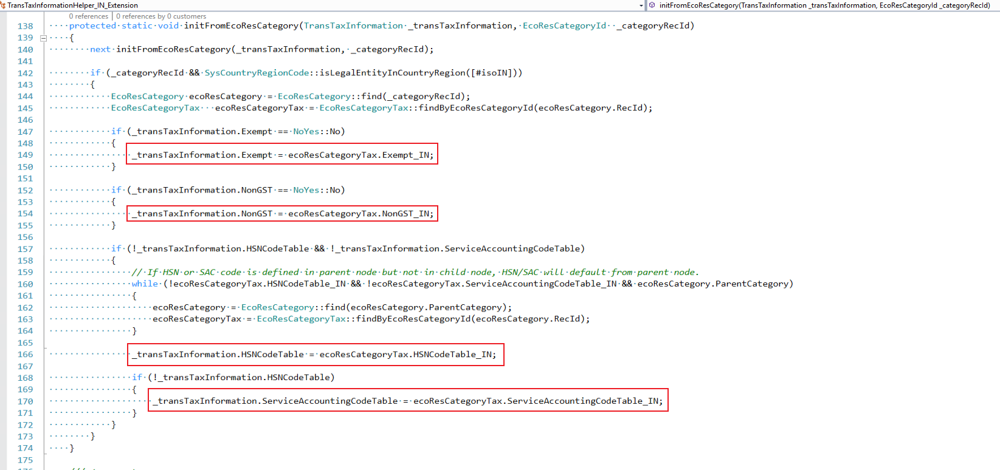
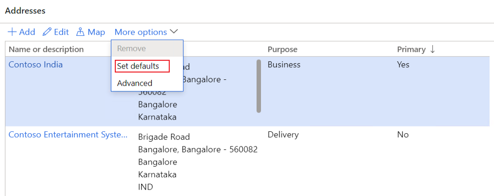
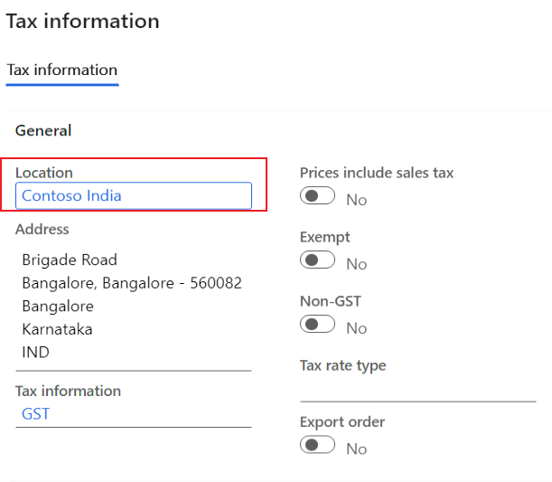
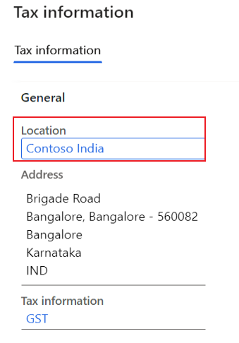

---
# required metadata

title: Default field value in tax information isn't as expected
description: This topic provides troubleshooting information to resolve the issue when the default values for tax information are't expected.
author: yungu
ms.date: 05/11/2021
ms.topic: article
ms.prod: 
ms.service: dynamics-ax-applications
ms.technology: 

# optional metadata

#ms.search.form:
audience: Application user
# ms.devlang: 
ms.reviewer: kfend
ms.search.scope: Core, Operations
# ms.tgt_pltfrm: 
# ms.custom: 
ms.search.region: India
# ms.search.industry: 
ms.author: wangchen
ms.search.validFrom: 2021-04-01
ms.dyn365.ops.version: 10.0.1
---

# Default field value in tax information isn't as expected

[!include [banner](../includes/banner.md)]

If the default value of a tax information field isn't as expected for one of the following fields, complete the sections in this topic to troubleshoot and resolve the issue.     

  - Company location
  - HSN/SAC 
  - Price inclusive

> [!NOTE]
> If there are other tax information fields whose value isn't as expected, the general debug point is also provided at the end of this topic which can be applied to the fields. 

Under each of the following scenarios, the fields that the tax information field default value derived from are listed. The paths to these *derived from* fields are listed in appendix.

## Company location

The default company location is determined based on different scenarios. For some scenarios, only one location is listed and it's used as default company location. In others, there is a sequential list with all the possible locations to be used as a default company location. Check the locations by following the list sequence until a location exists in your system. This location is used as the default company location.

### Scenario: Project contract

Set a breakpoint at the company primary address location and start debugging. 

  

### Scenario: Project

Set a breakpoint at the project contract company location and start debugging.

### Scenario: Project related transactions

For transactions without inventory dimensions, includingHour journal, Expense journal, Fee journal, project on account, and subscription, set a breakpoint at the company location and start debugging.

 

The following list includes transactions with inventory dimensions. These transaction types include, item journals and project sales orders.

  - Warehouse default location for delivery purpose
  - Warehouse primary address location
  - Site default location for delivery purpose
  - Site primary address location
  - Company default location for delivery purpose
  - Company primary address location

Set a breakpoint at **locationFetchedBasedOnInventDim** for these transactions with inventory dimensions, and start debugging.

   

### Scenario: Transactions not related to project

The following is a list of transactions that aren't related to a project and the corresponding company location fields.
    
   - Free text invoice/General journal: 

       - Company primary address location
    
   - Other transactions:

       - Warehouse default location for delivery purpose
       - Warehouse primary address location
       - Site default location for delivery purpose
       - Site primary address location
       - Company default location for delivery purpose
       - Company primary address location
  
Set a breakpoint at **transTaxInformation.CompanyLocation** and start debugging.
  
  
  
## HSN/SAC/Exempt/NonGST

The default HSN/SAC is determined differently based on the scenario. In some scenarios, only one value is listed under the scenario. This value is used as the default HSN/SAC/Exempt/NonGST. In other scenarios, there is a sequential list with all possible default values that can be used as the default HSN/SAC/Exempt/NonGST. Check the values by following the list sequence until a value exists in your system. This value used as default HSN/SAC/Exempt/NonGST in the tax information.

### Scenario: Non-project transactions related to an inventory item or released product

When the HSN/SAC/Exempt/NonGST is an inventory item or rleased product, set a breakpoint there and start debugging to find the default HSN/SAC/Exempt/NonGST.

  

### Scenario: Non-project transactions related to procurement category

When the HSN/SAC/Exempt/NonGST is a procurement category, set a breakpoint there and start debugging to find the default HSN/SAC/Exempt/NonGST.

 

### Scenario: Project transactions

For project transactions, the HSN/Exempt/NonGST is assigned differently.

  - Project tax information HSN/Exempt/NonGST

     Debug point

     

  - Inventory item HSN/Exempt/NonGST (Item journal, project sales order)

     Debug point

     

- - **Field: SAC**

    1. Project tax information SAC

       Debug point

       

    2. Inventory Item SAC (Item journal, project sales order)

       Debug point

       

    3. Project category SAC

       Debug point

       

## Price inclusive

The **Price inclusive** field is set in the tax information for the transaction line if a specific condition is met.

### Scenario: Non-project related transactions

In the General ledger journal, the journal header is marked as price inclusive. The customer or vendor account that is used on the journal line is marked as the default for the **Price inclusive** field. 

For other non-project related transactions, the transaction header is marked as price inclusive. 

### Scenario: Project related transactions

The general ledger journal header is marked as price inclusive. The customer or vendor account that is used on the journal line is marked as the default for the **Price inclusive** field. Any tax information for the project and the account used in the project is also marked as price inclusive. 

For other project related transactions, the transaction header is marked as price inclusive as is the project tax information and the account used in the project.

## Other fields

To check the default value for a certain field in tax information, set breakpoints and start debugging as explained in the following scenarios.

### Scenario: Non-project related transactions

  - - **Debug point**

      

      

### Scenario: Project related transactions

  - - **Debug point**

      

## Appendix: Find the fields related to default values in tax information

### Fields from which the company location is derived from

- **Company default location for delivery purpose**

    - Navigation path: **Organization administration** > **Organizations** > **Legal entities** > **Addresses**. Then select **"More options** > **Set defaults**.

      

      For the default address, **Delivery** is selected in the **Purpose** field.

      

- **Company primary address location**

  - Navigation path: **Organization administration** > **Organizations** > **Legal entities** > **Addresses**. You can see that the **Primary** field is marked as **Yes**.

      

- **Site default location for delivery purpose**

  - Navigation path: **Inventory management** > **Setup** > **Inventory breakdown** > **Sites** > **Addresses**, and then select **Set defaults**.

      

      For the default address, **Delivery** is selected in the **Purpose** field.

- **Site primary address location**

  - Navigation path: **Inventory management** > **Setup** > **Inventory breakdown** > **Sites** > **Addresses**. You can see that the **Primary** field is marked as **Yes**.

- **Warehouse default location for delivery purpose** 

  - Navigation path: **Inventory management** > **Setup** > **Inventory breakdown** > **Warehouses** > **Addresses**, and on the **Addresses** page, select **Set defaults**.

      For the default address, **Delivery** is selected in the **Purpose** field.

- **Warehouse primary address location**

  - Navigation path: **Inventory management** > **Setup** > **Inventory breakdown** > **Warehouses** > **Addresses**. You can see that the **Primary** field is marked as **Yes**.

- **Project contract tax information company location**

  - Navigation path: **Project management and accounting** > **Projects** > **Project contracts**. Select the project contract, and on the Action Pane, on the **Project contract** tab, in the **Attachments** group, select **Tax information**.

      

      The company location that is used is on the **Tax information** page, in the **Location** field. 

      

- **Project tax information company location**

  - Navigation path: **Project management and accounting** > **Projects** > **All projects**. Open the project and on the Action Pane, on the **Project** tab, in the **Setup** group, select **Tax information**.

      

      The company location that is used is on the **Tax information** page, in the **Location** field. 

     

### HSN/SAC/Exempt/NonGST derived from fields

- **Inventory item**

  - Navigation path: **Product information management** > **Products** > **Released Products**. Open the released product record, and in the **GST** field group, note the field values and selections in the **HSN**, **SAC**, **Exempt**, and **NonGST** fields.

      

- **Procurement category**

    - Navigation path: **Procurement and sourcing** > **Consignment** > **Procurement categories**. Open the category, and on the **Tax information** FastTab, note the field values and selections in the **HSN**, **SAC**, **Exempt**, and **NonGST** fields.

      

- **Project tax information**

  - Navigation path: **Project management and accounting** > **Projects** > **Project contracts**. Select the project contract, and on the Action Pane, on the **Project contract** tab, in the **Attachments** group, select **Tax information**.

      

- **Project category**

  - Navigation path: **Project management and accounting** > **Setup** > **Categories** > **Project categories**. Open the project category, and on the **Projecsts** FastTab, in the **GST** field group, note **Service accounting code** (SAC) field value.

      

## Price inclusive derived from fields

- **Customer**

    - Navigation path: **Accounts receivable** > **Customers** > **All customers**

      Open the customer record, and on the **Invoice and delivery** FastTab, note the selection in the **Prices include sales tax** field.

      

- **Vendor**

    - Navigation path: **Accounts payable** > **Vendors** > **All vendors**.

      Open the vendor record, and on the **Invoice and delivery** FastTab, note the selection in the **Prices include sales tax** field.

      

    
[!INCLUDE[footer-include](../../includes/footer-banner.md)]
