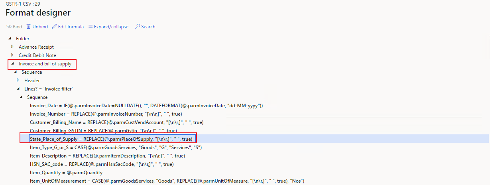

---
# required metadata

title: Incorrect field values in the GSTR report result
description: This topic provides troubleshooting information to help resolve the issue of incorrect field values in a generated report.
author: yungu
ms.date: 04/27/2021
ms.topic: article
ms.prod: 
ms.service: dynamics-ax-applications
ms.technology: 

# optional metadata

#ms.search.form:
audience: Application user
# ms.devlang: 
ms.reviewer: kfend
ms.search.scope: Core, Operations
# ms.tgt_pltfrm: 
# ms.custom: 
ms.search.region: India
# ms.search.industry: 
ms.author: wangchen
ms.search.validFrom: 2021-04-01
ms.dyn365.ops.version: 10.0.1
---


# Incorrect field values in the GSTR report result

[!include [banner](../includes/banner.md)]

When the GSTR report is generated, some of the field values might be incorrect. If this occurs, complete the steps in this topic to try and resolve the issue.
This topic will use the field value, **State of supply** from the **Invoice and bill of supply** field in legal entity, GSTR-1 as an example.

## Check if the issue is related to Microsoft Excel

Refer to [Details for issue 459982 (dynamics.com)](https://fix.lcs.dynamics.com/Issue/Details?bugId=459982&dbType=3&qc=38e839da1be8c7ec9b71b65e4c8607efe79c434c1c3dbcd2e1d86b9ba08b78a0) to see if this issue is related to Excel. If it is, resolve the issue according to LCS, or remove the special character, quote mark ("). If the issue isn't related to Excel, continue to the next section.

## Check the Report controller setup

- Go to **Tax** > **Setup** > **Tax configuration** > **Tax setup** > **Configurations**, and on the **Report configurations** tab, verify that the correct report controller is selected. If the wrong controller is selected, select the correct controller. If the correct controller was selected, continue to the next section.

     [](./media/field-value-incorrect-in-GSTR-report-result-Picture1.png)
     
## Check the value in TaxDocumentRowTransaction 

- Execute the following SQL query to check if the value of **TaxDocumentRowTransaction** is correct. 

> [!NOTE]
> In the query, 'xx' is the invoice number from the GSTR report. Find it in your report and replace it.

  ```sql
  select * from TaxDocumentRowTransaction T1 
       inner join TaxDocumentRowTransaction_IN T2
  on T1.RecId = T2.TaxDocumentRowTransactionRecId
       inner join TaxDocumentExtension_IN T3
  on T2.TaxDocumentExtension = T3.RecId
       where T3.TaxTransactionId = 'xx'; 
  ```

 [](./media/field-value-incorrect-in-GSTR-report-result-Picture2.png)
 
If the value is wrong, the issue is related to posting. To resolve the issue, see [Field value in invoice journal or voucher is wrong](./apac-ind-GST-troubleshooting-invoice-journal-wrong.md). IF the value is correct, move to the next section.

## Verify that the field value transferred to the GSTR report

1. Go to **Workspaces** > **Electronic reporting** > **Reporting configurations**.
2. Select the configuration, and then select **Format designer**.
3. On the **Format designer** page, select the **Mapping** tab. 

     [](./media/field-value-incorrect-in-GSTR-report-result-Picture3.png)

4. In the tree, find the report name, and then expand **report name** > **Sequence** > **Lines** > **Sequence** and verify that the field mapping is correct. In the example for this topic, it should be, **parmPlaceOfSupply**.

     [](./media/field-value-incorrect-in-GSTR-report-result-Picture4.png)

5. Go to the **TaxGSTRReportContract_IN** class, and search in the report configuration to check if the field mapping exists. In the example for this topic, you would search on "**parmPlaceOfSupply**" in the **TaxGSTRReportContract_IN** class. If the field mapping doesn't exist, report the bug to Microsoft. Otherwise, continue to the next section.

     [](./media/field-value-incorrect-in-GSTR-report-result-Picture5.png)

## Debug code to analyze the field logic

1. Find references of the method as explained earlier in the topic.
2. Set breakpoints in the places where the method is called, and then debug it.

   [](./media/field-value-incorrect-in-GSTR-report-result-Picture6.png)

## Determine whether customization exists

If you've completed the steps in the previous section but have found no issue, determine whether customization exists. If no customization exists, create a Microsoft service request for further support.


[!INCLUDE[footer-include](../../includes/footer-banner.md)]
