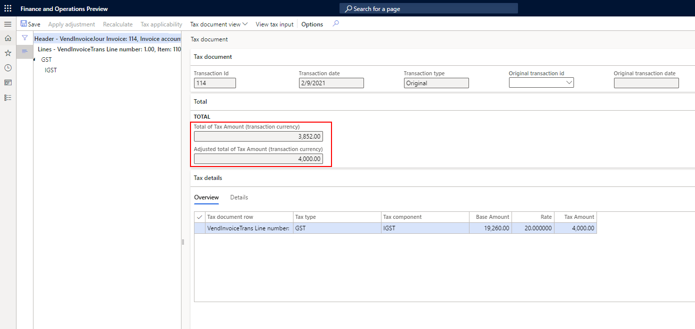

---
# required metadata

title: Tax amount is wrong after calculation
description: This topic provides troubleshooting information that helps you resolve the issue when the calculated tax amount is incorrect.
author: hailxu
ms.date: 04/28/2021
ms.topic: article
ms.prod: 
ms.service: dynamics-ax-applications
ms.technology: 

# optional metadata

#ms.search.form:
audience: Application user
# ms.devlang: 
ms.reviewer: kfend
ms.search.scope: Core, Operations
# ms.tgt_pltfrm: 
# ms.custom: 
ms.search.region: India
# ms.search.industry: 
ms.author: wangchen
ms.search.validFrom: 2021-04-01
ms.dyn365.ops.version: 10.0.1
---

# Tax amount is wrong after calculation

[!include [banner](../includes/banner.md)]
 
Complete the sections in this topic if the calculated tax on a business document is incorrect. In this topic, a purchase order is used as an example.

## Verify the tax rate is correct

1. Go to **Tax** > **Setup** > **Tax configuration** > **Tax setup**.
2. On the **Tax setup** page, select the company you are working in, and then select **Setup**.

   

3. On the tax document, go to the **Header** > **Lines** > **GST** > **CGST** > **Rate** to find the corresponding rate node.
4. Based on the conditions, see if your transaction matches the correct rate. You can view transaction details on the Tax document by selecting **View tax input**. For more information, see [Tax isn't calculated](apac-ind-GST-troubleshooting-tax-not-calculated.md)

   

**Step 2: Check if the tax base is wrong.**

1. Check the number of tax document lines matches the actual number of transactions lines. If no, please refer to [Tax is not calculated](./apac-ind-GST-troubleshooting-tax-not-calculated.md) to check if some lines don't match the condition that defined in tax configuration.

2. Check the tax information of all lines are correctly set, some setting may impact the calculation of  the tax base, such as, *Exempt, Prices include sales tax, Non-GST.*

   Exempt: GST will not be calculated.

   Prices include sales tax: GST will be included in the price.

   Non-GST: Tax with tax type other than GST (Such as VAT) will be calculated.

   

3. Check the "Price and discount" meets your requirement.

   

**Step 3: Check if the tax rate is correct.**

1. Open *Tax document*.

2. Compare Total of Tax Amount and Adjusted total of Tax Amount. If they are different, it means that adjustment was applied.

   

## Determine whether customization exists

If you've completed the steps in the previous sections but have found no issue, determine whether customization exists. If no customization exists, create a Microsoft service request for further support.

[!INCLUDE[footer-include](../../includes/footer-banner.md)]

