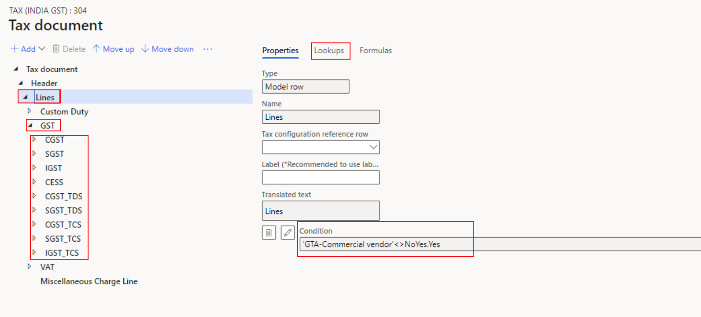
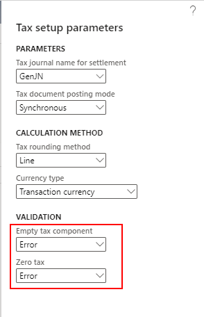

---
# required metadata

title: Tax isn't calculated
description: This topic provides troubleshooting information to resolve the issue when tax isn't being calculated on tax documents.
author: qire
manager: beya
ms.date: 04/28/2021
ms.topic: article
ms.prod: 
ms.service: dynamics-ax-applications
ms.technology: 

# optional metadata

#ms.search.form:
audience: Application user
# ms.devlang: 
ms.reviewer: kfend
ms.search.scope: Core, Operations
# ms.tgt_pltfrm: 
# ms.custom: 
ms.search.region: India
# ms.search.industry: 
ms.author: wangchen
ms.search.validFrom: 2021-04-01
ms.dyn365.ops.version: 10.0.1
---

# Tax isn't calculated

[!include [banner](../includes/banner.md)]

When you discover that there are tax component or tax document lines missing from a tax document, complete the sections in this topic to troubleshoot the issue.
For more information related to the Tax engine, components, or GTE, see [Tax engine overview](../general-ledger/tax-engine.md).

In this topic, a purchase order is used to show the troubleshooting process. 

## Check the tax applicability in tax configuration

1. Open the designer for the current tax configuration. For more information, see [Open the designer for the current tax configuration](apac-ind-GST-troubleshooting-open-designer-current-used-tax-configuration.md)  to open designer for current tax configuration.
2. If there are no tax document lines, select the **Header** node, and on the **Lookups** tab, verify that the condition is correct. 

      

3. If there are no tax component lines, verify that the condition is correct on the **Lookups** tab on the **Lines**, **Tax type**, and **Tax component** nodes. 

      

## Compare transaction details with other conditions

1. Select **Tax document** and then select the **Header** node.
2. Select **View tax input**. The transaction header details will be displayed. Verify that all the fields are set correctly for tax calculation.

     

3. Select the **Line** node, and then select **View tax input**. The transaction line details are displayed. Verify that all the fields are set correctly for tax calculation.

     

4. Compare the transaction fields in **Tax document** > **View tax input*** with the conditions found in the previous section.
5. Verify that all the fields match the corresponding conditions or lookups.

## Determine whether customization exists

If you've completed the steps in the previous sections but have found no issue, determine whether customization exists. If no customization exists, create a Microsoft service request for further support.

## Prevent posting transaction without GST calculated

To prevent posting a transaction without the GST calculated, complete the following steps to enable the feature, **[India] GTE calculation validation**.

1. Go to **Workspaces** > **Feature management**.
2. Find the feature, **[India] GTE calculation validation**, and then select **Enable now**.

     

3. Go to **Tax** > **Setup** > **Tax configuration** > **Tax setup**. Select the company in which you want to enable the validation, and then select **Parameters**.

   

4. In the dialog box, set up the validation parameter, **Empty tax component** and **Zero tax**, and then select **OK** to complete setup. 

      - **None**: No validation
      - **Warning**: Prompt a warning message, but the operaitons isn't blocked.
      - **Error**: Prompt a error message and block the posting operation.

   

   If someone tries to post a transaction without GST calculated, one of the following corresponding error messages will occur.

   - **No tax lines**: "No tax document lines are found in tax document. If it is not expected, please contact your system administrator, check the tax configuration, and try again."
   - **No tax component lines**: "No tax component is applicable for line %1, please contact your system administrator, check the tax setup, and try again. "
   - **Tax amount is zero**: "The tax amount is 0 for line %1, please contact your system administrator, check the tax setup, and try again."

> [!NOTE]
> Enabling the validation may also block some normal scenarios such as exempt or zero-rate scenarios. You must decide how to perform the validation setup based on your business.

[!INCLUDE[footer-include](../../includes/footer-banner.md)]
