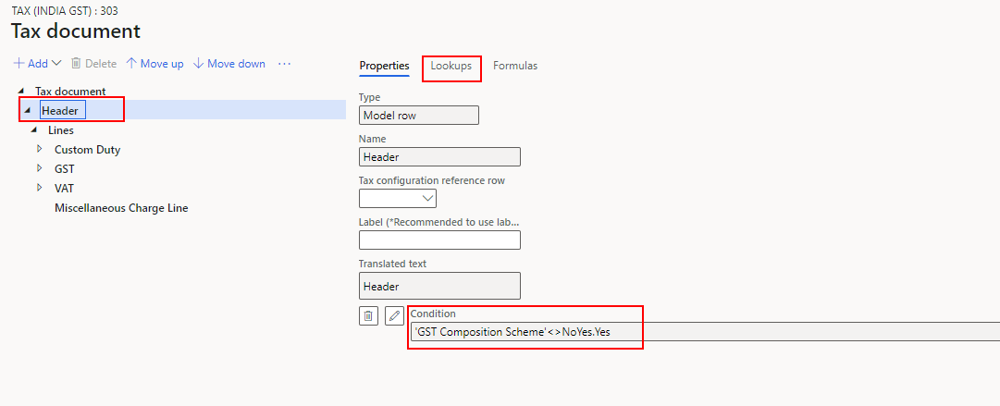
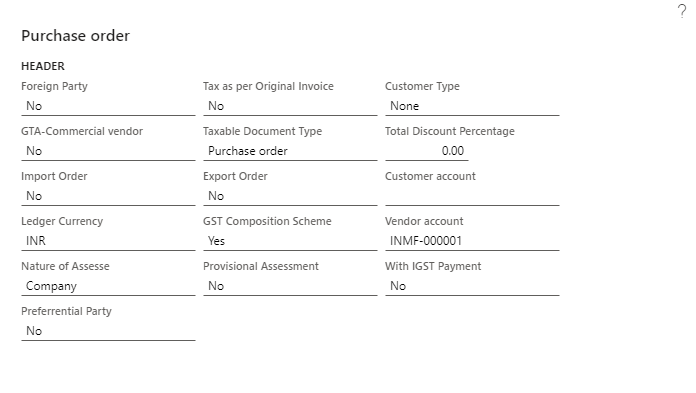
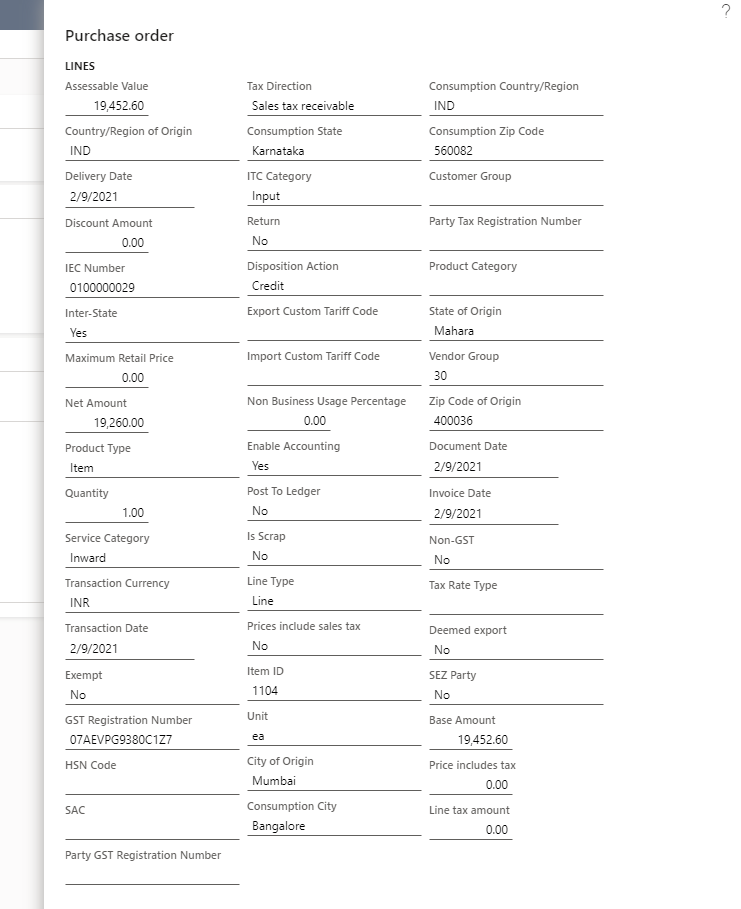
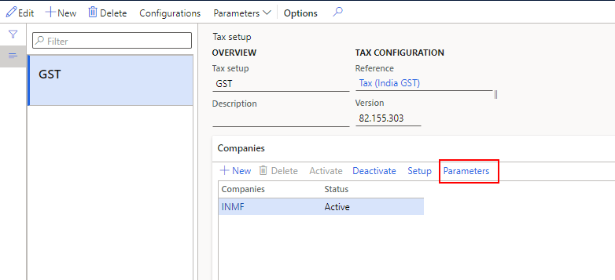

---
# required metadata

title: Tax is not calculated
description:
author: hailxu
manager: beya
ms.date: 02/04/2021
ms.topic: article
ms.prod: 
ms.service: dynamics-ax-applications
ms.technology: 

# optional metadata

#ms.search.form:
audience: Application user
# ms.devlang: 
ms.reviewer: kfend
ms.search.scope: Core, Operations
# ms.tgt_pltfrm: 
# ms.custom: 
ms.search.region: India
# ms.search.industry: 
ms.author: wangchen
ms.search.validFrom: 2021-04-01
ms.dyn365.ops.version: 10.0.1
---

# Tax is not calculated

[!include [banner](https://github.com/MicrosoftDocs/dynamics-365-unified-operations-public/blob/live/articles/finance/includes/banner.md)]

## Symptoms

- No tax component lines in Tax document.
- No tax document lines in tax document.

## Prerequisites

For concepts (e.g. Tax document, Tax components, etc.) related to Tax engine (aka. GTE), please refer to [Tax engine overview - Finance | Dynamics 365 | Microsoft Docs](https://docs.microsoft.com/en-us/dynamics365/finance/general-ledger/tax-engine).

## Trouble shooting guide

**In this document, we use Purchase order to show the trouble shooting process. For other transactions, you can also refer to the steps below.**

- **Step 1:     Check the tax applicability in tax configuration**

  1. Refer to [How to open designer of current used tax configuration](./apac-ind-GST-troubleshooting-open-designer-current-used-tax-configuration.md)  to open designer for current tax configuration.
  2. For no tax document lines case, check whether the *Condition/Lookups* on Header node are correct. 

  

  3. For no tax component lines case, check whether the *Condition/Lookups* on *Lines*, *Tax type* or Tax component nodes are correct. 

  

- **Step 2:     Compare the transaction details with the conditions that found in step 1**

- 1. Click *Tax document* button to open tax document.

  2. Select *Header* node, then click *View tax input* button. The transaction header details will be displayed. Check all those fields are correctly set for tax calculation.

     

  3. Select *Line* node, then click *View tax input* button. The transaction line details will be displayed. Check all those fields are correctly set for tax calculation.

     

  4. Compare the transaction fields in *Tax document > View tax input* dialog with the conditions that is found in step 1, check all those fields are met the corresponding conditions or lookups.

- **Step 3: If no issue is found in above steps, check whether customization exists. If not, create a service request to Microsoft for further support.**

## Prevent posting transaction without GST calculated

If you'd like to prevent to post the transaction without GST calculated, you can enable the feature **[India] GTE calculation validation** following the steps below.

1. Go to *Workspaces>Feature management*

2. Find the feature *[India] GTE calculation validation*, then click *Enable now*.

   

3. Go to *Tax -> Setup -> Tax configuration -> Tax setup*. Select a company in which you want to enable the validation and then click *Parameters* button.

   

4. In the pop-up dialog, setup the validation parameter *Empty tax component* and *Zero tax,* and then click *OK* to complete setup

   None: no validation

   Warning: Prompt a warning message, but won't block the posting operation.

   Error: Prompt a error message and block the posting operation.

   

5. Then when you posting transaction without GST calculated, the corresponding error/warning     message will be prompted.

   - No tax lines: "No tax document lines are found in tax document. If it is not expected, please contact your system administrator, check the tax configuration, and try again."
   - No tax component lines: "No tax component is applicable for line %1, please contact your system administrator, check the tax setup, and try again. "
   - Tax amount is zero: "The tax amount is 0 for line %1, please contact your system administrator, check the tax setup, and try again."

**Note: Enable the validation may also block some normal scenarios e.g. Exempt or Zero rate scenarios. So it's up to you to decide how to do the validation setup per your business.**

[!INCLUDE[footer-include](https://github.com/MicrosoftDocs/dynamics-365-unified-operations-public/blob/live/articles/includes/footer-banner.md)]