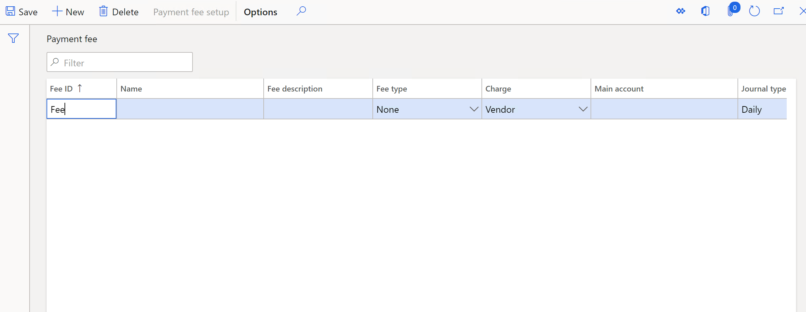

---
# required metadata

title: Set up payment fees for payment fee charges for TDS authority payments
description: This topic lists the steps for setting up a payment fee for Tax Deducted at Source (TDS) authority payments.
author: kailiang
manager: AnnBe
ms.date: 02/12/2021
ms.topic: article
ms.prod: 
ms.service: dynamics-ax-applications
ms.technology: 

# optional metadata

ms.search.form: 
# ROBOTS: 
audience: Application User
# ms.devlang: 
ms.reviewer: roschlom
# ms.search.scope: Core, Operations
# ms.tgt_pltfrm: 
ms.custom: 15721
ms.assetid: b4b406fa-b772-44ec-8dd8-8eb818a921ef
ms.search.region: Global
# ms.search.industry: 
ms.author: kailiang
ms.search.validFrom: 2021-02-12
ms.dyn365.ops.version: AX 10.0.17

---

# Set up payment fees for payment fee charges for TDS authority payments

[!include [banner](../includes/banner.md)]

This topic lists the steps for setting up a payment fee for Tax Deducted at Source (TDS) authority payments.

Begin by opening the **Payment fee** page (**Accounts payable > Payment setup > Payment fee**).

1. On the **Overview** tab, press ALT+N to create a payment fee. Enter the required details.

2. In the **Fee type** field, select the payment fee type. The options are:

   - **None**

   - **Interest**: Select this option to charge interest on late payment made to the TDS authority vendor.

   - **Others**: Select this option to charge other charges on late payment made to the TDS authority vendor. 

3. In the **Charge** field, the **Ledger** option is displayed automatically when the **Interest** or **Others** option is selected in the **Fee type** field.

4. In the **Main account** field, select the ledger account to post the interest or other charges. Enter the other required details.

5. Click the **Payment fee setup** button to set up payment fees for various combinations of banks, methods of payment, payment specifications, currencies, and date intervals.

6.  Click the **Overview** tab. In the **Groupings** field, select the option to set up the bank information for. The options are:

   - **Table**: The fee is valid for the bank account selected in the Bank relation list.

   - **Group**: The fee is valid for the bank group selected in Bank relation list.

   - **All**: The fee is valid for all the bank accounts.

7. In the **Bank** **relation** field, specify the bank to set up the payment fees setup for.

8. In the **Method** **of** **payment** field, select the method of payment for the payment of fees.

9. In the **Payment** **specification** field, select or enter the payment specification code generated using the **Payment specification** page.

10. In the **Fee Currency** field, select the currency that activates the fee. Only transactions with this currency can activate the fee. If blank, all currencies will activate the fee.

11. In the **Percentage/Amount** field, select the calculation method. The options are Amount, Percent, and Interval.

12. In the **Fee amount** field, specify the fee amount in percentage of the payment or amount for one payment.

13. In the **Fee Currency** field, specify the currency code for fee.

14. Click the **General** tab to view or modify the details entered for the selected bank account.

15. In the **Minimum** field, enter the minimum transaction amount to activate the fee.

16. In the **Maximum** field, enter the maximum transaction amount to activate the fee.

17. In the **From** and **To** date fields, enter starting and ending dates to define a range for calculating the fees. 

18. In the **Minimum** **fee** field, specify the amount of the fee in percentage of the payment or amount for one payment.

19. In the **Sales** **tax** **group** field, select the sales tax group to calculate the sales tax for the fee amount.

20. In the **Item** **sales** **tax** **group** field, select the item sales tax group to calculate the item sales tax for the fee amount.

21. Click the **Interval** tab. 

22. In the **Days** field, enter the number of days between the posting date (discounting date) of the payment and the due date of the promissory note.

23. In the **Percentage/Amount** field, select whether the specification is a percentage or an set amount.

24. In the **Fee** **amount** field, enter the amount of the fee in percent of the payment or amount for one payment.

25. Close the **Payment fee setup** page.

26. Close the **Payment fee** page.
