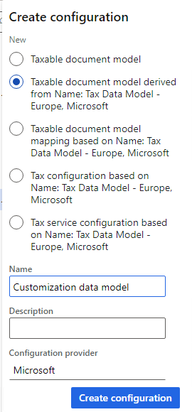
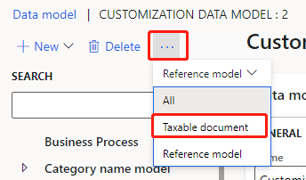
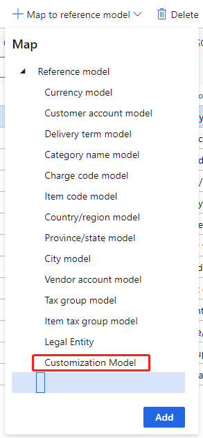
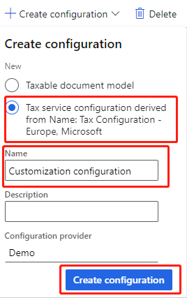
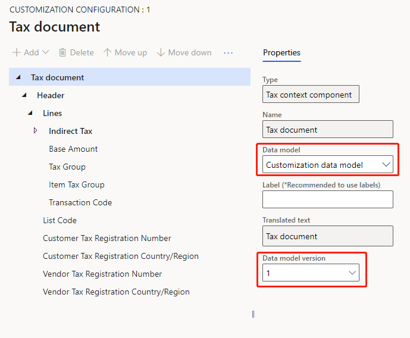

---
# required metadata

title: Customize tax configurations for master data lookup
description: This topic explains how to customize tax configurations to extend master data lookup functionality.
author: kai-cloud
ms.date: 04/21/2021
ms.topic: article
ms.prod: 
ms.technology: 

# optional metadata

ms.search.form:
audience: Application user
# ms.devlang: 
ms.reviewer: kfend
ms.search.scope: Core, Operations
# ms.tgt_pltfrm: 
ms.custom: 
ms.search.region: Global
# ms.search.industry: 
ms.author: pashao
ms.search.validFrom: 2021-04-01
ms.dyn365.ops.version: 10.0.18
---
# Customize tax configurations for master data lookup

This topic explains how to customize tax configurations to extend master data lookup functionality.

**1 Set entity you want to use by following the Enabling virtual entities] step in**  https://docs.microsoft.com/en-us/dynamics365/fin-ops-core/dev-itpro/power-platform/admin-reference

**2 Create customized data model configuration**

- Choose data model configuration named **Tax Data Model - Europe**.
- Click **Create configuration**. 
- Choose "Taxable document model derived from Name: Tax Data Model - Europe, Microsoft". 
- In **Name** field, type in **Customization data model**.
- Click **Create configuration.**

**3 Create customized reference models**

- Choose the newly-created Customization data model.
- Click Designer.
- Change view to reference model

- Create the customized reference model. See [link to how to create reference model]. Customized model is root model. Customized entity is Record list. Customized field is string field you want to use in lookup. You can add more on demand.

- Change view to taxable document

- Choose the attribute you want to bind the customized reference model. Take **Customized attribute** as an example, click **Select reference model**, choose **Customized model**, click **OK**. The reference model name will be in the **Natural key** field.

- Save the configuration and complete.

**4 Create customized model mapping configuration**

- Choose model mapping configuration named **Dataverse model mapping**. Set **Default for model mapping** as **No**.
- Click **Create configuration**.
- Choose Taxable document model mapping derived from Name: Dataverse Model Mapping, Microsoft.
- In **Name** field, type in **Customization     model mapping**.
- In **Target model** field, choose the     newly-created data model **Customization data model**.
- Click **Create configuration**.

- The model mapping configuration will show up as

- Choose the **Customization model mapping** and set **Connected application** as the one you created above.

  Set **Default for model mapping** as **Yes**.

**5 Create customized model mappings**

- Choose the newly-created **Customization model mapping**. 
- Click Designer.
- Choose the newly-created **Customization Model**

**6 Map model mapping to Dataverse entity**

- In model mapping designer, choose Customization Model and click Designer.
- In **data source types**, choose Dataverse Table.
- In **data sources**, click **+Add root**.
- In **Name** field, type in Customized Dataverse.
- In **Name** field, choose an entity.
- Click **OK**.

- Choose **Customized Dataverse** and **Customized entity**, click **Bind**.

- Choose a field under **Customized Dataverse** and **Customized field**, click **Bind**.

- Click **save** and complete **Customization model mapping**

**7 Create customized tax configuration**

- Choose **Tax Configuration - Europe** and click Create configuration**.
- Choose Tax service configuration derived from Name: Tax Configuration - Europe, Microsoft
- In **Name** field, type in Customization configuration.
- Click **Create configuration**.

- Choose newly-created Customization configuration** and click **Designer**.
- In **Data model** field, choose **Customization data model**
- In **Data model version** field, choose the corresponding one.

- Complete the configuration.