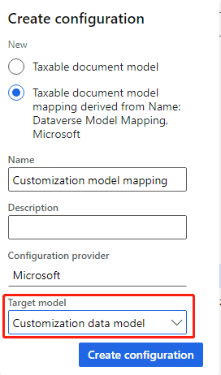

---
# required metadata

title: Customize tax configurations for master data lookup
description: This topic explains how to customize tax configurations to extend master data lookup functionality.
author: kai-cloud
ms.date: 10/26/2021
ms.topic: article
ms.prod: 
ms.technology: 

# optional metadata

ms.search.form:
audience: Application user
# ms.devlang: 
ms.reviewer: kfend
ms.search.scope: Core, Operations
# ms.tgt_pltfrm: 
ms.custom: 
ms.search.region: Global
# ms.search.industry: 
ms.author: pashao
ms.search.validFrom: 2021-04-01
ms.dyn365.ops.version: 10.0.18
---

# Customize tax configurations for master data lookup

[!include [banner](../includes/banner.md)]

Complete the steps in this topic to customize tax configurations to extend master data lookup functionality.

## Import a tax configuration provided by Microsoft

1. In Dynamics Regulatory Configuration Service (RCS), go to the **Electronic reporting** workspace and select the **Microsoft** configuration provider. 
2. Select **Repositories**.
3. Select **Global**, and then select **Open**. 
4. Choose a tax configuration, such as the T**ax Calculation Configuration**, and on the **Versions** tab, select a version. 
5. Select **Import**. 

   > [!NOTE]
   > The Dataverse Model Mapping is imported by default. If you saw warning messages in the configuration import process, you should enable the virtual entities in Datavers. For more information, see [Enable Dataverse virtual entities](../../fin-ops-core/dev-itpro/power-platform/enable-virtual-entities.md). 

## Create customized data model configuration

1. In the **Electronic reporting** workspace, select the data model configuration you want to extend. For example, **Tax Calculation Data Model**. 
2. Select **Create configuration**. 
3. Select **Taxable document model derived from Name: Tax Calculation Data Model, Microsoft**. 
4. In **Name** field, type in **Customization data model** and then select **Create configuration.** 

## Create customized reference models

1. Select **Customization data model** and then select **Designer**.
2. Select the ellipsis button **...**, and select the **Reference model** view.

      

3. Create the customized reference model. The customized model is a root model. The customized entity is a record list. The customized field is a string field you want to use in lookup. You can add more fields as needed.
4. Select the ellipsis button **...**, and select the **Taxable document** view.
5. Select the attribute you want to bind to the customized reference model. For example, if you select **Customized attribute**:

      1. Select **Select reference model**.
      2. Select **Customized model** and then select **OK**. The reference model name will be updated to the **Natural key** field.

         

      3. Select **Save** and then select **Complete**.

## Create a customized model mapping configuration

   1. In the **Electronic reporting** workspace, select the model mapping configuration, **Dataverse model mapping**. 
   2. In the **Default for model mapping** field, select **No**. 
   3. Select **Create configuration**. 
   4. Select the taxable document model mapping derived from **Name: Dataverse Model Mapping, Microsoft**. 
   5. In **Name** field, enter **Customization model mapping**. 
   6. In **Target model** field, select the data model **Customization data model**. 
   7. Select **Create configuration**.

      

   8. Select the **Customization model mapping** and set **Connected application** as the one you created above.
   9. Set the **Default for model mapping** field to **Yes**.

## Create customized model mappings

1. Select **Customization model mapping**. 
2. Select **Designer** and then select **Customization Model**.

   

## Map model mapping to Dataverse entity

1. On the **Model mapping designer** page, select **Customization Model**, and then select **Designer**.
2. In the **Data source types** tree, select **Dataverse Table**.
3. On the **Data sources** tab, select **Add root**.
4. In the **'Table' data source properties** pane, in **Name** field, enter **Customized Dataverse**.
5. In the second **Name** field, select an entity and then select **OK**.

   

6. Select **Customized Dataverse** and **Customized entity** and then select **Bind**.

   

7. Select a field under **Customized Dataverse** and **Customized field** and then select **Bind**.

   

8. Select **Save** and complete the **Customization model mapping**.

## Create a customized tax configuration

   1. Go to the **Electronic reporting** workspace.
   2. Select **Tax Configuration - Europe** and then select **Create configuration**.
   3. Select **Tax service configuration derived from Name: Tax Calculation Configuration, Microsoft**.
   4. In **Name** field, enter **Customization configuration**.
   5. Select **Create configuration**.
   6. Select **Customization configuration** and then select **Designer**.
   7. In the **Data model** field, select **Customization data model**.
   8. In **Data model version** field, select the corresponding data model version.

      

   9. Select **Complete**.

[!INCLUDE[footer-include](../../includes/footer-banner.md)]
