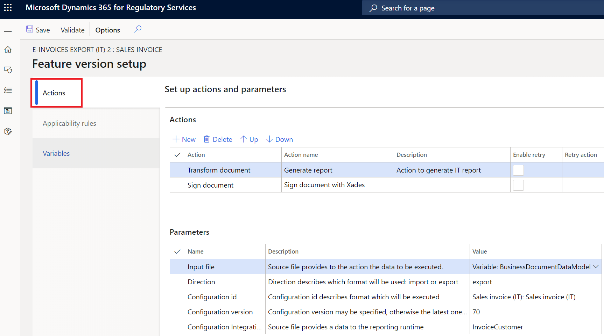
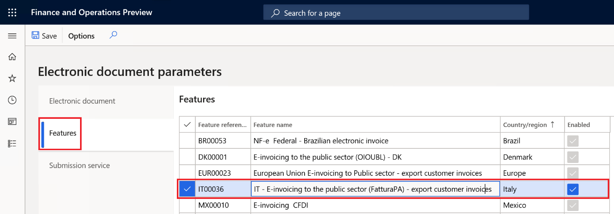
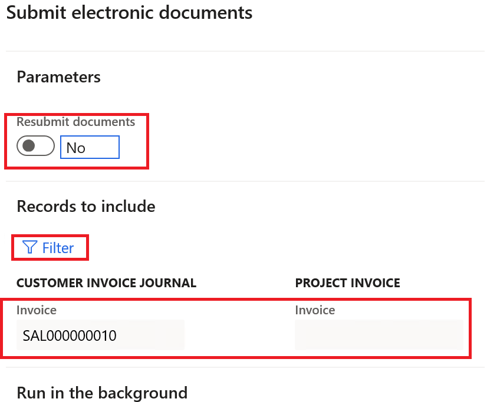

# Get started with e-Invoicing services for Italy

Important: The e-Invoicing service for Italy may not currently support all
the functions that are available for electronic invoices in Microsoft Dynamics
365 Finance. 

In this topic, you will learn how to enable e-Invoicing services for Italy. This
topic will guide you through the configuration steps which are country-dependent
in Regulatory Configuration Services (RCS) and in Finance. The topic will also
walk you through the process for submitting electronic invoices that are
generated in the Italy-specific “**FatturaPA**” format through the service, and
how to acknowledge the results of processing over the status of electronic
invoices.

# Prerequisites

To complete these steps, the following must be complete:

-   Complete the steps described in the topic, Get started with e-invoicing
    service

# Regulatory Configuration Services setup

During the RCS setup you will:

-   Import the **e-invoicing feature** for the export of customers electronic
    invoices in the **FatturaPA** format.

-   Review the format configurations required to generate, submit, and receive
    responses regarding electronic invoices.

-   Configure the events that will support electronic invoices submission
    scenarios.

-   Publish the e-Invoicing feature.

The e-Invoicing feature is the generic name of the resource that will be
configured and published to consume the e-invoicing service server. In this
case, the export of customers electronic invoices is the e-invoicing feature we
want to set up.

## Adding e-invoicing features

1.  Sign into your RCS account and go to the **Globalization features
    workspace**.

2.  Select **Features \> e-Invoicing** tile.

3.  Select **Import** to import the e-Invoicing feature from the Global
    repository.  
    *Note.* If you don’t see the list of available features,
    select **Synchronize**. 

4.  Select the **e-Invoices Export (IT)** feature, and then select **Import**.

Note. After you import the **e-Invoices Export (IT)** feature from the
Global repository, all the settings described in the next sections will be also
imported.

## Create a new version of the feature, e-Invoices Export (IT)

1.  On the **e-Invoicing Features** page, select the **Versions** tab.

2.  Select **New**. 

1.  On the **Configurations** tab, configure the Electronic Reporting (ER)
    formats that are associated with the e-Invoicing feature.

2.  Select **Add** to manage the configurations versions.

Notes:

-   Through this step you are adding and configuring the ER formats of different
    files that are used to export Italian e-invoices. For Italian FattauraPA
    e-invoices, use the following standard configurations, or the actual
    customized configurations you use for e-Invoicing:

    -   **Sales invoice (IT)**

    -   **Project invoice (IT)**

-   When you create an e-invoicing feature that is derived from another
    e-invoicing feature, all ER formats are inherited from the original feature.

1.  Select a specific ER format file configuration.

2.  Select **Edit** or **View** to open the **ER format designer**.

1.  Use the **Format designer** to edit and view the ER format file
    configurations.

## E-invoicing feature setup

1.  On the **e-Invoicing Features** page, select the **Setups** tab.

2.  Select **Add**, **Delete** or **Edit** to manage the e-invoicing feature
    setups .

In this step you are configuring the events that are applicable to electronic
invoices including generating the XML output files in FatturaPA format and
digital signing (if required).

## Sales invoice feature setup 

1.  On the **e-Invoicing Features** page, on the **Setups** tab, in the
    **Feature setup** list, select **Sales invoice**.

2.  Select **Edit**.

3.  On the **Feature version setup** page, select the **Actions** tab to manage
    the Actions list.

**Note:** Actions define a list of operations to be run in sequential order, to
accomplish the full execution of the event.

| **Action ID** | **Action name**     | **Action description**                              |
|---------------|---------------------|-----------------------------------------------------|
| 1             | Transform document  | Creates the e-invoice XML file in FatturaPA format. |
| 2             | Sign document       | Applies a digital signature to the XML file .       |

1.  Select the **Applicability rules** tab to view and maintain the
    applicability rules.

Note: Applicability rules define the context where the action is going to be
executed.

1.  Select the **Variables** tab to view and maintain the variables.

1.  Define the public variables that are required to execute the actions.

## Project invoice feature setup 

The steps and settings needed to complete Project invoice feature setup are very
similar to those listed for Sales invoice feature setup. Refer to the Sales
invoice procedures when working on Project invoices.

## Assign the e-invoicing feature to the environment

1.  On the **e-Invoicing Features** page, on the **Environments** tab, select
    **Enable**.

2.  Select the **Environment**, and in the **Effective from** field, select the
    date on which the environment will be effective.

3.  Select **Enable**. 

## Publishing the e-invoicing feature

You can publish the e-Invoicing feature by changing the version status to
**Completed** or **Published**.

### Change the version status to Completed 

1.  On the **e-Invoicing Features** page, on the **Versions** tab, select the
    **Draft** version of the e-Invoicing feature.

2.  Select **Change status** \> **Complete**. 

### Change the version status to Published 

1.  On the **e-Invoicing Features** page, on the **Versions** tab, select the
    **Completed** version of the e-Invoicing feature.

2.  Select **Change status** \> **Publish**.

# Set up e-Invoicing service integration in Finance

During the time that you set up Finance, you will:

-   Import the ER data model, ER data model mapping, and the context
    configurations for FatturaPA e-invoices.

-   Configure the certificate required for digital signature of Italian
    e-invoices.

## Import the ER data model, data model mapping, and formats

1.  Go to the **Electronic reporting** workspace and verify that the **Business
    Document Service** configuration provider is **Active**.

2.  Select **Repositories**.

3.  Select **Global resource**.

4.  Select **Open**, and then select to import the **Invoice model**, **Invoice
    model mapping**, and the **Customer invoice context model**.

### Enable export of customers electronic invoices Feature for Italy

1.  Go to **Organization administration \> Setup \> Electronic document
    parameters.**

2.  On the **Features** tab, in the **Features** list, locate **IT00036** in the
    **Feature reference** column and select the **Enabled** check box.

### Configure Electronic documents

1.  Go to **Organization administration \> Setup \> Electronic document
    parameters**.

2.  On the **Electronic document** tab, select **Add** and enter the tables
    required for Italian e-invoices generation:

    -   **Table name** = Customer invoice journal

    -   **Table name** = Project invoice

3.  For each table, define a related document context.

    -   For **Customer invoice journal**, select **Customer invoice context**.

    -   For **Project invoice**, select **Project invoice context**.

# Electronic invoice processing

During processing in Finance, you will:

-   Generate Italian e-invoices through the e-invoicing service

-   View the execution logs and acknowledge the results of processing

## Generate electronic invoices

After you enable the **Configurable e-Invoicing Service integration** feature
and activate the **IT00036** feature, the legacy Finance process for Italian
e-invoices generation can no longer be used and is replaced by a new process
called **Submit electronic documents.**

You can submit the documents manually, based on your demand for e-invoice
documents.

Verify that the setup required for Italian e-invoices was completed. For more
information, see [Customer electronic
invoices](https://nam06.safelinks.protection.outlook.com/?url=https%3A%2F%2Fdocs.microsoft.com%2Fen-us%2Fdynamics365%2Ffinance%2Flocalizations%2Femea-ita-e-invoices&data=02%7C01%7Cilyako%40microsoft.com%7C5bf724af97684b0fc1f408d803a6a90d%7C72f988bf86f141af91ab2d7cd011db47%7C1%7C0%7C637263361621227134&sdata=lfKJcYsBu1%2FiQQnSzvocpSnkofXWt9ygzZDnyYTv8ug%3D&reserved=0).  
**Note:** Some setup steps described in the topic may be unavailable due to
**e-invoicing service** activation.

1.  Go to **Organization administration \> Periodic \> Electronic documents \>
    Submit electronic documents**.

2.  Set the **Resubmit documents** field to **No** for the first submission of
    any document. Set the **Resubmit documents** field to **Yes** when you need
    to resubmit documents through the service.

3.  On the **Records to include** FastTab, select **Filter** to build the query
    to select documents for submission.

### Filter query

1.  Configure the filtering conditions for both Sales and Project invoices or
    leave the conditions empty to include all unsubmitted invoices.

2.  Select **OK** button to close the **Filter query dialog** page.

3.  Select **OK** submit the selected documents.

>   **Note:** During your first attempt to submit a document through the
>   services, you will be asked to confirm the connection with the e-invoicing
>   service. Select **Click here to connect to Electronic Document Submission
>   Service**.

### View submission logs

You can view the submission logs for all submitted documents.

1.  Go to **Organization administration \> Periodic \> Electronic documents \>
    Electronic document submission log.**

2.  In the **Document type** field, select **Customer invoice journal** or
    **Project invoice** to filter required electronic documents.

>   The status displayed in **Submission status** column represents the status
>   of the submission process, whether the process ran as configured, and if
>   additional action is required.

1.  Select **Inquires** \> **Submission details**. The page will show you the
    details of submission execution logs.

1.  In the **Processing actions** section, you can view the execution log of the
    actions as configured in the **Feature version** set up in RCS. The
    **Status** column displays if the action was successfully executed.

2.  In the **Action files** pane, view the intermediate files that were
    generated along the execution of actions. If you select **View**, you can
    download the output XML file in **FatturaPA** format and see its content.

# Related topics

-   E-Invoicing service overview

-   Get started with e-Invoicing services

-   Configuration feature set for e-Invoicing

