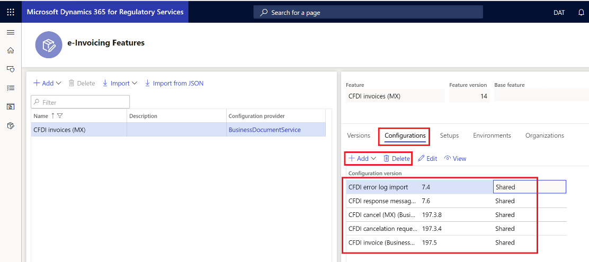
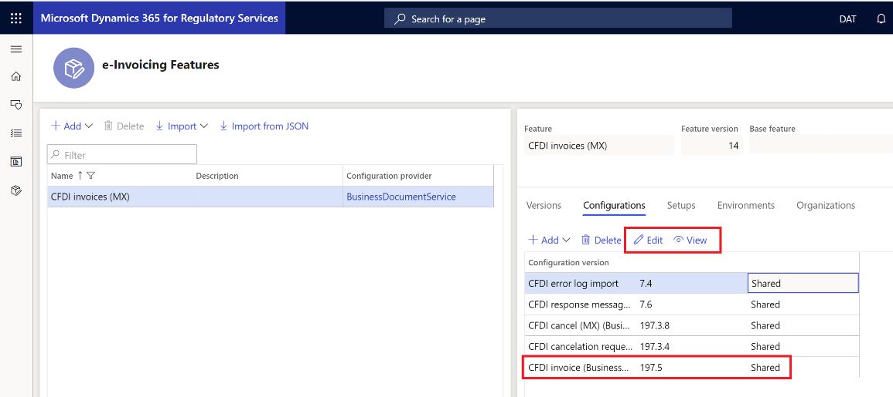
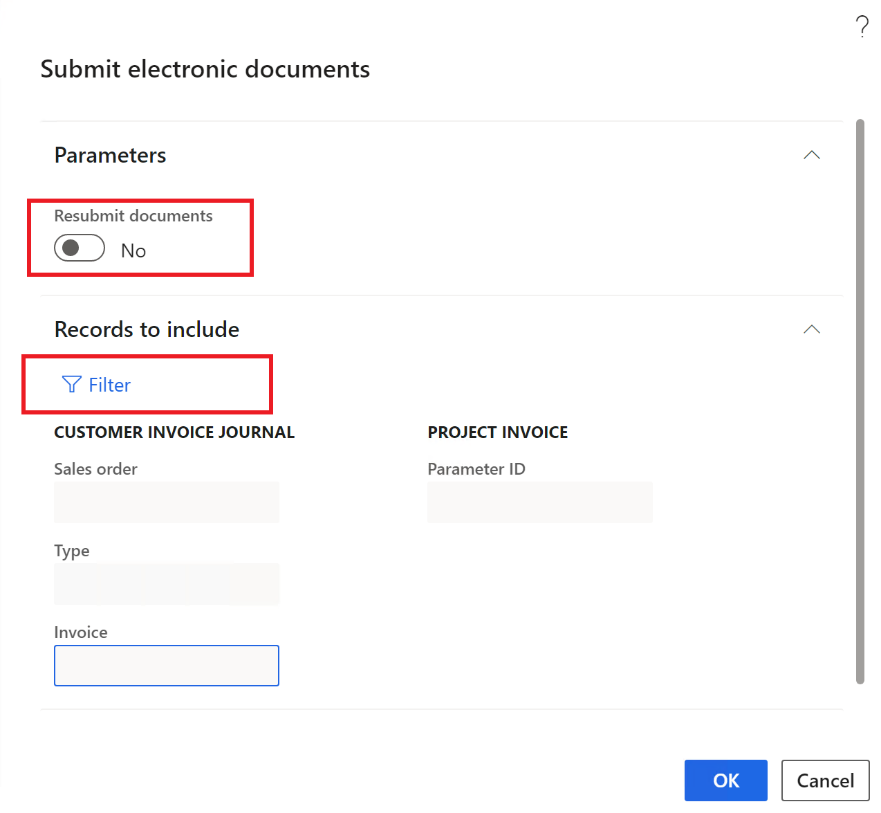
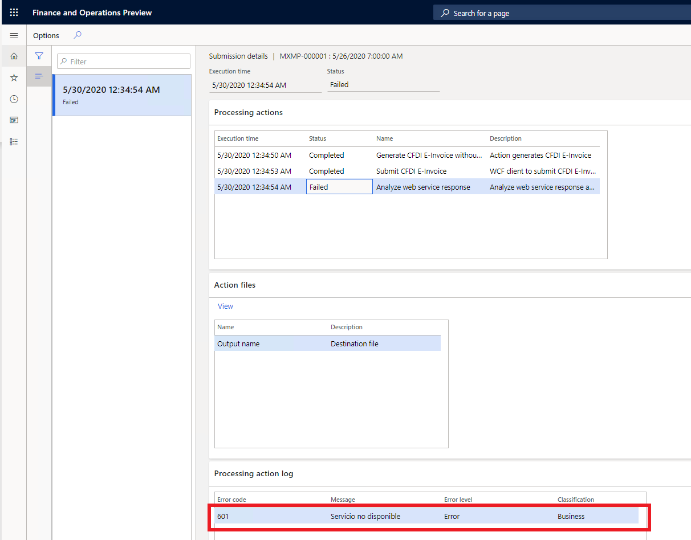

---
# required metadata

title: Get started with the Electronic invoicing add-on for Mexico
description: This topic provides information that will help you get started with the Electronic invoicing add-on for Mexico in Microsoft Dynamics 365 Finance and Dynamics 365 Supply Chain Management.
author: gionoder
manager: AnnBe
ms.date: 09/04/2020
ms.topic: article
ms.prod: 
ms.service: dynamics-ax-platform
ms.technology: 

# optional metadata

ms.search.form: 
# ROBOTS: 
audience: Application User
# ms.devlang: 
ms.reviewer: kfend
ms.search.scope: Core, Operations
# ms.tgt_pltfrm: 
ms.custom: 97423
ms.assetid: 
ms.search.region: Global
# ms.search.industry: 
ms.author: janeaug
ms.search.validFrom: 2020-07-08
ms.dyn365.ops.version: AX 10.0.12

---

# Get started with the Electronic invoicing add-on for Mexico

[!include [banner](../includes/banner.md)]
[!include [banner](../includes/preview-banner.md)]

> [!IMPORTANT]
> The Electronic invoicing add-on for Mexico might not currently support all the functions that are available in the Comprobante Fiscal Digital por Internet (CFDI) document, and in the related integration that is built into Microsoft Dynamics 365 Finance or Dynamics 365 Supply Chain Management.

This topic provides information that will help you get started with the Electronic invoicing add-on for Mexico. It guides you through the configuration steps that are country-dependent in Regulatory Configuration Services (RCS) and Finance. It also guides you through the steps that you must follow in Finance to submit CFDI invoices through the service, and it explains how to review the processing results and the status of CFDI invoices.

## Prerequisites

Before you complete the steps in this topic, you must complete the steps in [Get started with the Electronic invoicing add-on](e-invoicing-get-started.md).

## RCS setup

During the RCS setup, you will complete these tasks:

1. Import the e-Invoicing feature for processing CFDI invoices.
2. Review the format configurations that are required to generate, submit, and receive responses about CFDI invoices, and to submit and receive responses about cancellation.
3. Configure the events that support the CFDI invoice submission scenarios.
4. Publish the e-Invoicing feature for CFDI invoices.

> [!NOTE]
> "The e-Invoicing feature" is the generic name for the resource that is configured and published to consume the Electronic invoicing add-on server. In this case, CFDI invoices (MX) are the e-Invoicing feature that you will set up.

## Import the e-Invoicing feature

1. Sign in to your RCS account.
2. In the **Globalization features** workspace, in the **Features** section, select the **e-Invoicing** tile.
3. On the **e-Invoicing Features** page, select **Import** to import the **CFDI invoices (MX)** feature from the Global repository.

    > [!NOTE]
    > If you don't see the feature in the list, select **Synchronize**, and then repeat step 3.

When you import the **CFDI invoices (MX)** feature from the Global repository, all the feature settings, including configurations and actions, are also imported.

### Create a new version of the CFDI invoices (MX) feature

You can create a new version if, for example, URLs must be updated. For more information, see [E-invoicing CFDI](tasks/mx-00010-e-invoicing-cfdi).

- On the **e-Invoicing Features** page, on the **Versions** tab, select **New**.

### Update the configuration version

1. On the **e-Invoicing Features** page, on the **Configurations** tab, select **Add** or **Delete** to manage the configuration versions (ER file format configurations).

    

    When you create a new version, all configurations are inherited from the last published version. To process CFDI invoices, the following configurations are required:

    - CFDI invoice (BusinessDocumentService)
    - CFDI response message import
    - CFDI error log import
    - CFDI cancelation request (MX) (BusinessDocumentService)
    - CFDI invoice (BusinessDocumentService)

2. In the list, select a configuration version, and then select **Edit** or **View** to open the **Format designer** page, where you can edit or view the configuration.

    

3. Use the **Format designer** page to edit and view the ER format file configurations. For more information, see [Create electronic document configurations](../../dev-itpro/analytics/electronic-reporting-configuration.md).

    

## Manage the e-Invoicing feature setups

- On the **e-Invoicing Features** page, on the **Setups** tab, select **Add**, **Delete**, or **Edit** to manage the e-Invoicing feature setups.

To submit CFDI invoices for authorization (generate the XML file, submit the XML file, and process the response), the **Sales invoice** feature setup is required.

To submit CFDI invoice cancellation, the **Cancellation** and **Cancel** feature setups are required.

### Configure the Sales invoice feature setup

1. On the **e-Invoicing Features** page, on the **Setups** tab, in the **Feature setup** column, select **Sales invoice**.
2. Select **Edit** to configure the actions, applicability rules, and variables.

    

3. On the **Feature version setup** page, select the **Actions** tab to manage the list of actions. Actions define a list of operations that must be run in sequential order to accomplish full execution of the event.

    

    | Action ID | Action                   | Action name                                  | Action description                                          |
    |-----------|--------------------------|----------------------------------------------|-------------------------------------------------------------|
    | 1         | Transform document       | Generate CFDI E-Invoice without digital sign | Generate the CFDI e-invoice.                                |
    | 2         | Sign document            | Digital sign                                 | Digitally sign the e-invoice for submission.                |
    | 3         | Call Mexican PAC service | Submit CFDI E-Invoice                        | The Windows Communication Foundation (WCF) client submits the CFDI e-invoice. |
    | 4         | Process response         | Analyze web service response                 | Analyze the web service response, and return the error log. |

### Set up the URL for Mexican PAC web services 

1. On the **Feature version setup** page, on the **Actions** tab, on the **Actions** FastTab, select **Call Mexican PAC service**.
2. On the **Parameters** FastTab, in the **URL address** field, enter the URL of the web service for CFDI invoice submission.

> [!NOTE]
> Use the same steps to update the URL for **Call Mexican PAC service** action for the **Cancel** and **Cancelation request** feature setups.

## Assign the Draft version to an e-Invoicing environment

1. On the **e-Invoicing Features** page, on the **Environments** tab, select **Enable**.
2. In the **Environment** field, select the environment.
3. In the **Effective from** field, select the date when the environment should become effective.
3. Select **Enable**.

## Change the version status to Completed

1. On the **e-Invoicing Features** page, on the **Versions** tab, select the version of the e-Invoicing feature that has a status of **Draft**.
2. Select **Change status \> Complete**.

## Change the version status to Published

- On the **e-Invoicing Features** page, on the **Versions** tab, select **Change status \> Publish**.

## Publish the e-Invoicing feature

1. On the **e-Invoicing Features** page, select the **Versions** tab to manage the status of the **CFDI invoices (MX)** feature.
2. Select **Change status** to change the status of the feature.

## Set up Electronic invoicing add-on integration in Finance

To set up the Electronic invoicing add-on in Finance, you will complete these tasks:

1. Import the ER data model, the ER data model mapping, and the formats that are required for CFDI invoices.
2. Configure response types for updating the CFDI invoices. These response types are used for the response from the authorized certification provider (PAC) server.

### Import the ER data model, ER data model mapping, and context configurations for CFDI invoices

1. Sign in to Finance.
2. In the **Electronic reporting** workspace, in the **Configuration providers** section, select the **Microsoft** title. Make sure that this configuration provider is set to **Active**. For information about how to set a provider to **Active**, see [Create configuration providers and mark them as active](https://docs.microsoft.com/dynamics365/fin-ops-core/dev-itpro/analytics/tasks/er-configuration-provider-mark-it-active-2016-11).
3. Select **Repositories**.
4. Select **Global resource \> Open**.
5. Import **Invoice model**, **Invoice model mapping**, **CFDI invoice format (MX)**, **CFDI invoice cancelation request format (MX)**, and **CFDI invoice cancel format (MX)**.

### Turn on the feature for processing CFDI invoices

1. Go to **Organization administration \> Setup \> Electronic document parameters**.
2. On the **Features** tab, select the **Enable** check box in the rows for feature references **MX-00010** and **MX-00016**.

### Import ER configurations and set up the response types for updating CFDI invoices

#### Import ER configurations

1. In the **Electronic reporting** workspace, in the **Configuration providers** section, select the **Microsoft** title.
3. Select **Repositories**.
4. Select **Global resource \> Open**.
5. Import **Response message model**, **CFDI error log import (MX)**, **CFDI error log import (MX)**, and **CFDI response message import (MX)**.

#### Set up the response types

1. Go to **Organization administration \> Setup \> Electronic document parameters**.
2. On the **Electronic document** tab, select **Add**.
3. Enter the customer invoice journal, and then, in the **Table name** field, select the project invoice.
4. For each table, define a related document context:

    - For **Customer invoice journal**, enter **Customer invoice context**.
    - For **Project invoice**, enter **Project invoice context**.

4. Select **Response types** to configure the response types that can be returned from the Electronic invoicing add-on and included in a customer invoice journal or project invoice.
5. Select **New**, and then, in the **Response type** field, select **Response**.
6. In the **Submission status** field, select **Pending**.
7. In the **Model mapping** field, select **Response message import format – Model mapping from response message**.
8. Select **Save**.
9. Select **New**, and then, in the **Response type** field, select **ResponseData**.
10. In the **Submission status** field, select **Pending**.
11. In the **Model mapping** field, select **CFDI response data import format (details) – Response data import**.
12. Select **Save**.

## Process electronic invoices in Finance 

During the processing of CFDI invoices in Finance through the Electronic invoicing add-on, you can perform the following tasks:

- Submit CFDI invoices.
- View the submission execution logs.
- Submit the cancellation of a CFDI invoice.

### Submit CFDI invoices

After you turn on the **Configurable Electronic invoicing add-on integration** feature, the **Export/Import electronic invoice** process (**Accounts receivable \> Invoices \> E-invoices**) for submitting CFDI invoices can no longer be used. It's replaced by a new process that is named **Submit electronic documents**.

> [!NOTE]
> Before you use the new **Submit electronic documents** process, verify that the setup that is required for Mexican e-invoices was completed. For more information, see [CFDI layout version 3.3](https://docs.microsoft.com/dynamics365/finance/localizations/latam-mex-cfdi-3-3).

1. Go to **Organization administration \> Periodic \> Electronic documents \> Submit electronic documents**.
2. For the first submission of any document, always set the **Resubmit documents** option to **No**. If you must resubmit a document through the service, set this option to **Yes**.
3. On the **Records to include** FastTab, select **Filter** to open the **Inquiry** dialog box, where you can build a query to select documents for submission.

> [!NOTE]
> During your first attempt to submit a document through the service, you will be prompted to confirm the connection with the Electronic invoicing add-on. Select **Click here to connect to Electronic Document Submission Service**.

### View submission logs

You can view the submission logs for all submitted documents or for just one submitted document.

#### View all submission logs

After you turn on the **Configurable Electronic invoicing add-on integration** feature, a new page is available that lets you follow up on the document submission process. You can use this page to view the submission logs for all submitted documents.

1. Go to **Organization administration \> Periodic \> Electronic documents \> Electronic document submission log**.
2. In the **Document type** field, select **Customer invoice journal** to filter for the required electronic documents.

    

3. On the Action Pane, select **Inquiries \> Submission details** to view the details of the submission execution logs.

    

The information in the submission logs is divided among three FastTabs:

- **Processing actions** – This FastTab shows the execution log for the actions that are configured in the feature version that was set up in RCS. The **Status** column shows whether the action was successfully run.
- **Action files** – This FastTab shows the intermediate files that were generated during execution of the actions. You can select **View** to download and view the file.
- **Processing action log** – This FastTab shows the results of the communication between the Electronic invoicing add-on and the target web service. It also shows what was returned by the processing from the web service. The **Error code** column shows the return code that was returned by the authorization web service.

When the submitted CFDI invoice is authorized, its status is updated to **Approved**.

#### View submission logs from CFDI invoices

After you turn on the **ConfigurableElectronic invoicing add-on integration** feature, you can also view the submission logs from CFDI invoices.

1. Go to **Accounts receivable \> Inquiries and reports \> CFDI (electronic invoices)**.
2. Select a CFDI invoice that was submitted after the **Configurable Electronic invoicing add-on integration** feature was turned on.
3. On the Action Pane, on the **History** tab, select **Electronic document log**.

> [!NOTE]
> For CFDI invoices that were submitted before the **Configurable Electronic invoicing add-on integration** feature was turned on, the **History** button is available. The **History** button isn't available for CFDI invoices that were submitted after the **Configurable Electronic invoicing add-on integration** feature was turned on.

### Submit cancellation of CFDI invoices

After you turn on the **Configurable Electronic invoicing add-on integration** feature, the old process for canceling CFDI invoices can no longer be used. It's replaced by a new cancellation process that is embedded on the **Electronic document submission log** page.

1. Go to **Accounts receivable \> Inquiries and reports \> CFDI (electronic invoices)**.
2. If the CFDI invoice has a status of **Approved**, select **Functions \> Cancel CFDI**.
3. Go to **Organization administration \> Periodic \> Electronic documents \> Electronic document submission log**.
4. Select the CFDI invoice, and then select **Functions \> Send related submissions**.
5. Enter a description for the related submission, and then select **OK**.

#### View cancellation submission logs

1. Go to **Organization administration \> Periodic \> Electronic documents \> Electronic document submission log**.
2. In the **Document type** field, select **Customer invoice journal** to filter for customer invoice journal documents only.
3. Select the CFDI invoice, and then, on the Action Pane, select **Inquiries \> Related submission**.

    The **Related submissions** page shows all related submissions, and their submission status, for a given CFDI invoice. In the following illustration, the first line represents the submission that requested approval of the CFDI invoice. The second line represents the submission that canceled that CFDI invoice.

    

4. On the Action Pane, select **Inquiries \> Submission details** to view the details of the submission execution logs.

    

## Privacy notice
Enabling the MX-00010 and MX-00016 (CFDI Invoice and CFDI Cancellation) features may require sending limited data, which includes the organization tax registration ID. This will be transmitted to third-party agencies authorized by the tax authority for purposes of sending electronic invoices to this tax authority in the predefined format required for integration with the government’s web service. An administrator can enable and disable the MX-00010 and MX-00016 (CFDI Invoice and CFDI Cancellation) features by navigating to **Organization administration \> Setup \> Electronic document parameters**. Select the **Features** tab, select the rows containing the MX-00010 and MX-00016 features, and then make the appropriate selection. Data imported from these external systems into this Dynamics 365 online service are subject to our [privacy statement](http://go.microsoft.com/fwlink/?LinkId=512132). Please consult the Privacy notice sections in country-specific feature documentation for more information.

## Additional resources

- [Electronic invoicing add-on overview](e-invoicing-service-overview.md)
- [Get started with the Electronic invoicing add-on](e-invoicing-get-started.md)
- [Set up the Electronic invoicing add-on](e-invoicing-setup.md)
