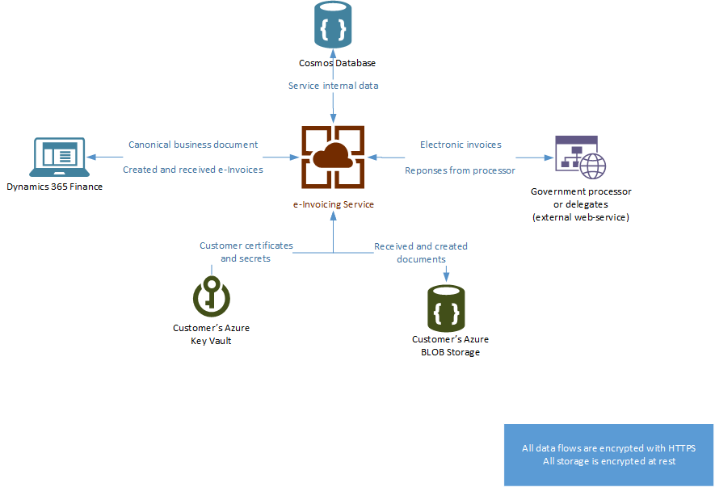

---
# required metadata

title: E-Invoicing service overview
description: This topic provides information about the e-Invoicing service in Dynamics 365 Finance and Dynamics 365 Supply chain management.
author: gionoder
manager: AnnBe
ms.date: 06/24/2020
ms.topic: article
ms.prod: 
ms.service: dynamics-ax-platform
ms.technology: 

# optional metadata

ms.search.form: 
# ROBOTS: 
audience: Application User
# ms.devlang: 
ms.reviewer: kfend
ms.search.scope: Core, Operations
# ms.tgt_pltfrm: 
ms.custom: 97423
ms.assetid: 
ms.search.region: Global
# ms.search.industry: 
ms.author: janeaug
ms.search.validFrom: 2020-07-08
ms.dyn365.ops.version: AX 10.0.12

---

# E-Invoicing service overview

[!include [banner](../includes/banner.md)]
[!include [banner](../includes/preview-banner.md)]

The e-Invoicing service for Dynamics 365 Finance and Dynamics 365 Supply chain management is a hyper-scalable multi-tenant service that enables configurable electronic invoice document processing and configurable document exchange. The processing and integration rules are fully configurable, and the logic is executed outside of Finance and Supply chain management. The service is targeted mainly for e-invoice processing in business-to-government scenarios but can be custom-configured for other purposes.

E-Invoicing service can help you achieve the following goals:

- Fast and easy adoption to country / region specific requirements
- Standardized e-Invoicing solution implementations
- Enhanced document history traceability
- Shorter implementation cycle
- Reduced Total Cost of Ownership (TCO)
- Easy-to-adjust configurations with no code changes
- Simplified configuration packaging
- Built-in export, import and integration, easy extensibility in e-Invoice document processing
- East to reuse the same export/ import/ integration configurations across companies

To use the e-Invoicing service, you must install the e-Invoicing service add-in from your project in Microsoft Dynamics Lifecycle Services (LCS) and follow setup procedure to enable integration into Finance or Supply chain management. For more information, see [Get started with e-Invoicing Service](e-invoicing-get-started.md).

## Availability

Initially, the e-Invoicing service is available to selected customers through a preview program. Later the preview will open to a wider range of customers and will then become generally available. Functionality that addresses country-specific requirements might be limited at different phases of the release, so always check the most up-to-date documentation highlighting coverage and scope of supported country-specific solutions. Countries targeted for preview at this time are Brazil, Italy, and Mexico.

The e-Invoicing service add-in is deployed in the following Azure geographies:

- United States
- Europe

> [!NOTE]
> The e-Invoicing service does not support on-premises deployments.

## Extended configurability

The e-Invoicing service can be used in scenarios that require you to create and send an electronic document to the designated parties. It's specifically designed for executing configurable flow of processing actions based on received data. The service extends the available configurability options limited to document transformation available in Finance and Supply chain management, with the configurable integrations available in the service. In addition to that, all the electronic invoice functionalities previously available, such as Brazilian NF-e, Mexican CFDI or other Western European UBL \\ PEPPOL, will be using configurations for export, import, and to enable integrations with external web services.

## Feature highlights

-  Out-of-the-box integration with Finance and Supply Chain management
-  Consistent user experience for e-invoice process configuration and monitoring for all countries
-  Faster, easier, and cheaper adoption of e-invoicing solutions in new countries
-  Configuration of the service through the Regulatory Configuration Service (RCS) and Globalization feature setup
-  Transformation of business data into multiple e-invoice formats (XML, JSON, txt, csv) using configurations defined in RCS:

    - Electronic reporting formats available for countries without enabled configurability for e-invoice transformation

- Configurable submission of e-invoices to external Web services including certification handling with digital signature:

    - Built-in, easily extendible, and configurable integration with additional content planned for Brazil and Mexico

> [!NOTE]
> Currently, a limited number of direct submissions are supported. For more information, check the availability section. Support will be extended in the future.

- Handling responses from web services, including configurable exception message handling
- Support of electronic signatures (for example, using the XMLDSIG signing algorithm)
- Batch processing e-invoice messages

## Architecture and data flow

When the e-Invoicing service add-in is enabled from LCS, and the required setup is complete in all required applications, a secure connection to the e-invoicing service is established. The service is currently located in data centers in the United States and Europe. This means that the service location can be different from the related Finance or Supply chain management instance. After you complete the e-invoicing service setup and enable the integration, when an electronic invoice is sent, master data and transactional data related to a particular document is sent to the e-invoicing service.

> [!NOTE]
> If your electronic invoice or any other document contains personal data, verify that your use of this feature meets GDPR and other regulations for the transfer of personal data.

### High-level data flow description

1. The client sends a canonical business document to the service.
2. According to the context information received from the client, the service selects the applicable processing flow.
3. The service then executes the processing actions, which may include transforming the business document into an electronic invoice, applying an electronic signature, and submitting to external web-service.
4. All the received and processed documents are stored in the customer’s BLOB storage.
5. All the tenant secrets and certificates used for processing are stored in the customer’s Azure Key Vault.
6. The service provides on-demand information to the client about the processing status of for the sent business document.
7. The client receives information about the completed processing execution and make all the log information as well as document created or received during flow processing available.

The following illustration shows how data flows to and from the e-invoicing service.

## Related resources

- [Get started with e-Invoicing service](e-invoicing-get-started.md)
- [Get started with e-Invoicing service in Brazil](e-invoicing-bra-get-started.md)
- [Get started with e-Invoicing service in Mexico](e-invoicing-mex-get-started.md)
- [Get started with e-Invoicing service in Italy](e-invoicing-ita-get-started.md)
- [Configuration feature set for e-Invoicing](e-invoicing-setup.md)
