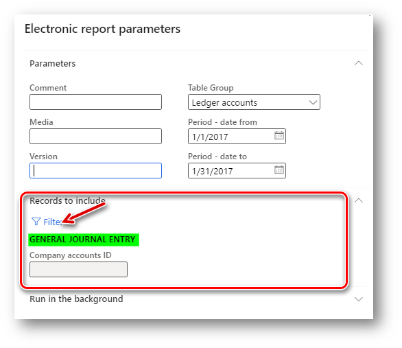

---
# required metadata

title: Adding filters to audit file configuration
description: This article explains how to add a filer for data in German audit file on example of filter for Posting layer field in general ledger transactions data.
author: liza-golub
ms.date: 02/09/2021
ms.topic: article
ms.service: dynamics-ax-applications
ms.technology: 

# optional metadata

ms.search.form: ERWorkspace
audience: Application User
ms.reviewer: kfend
# ms.tgt_pltfrm: 
ms.search.region: Austria, Germany
# ms.search.industry: 
ms.author: liza-golub

---

# Adding a filter to audit file configuration

[!include [banner](../includes/banner.md)]

This article explains how to add a filer for data in German audit file on example of filter for **Posting layer** field in **General journal entry** table.

As it is explained in [German audit file (GDPdU/GoBD) overview](https://docs.microsoft.com/en-us/dynamics365/finance/localizations/emea-deu-gdpdu-audit-data-export#sachkontobuchungen) **SPEZIALBUCHUNG** (Posting layer) field of **Sachkontobuchungen** data set is collected from **$GeneralJournalEntry/PostingLayer** electronic reporting data source path. To add possibility of filtering data in the report by **SPEZIALBUCHUNG** (Posting layer) field follow the steps:

1.	Open **Workspaces** > **Electronic reporting** and click on **Reporting configurations** button.
2.	Select **Data export model** configuration in the configuration tree and derive it creating a format that will be used in your company.
3.	Select derived configuration, click **Designer** on the Action pane, click **Map model to datasource** on the Action pane of **Data model** page, select “Group” definition on the **Model to datasource mapping** page, click **Designer** on the Action pane and search for “$GeneralJournalEntry” data source on the **DATA SOURCES** section of the model mapping design page.
4.	“$GeneralJournalEntry” data source is a calculated record list sourcing data from **GeneralJournalEntry** table (this can be observed from the formula for “$GeneralJournalEntry”).
5.	Search for **GeneralJournalEntry** table on the **DATA SOURCES** section of the model mapping design page and select it.
6.	Click **Edit** button on top of the **DATA SOURCES** section of the model mapping design page and mark **Ask for query** check box for **GeneralJournalEntry** table. Click **OK** button.

7.	Save, close and complete the configuration.
8.	Unmark **Default for model mapping** parameter for parent **Data export model** configuration if it was marked and mark your derived configuration as **Default for model mapping**. 

With this change when you will run **Data export** periodic tasks, you will see **Records to include** on the fast tab on the dialog of the report for General journal entry table. Click **Filter** button to specify conditions for general ledger entries filtering.

To filter by **Posting layer** field of the **General journal entry** table, select **Posting layer** in **Field** column and select necessary posting layer in **Criteria** column.
