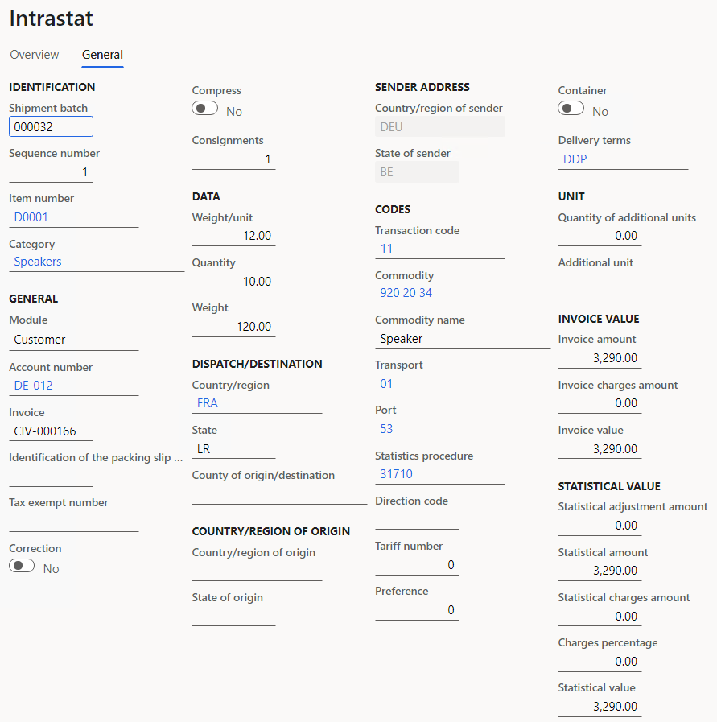
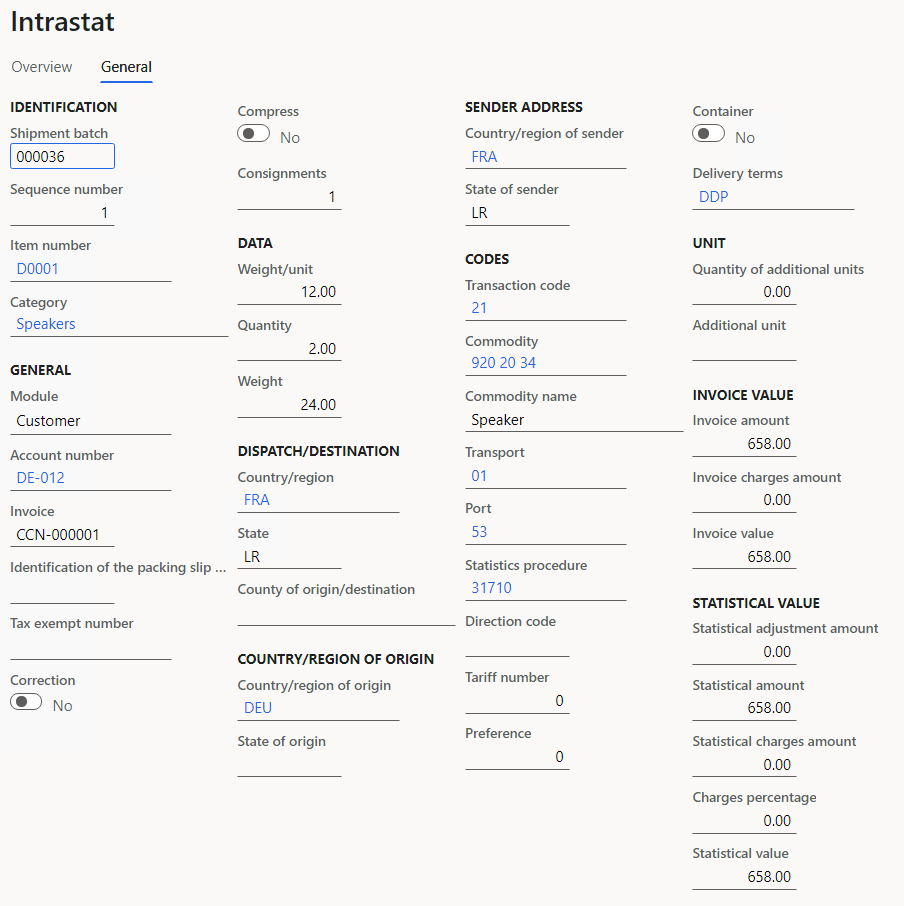
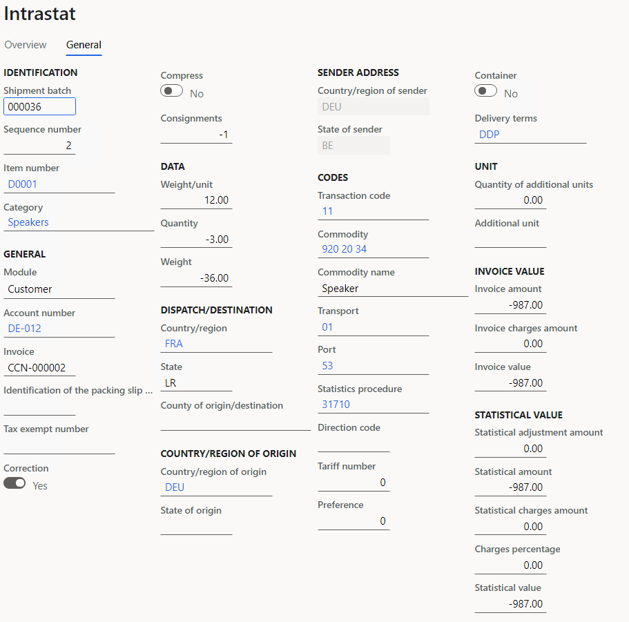

---
# required metadata

title: German Intrastat
description: This topic contains information about Intrastat declaration in Germany.
author: anasyash
ms.date: 09/09/2021
ms.topic: article
audience: Application User
ms.reviewer: kfend
ms.search.region: Global
ms.author: anasyash
ms.search.validFrom: 
---

# German Intrastat

The **Intrastat** page is used to generate and report information about trade among European Union (EU) countries. The German Intrastat declaration contains information about the trade of goods for reporting. The report is formatted according to the guidelines of the German authorities that are presented on the [6.2 File declarations in INSTAT/XML format](https://www-idev.destatis.de/idev/doc/intra_en/hilfe6_2.html) page.

The following table shows the fields that are included in the German Intrastat declaration.

| Fields | Dispatches | Arrivals |
|-------------------------|-------------------------|-------------------------|
| Reference period | X | X |
| Direction code | X | X |
| Currency of the Intrastat declaration **Note:** This currency is the <em>accounting currency</em>. | X | X |
| Commodity code | X | X |
| Commodity name | X | X |
| Supplementary unit code | X | X |
| Member State of consignment/destination | X | X |
| Net mass | X | X |
| Quantity in supplementary units | X | X |
| Country of origin |  | X |
| Invoice amount | X |  |
| Statistical value | X | X |
| Nature of transactions | X | X |
| Mode of transport | X | X |
| Region code **Note:** <ul> <li>If the country or region of origin is Germany, and the invoice is for dispatches, an Intrastat code for the state of origin is shown.</li> <li>If the country or region of origin isn't Germany, and the invoice is for dispatches, the code **99** is shown.</li> <li>If the invoice is for arrivals, an Intrastat code for the state is shown.</li> </ul> | X | X |
| Port/Airport/Inland port code | X | X |
| Delivery terms | X | X |

## Set up Intrastat

1. Set up the company's codes.

    1. Go to **Organization administration** > **Organizations** > **Legal entities**.
    2. On the **Foreign trade and Logistics** FastTab, in the **Identification** section, in the **DVR** field, enter the Interchange agreement ID. This ID will be included on the report.
    3. In the **VAT exempt number export** field, enter your company's value-added tax (VAT) number for export.
    4. In the **VAT exempt number import** field, enter your company's VAT number for import.
    5. In the **Intrastat code** field, enter the Intrastat code that is assigned to the legal entity.
    6. On the **Tax registration** FastTab, in the **Tax registration number** field, enter your company's tax registration number.

    > [!NOTE]
    > If you generate an Intrastat report for affiliates, in the **Tax registration number** field, enter the tax registration number of your parent company.

2. In [Microsoft Dynamics Lifecycle Services (LCS)](https://lcs.dynamics.com/Logon/Index), in the Shared asset library, download the latest versions of the following Electronic reporting (ER) configurations for the Intrastat declaration.

    - Intrastat model
    - Intrastat report
    - INSTAT XML
    - INSTAT XML (DE)

3. Set up foreign trade parameters:

    1. In Dynamics 365 Finance, go to **Tax** > **Setup** > **Foreign trade parameters**.
    2. On the **Intrastat** tab, on the **Electronic reporting** FastTab, in the **File format mapping** field, select **Intrastat XML (DE)**.
    3. In the **Report format mapping** field, select **Intrastat report**.
    4. On the **Commodity code hierarchy** FastTab, in the **Category hierarchy** field, select **Intrastat**.
    5. In the **Transaction code** field, select the transaction code for property transfers. You use this code for transactions that produce actual or planned transfers of property against compensation (financial or other). You also use it for corrections.
    6. In the **Credit note** field, select the transaction code for the return of goods.
    7. In the **Worker** field, select the contact person for Intrastat report. Alternatively, on the **Contact** tab enter or select values in the **Name**, **Telephone**, **Fax**, **Email**, and **Internet address** fields. These fields are included in the report.
    8. In the **Authority** field, select the Intrastat authority.
    9. Go to **Tax** > **Indirect taxes** > **Sales tax** > **Sales tax authorities**, and enter the following information for the Intrastat authority that you selected in the previous step:

       - Authority identification
       - Address
       - Contact information

    10. On the **Country/region properties** tab, in the **Country/region** field, list all the countries or regions that your company does business with. For each country or region, in the **Country/region type** field, select **EU**, so that the country or region appears on your Intrastat report.

4. Set up region codes.

    1. Go to **Organization administration** > **Global address book** > **Addresses** > **Address setup**.
    2. On the **State/province** tab, in the **Country/region** field, select **DEU**, and then select **Apply filter**.
    3. In the grid, select the state. Then, in the **Intrastat code** field, enter the unique Intrastat code.

5. Set up the address of origin for a product.

    1. Go to **Product information management** > **Products** > **Released products**.
    2. In the grid, select the product.
    3. On the **Foreign trade** FastTab, in the **Intrastat** section, in the **Country of origin** field, select **DEU**.

6. Go to **Tax** > **Setup** > **Foreign trade** > **Compression of Intrastat**, and select the fields that should be compared when Intrastat information is summarized. For German Intrastat, select the following fields:

    - Commodity
    - Country/region
    - Correction
    - Direction
    - Delivery terms
    - Invoice
    - Country/region of origin
    - Port
    - Country/region of sender
    - State of sender
    - Statistical procedure
    - Transaction code
    - Transport
    - Tax exempt number

### Intrastat transfer

On the **Intrastat** page, on the Action Pane, select **Transfer** to automatically transfer the information about intracommunity trade from your sales orders, free text invoices, purchase orders, vendor invoices, vendor product receipts**,** project invoices, and transfer orders. Only documents that have an EU country as the country or region of destination (for dispatches) or consignment (for arrivals) will be transferred.

Alternatively, you can manually enter transactions by selecting **New** on the Action Pane.

### Generate an Intrastat report

1. Go to **Tax** > **Declarations** > **Foreign trade** > **Intrastat**.
2. On the Action Pane, select **Output** > **Report**.
3. In the **Intrastat Report** dialog box, set the following fields.

    | Field | Description |
    |-------------------------|-------------------------|
    | From date | Select the start date for the report. |
    | To date | Select the end date for the report. |
    | Generate file | Set this option to **Yes** to generate an .xml file. |
    | File name | Leave this field blank. The file name is automatically generated and consists of the value of the **&lt;envelopeId&gt;** XML tag plus the file name extension **.xml**. The **&lt;envelopeId&gt;** value is a concatenation of the following elements, in this order: <ol type="1"> <li>The value of the **&lt;interchangeAgreementId&gt;** tag</li> <li>A hyphen (-)</li> <li>The value of the **&lt;referencePeriod in YYYYMM&gt;** tag</li> <li>A hyphen (-)</li> <li>The value of the **&lt;Envelope/DateTime/date in YYYYMMDD&gt;** tag</li> <li>A hyphen (-)</li> <li>The value of the **&lt;Envelope/DateTime/time in hhmm&gt;** tag</li> </ol> |
    | Direction | <ul> <li>Select **Arrivals** to report on intracommunity arrivals.</li> <li>Select **Dispatches** to report on intracommunity dispatches.</li> <li>Select **Both** to report on both arrivals and dispatches.</li> </ul> |
    | Tax registration number | Enter the registration number to use to generate the identification code of the sender, if the number differs from the tax registration number of the legal entity. |

## Example

This example shows how to post arrivals and dispatches for Intrastat. It uses the **DEMF** legal entity.

1. In [LCS](https://lcs.dynamics.com/Logon/Index), in the Shared asset library, download the latest versions of the following ER configurations for the Intrastat declaration format:

    - Intrastat model
    - Intrastat report
    - Intrastat XML
    - Intrastat XML (DE)

2. Create transaction codes.

    1. Go to **Tax** > **Setup** > **Foreign trade** > **Transaction codes**.
    2. On the Action Pane, select **New**.
    3. In the **Transaction** **code** field, enter **21**.
    4. In the **Name** field, enter **Return of goods**.
    5. On the Action Pane, select **Save**.

3. Set up the authority identification number.

    1. Go to **Tax** > **Indirect taxes** > **Sales tax** > **Sales tax authorities**.
    2. In the list, select **TA**.
    3. In the **Authority identification** field, enter **123**.

4. Set up region codes.

    1. Go to **Organization administration** > **Global address book** > **Addresses** > **Address setup**.
    2. On the **State/province** tab, in the **Country/region** field, select **DEU**, and then select **Apply filter**.
    3. In the grid, select **BE**, and then, in the **Intrastat code** field, enter **11**.
    4. On the Action Pane, select **Save**.

5. Set up foreign trade parameters.

    1. Go to **Tax** > **Setup** > **Foreign trade** > **Foreign trade parameters**.
    2. On the **Intrastat** tab, on the **General** FastTab, in the **Transaction** **code** field, select **11**.
    3. In the **Credit note** field, select **21**.
    4. In the **Authority** field, select **TA**.
    5. On the **Electronic reporting** FastTab, in the **File format mapping** field, select **INSTAT XML (DE)**.
    6. In the **Report format mapping** field, select **Intrastat Report**.
    7. On the **Commodity code hierarchy** FastTab, in the **Category hierarchy** field, make sure that **Intrastat** is selected.
    8. On the **Country/region properties** tab, select **New**.
    9. In the **Party country/region** field, select **FRA**.
    10. In the **Country/region type** field, select **EU**.

6. Assign a commodity code to a product, and set the product's origin. The **Commodity code**, **Country/region of origin**, and **State of origin** fields will then automatically be set on sales orders and purchase orders when you select the product.

    1. Go to **Product information management** > **Products** > **Released products**.
    2. In the grid, select **D0001**.
    3. On the **Foreign trade** FastTab, in the **Intrastat** section, in the **Commodity** field, select **920 20 34**.
    4. In the **Origin** section, in the **Country/region** field, select **DEU**.
    5. On the **Manage inventory** FastTab, in the **Weight measurements** section, in the **Net weight** field, enter **12**.
    6. On the Action Pane, select **Save**.

7. Assign transport to a mode of delivery. The transport code will then automatically be set on orders when you select the mode of delivery.

    1. Go to **Procurement and sourcing** > **Setup** > **Distribution** > **Modes of delivery**.
    2. In the list, select **10**.
    3. On the **Foreign trade** FastTab, in the **Transport** field, select **01**.

8. Create a sales order with an EU customer.

    1. Go to **Accounts receivable** > **Orders** > **All sales orders**.
    2. On the Action Pane, select **New**.
    3. In the **Create sales order** dialog box, on the **Customer** FastTab, in the **Customer** section, in the **Customer account** field, select **DE-012**.
    4. On the **General** FastTab, in the **Storage dimensions** section, in the **Site** field, select **1**.
    5. In the **Warehouse** field, select **11**.
    6. Select **OK**.
    7. On the **Header** tab, on the **Foreign trade** FastTab, in the **Port** field, select **53**.
    8. In the **Statistical procedure** field, select **31710**.
    9.  On the **Lines** tab, on the **Sales order** **lines** FastTab, in the **Item number** field, select **D0001**. Then, in the **Quantity** field, enter **10**.
    10. On the **Line details** FastTab, on the **Foreign trade** tab, make sure that the **Transaction code**, **Transport**, **Commodity**, and **Country/region of origin** fields are automatically set.
    11. On the Action Pane, select **Save**.
    12. On the Action Pane, on the **Invoice** tab, in the **Generate** section, select **Invoice**.
    13. In the **Posting invoice** dialog box, on the **Parameters** FastTab, in the **Parameter** section, in the **Quantity** field, select **All**.
    14. Select **OK** to post the invoice.

9.  Transfer the transaction to the Intrastat journal, and review the result.

    1. Go to **Tax** > **Declarations** > **Foreign trade** > **Intrastat**.
    2. On the Action Pane, select **Transfer**.
    3. In the **Intrastat (Transfer)** dialog box, in the **Parameters** section, set the **Customer invoice** option to **Yes**.
    4. Select **Filter**.
    5. In the **Intrastat Filter** dialog box, on the **Range** tab, select the first line, and make sure that the **Field** field is set to **Date**.
    6. In the **Criteria** field, select the current date.
    7. Select **OK** to close the **Intrastat Filter** dialog box.
    8. Select **OK** to close the **Intrastat (Transfer)** dialog box, and review the result. The line represents the sales order that you created earlier.

        

10. Select the transaction line, and then select the **General** tab to view more details.

    

11. Create a credit note by using a sales order.

    1. Go to **Accounts receivable** > **Orders** > **All sales orders**.
    2. On the Action Pane, select **New**.
    3. In the **Create sales order** dialog box, on the **Customer** FastTab, in the **Customer** section, in the **Customer account** field, select **DE-012**.
    4. On the **General** FastTab, in the **Storage dimensions** section, in the **Site** field, select **1**.
    5. In the **Warehouse** field, select **11**.
    6. On the **Header** tab, on the **Foreign trade** FastTab, in the **Port** field, select **53**.
    7. In the **Statistical procedure** field, select **31710**.
    8. On the **Lines** tab, on the **Sales order** **lines** FastTab, in the **Item number** field, select **D0001**. Then, in the **Quantity** field, enter **-2**.
    9. On the **Line details** FastTab, on the **Foreign trade** tab, in the **Transaction code** field, select **21**.
    10. Make sure that the **Transport**, **Commodity**, and **Country/region of origin** fields are automatically set.
    11. On the Action Pane, select **Save**.
    12. On the Action Pane, on the **Invoice** tab, in the **Generate** section, select **Invoice**.
    13. In the **Posting invoice** dialog box, on the **Parameters** FastTab, in the **Parameter** section, in the **Quantity** field, select **All**.
    14. Select **OK** to post the invoice.

12. Transfer the transaction to the Intrastat journal, and review the result.

    1. Go to **Tax** > **Declarations** > **Foreign trade** > **Intrastat**.
    2. On the Action Pane, select **Transfer**.
    3. In the **Intrastat (Transfer)** dialog box, in the **Parameters** section, set the **Customer invoice** option to **Yes**.
    4. Select **OK** to close the **Intrastat (Transfer)** dialog box, and review the result. A new line where the **Direction** field is set to **Arrivals** has been added.            
        This line represents the physical return of goods.

        

13. Select the transaction line, and then select the **General** tab to view more details.

    

14. Create a correction by using a sales order:

    1. Go to **Accounts receivable** > **Orders** > **All sales orders**.
    2. On the Action Pane, select **New**.
    3. In the **Create sales order** dialog box, on the **Customer** FastTab, in the **Customer** section, in the **Customer account** field, select **DE-012**.
    4. On the **General** FastTab, in the **Storage dimensions** section, in the **Site** field, select **1**.
    5. In the **Warehouse** field, select **11**.
    6. On the **Header** tab, on the **Foreign trade** FastTab, in the **Port** field, select **53**.
    7. In the **Statistical procedure** field, select **31710**.
    8. On the **Lines** tab, on the **Sales order** **lines** FastTab, in the **Item number** field, select **D0001**. Then, in the **Quantity** field, enter **-3**.
    9. On the **Line details** FastTab, on the **Foreign trade** tab, in the **Transaction code** field, select **11**.
    10. Make sure that the **Transport**, **Commodity**, and **Country/region of origin** fields are automatically set.
    11. On the Action Pane, select **Save**.
    12. Make sure that the **Transaction code** field is set to 11.
    13. On the Action Pane, on the **Invoice** tab, in the **Generate** section, select **Invoice**.
    14. In the **Posting invoice** dialog box, on the **Parameters** FastTab, in the **Parameter** section, in the **Quantity** field, select **All**.
    15. Select **OK** to post the invoice.

15. Transfer the transaction to the Intrastat journal, and review the result:

    1. Go to **Tax** > **Declarations** > **Foreign trade** > **Intrastat**.
    2. On the Action Pane, select **Transfer**.
    3. In the **Intrastat (Transfer)** dialog box, in the **Parameters** section, set the **Customer invoice** option to **Yes**.
    4. Select **OK** to close the **Intrastat (Transfer)** dialog box, and review the result. A new line where a check mark appears in the **Correction** column has been added.

        

16. Select the transaction line, and then select the **General** tab to view more details.

    

17. On the Action Pane, select **Output** > **Report**.
18. In the **Intrastat Report** dialog box, on the **Parameters** FastTab, in the **Date** section, select the month of the sales order that you created.
19. In the **Export** **options** section, set the **Generate file** option to **Yes**.
20. In the **File name** field, enter the required name.
21. Select **OK**, and review the report that is generated. The following table shows the values in the example report.

    | **Name**                  | **Sales invoice**  |   **Correction**   | **Credit note** |
    |---------------------------|--------------------|--------------------|-----------------|
    | declarationId             | 2021-07-D          | 2021-07-A          |                 |
    | referencePeriod           | 2021-07            | 2021-07            |                 |
    | PSIId                     | 11203/118/12345000 | 11203/118/12345000 |                 |
    | functionCode              | O                  | O                  |                 |
    | flowCode                  | D                  | A                  |                 |
    | CurrencyCode              | EUR                | EUR                |                 |
    | itemNumber                | 0000362            | 0000362            | 0000361         |
    | CN8Code                   | 9202034            | 9202034            | 9202034         |
    | goodsDescription          | Speaker            | Speaker            | Speaker         |
    | MSConsDestCode            | FR                 | FR                 | FR              |
    | countryOfOriginCode       | \-                 | \-                 | DE              |
    | netMass                   | 120                | -36                | 24              |
    | invoicedAmount            | 3290               | -987               | \-              |
    | StatisticalValue          | 3290               | -987               | 658             |
    | natureOfTransactionACode  | 1                  | 1                  | 2               |
    | natureOfTransactionBCode  | 1                  | 1                  | 1               |
    | modeOfTransportCode       | 01                 | 01                 | 01              |
    | regionCode                | 11                 | 11                 | 11              |
    | portAirportInlandportCode | 53                 | 53                 | 53              |

