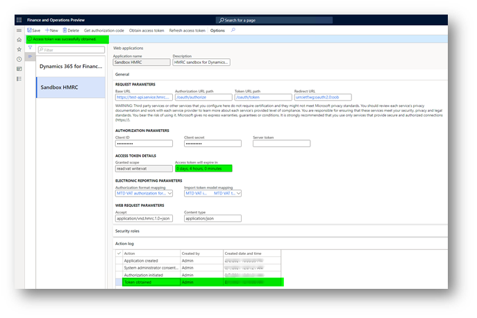
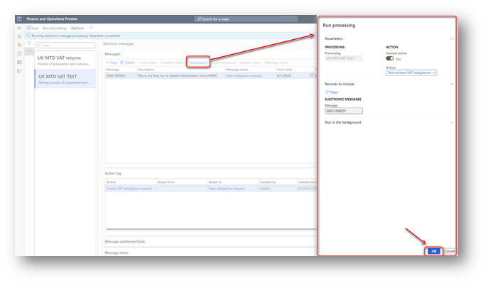
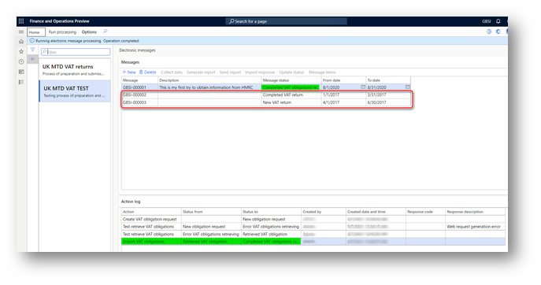
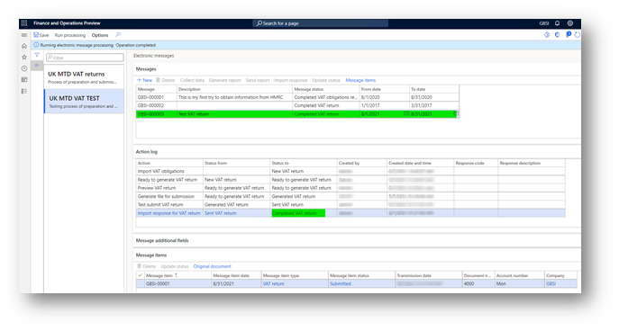

---
# required metadata

title: Test interoperation with MTD VAT sandbox
description: This topic explains how to test interoperation of Dynamics 365 Finance against HMRC's MTD VAT API.
author: liza-golub
ms.date: 08/19/2021
ms.topic: article
ms.prod: 
ms.technology: 

# optional metadata

# ms.search.form: 
# ROBOTS: 
audience: Application User
# ms.devlang: 
ms.reviewer: kfend
# ms.tgt_pltfrm: 
# ms.custom: 
ms.search.region: United Kingdom
# ms.search.industry: 
ms.author: elgolu
ms.search.validFrom: 08/06/2021

---

# Test interoperation with MTD VAT sandbox

[!include [banner](../includes/banner.md)]

This topic explains how to test interoperation of Dynamics 365 Finance against HMRC's MTD VAT API.

For testing purposes, HMRC lets you register as a developer on the [HMRC Developer Hub](https://developer.service.hmrc.gov.uk/developer/registration) and access the sandbox environment. When you're registered as a developer, you can use the **UK MTD VAT TEST** Electronic Messaging (EM) processing in Finance to try to interoperate with the HMRC's sandbox environment. 

## Create a sandbox application in the HMRC Developer Hub

When you're registered as a developer in the HMRC Developer Hub, you can create a sandbox application. This sandbox application is used to test the interoperation of Finance against HMRC's MTD VAT API.

1. Use the [Add an application to the sandbox](https://developer.service.hmrc.gov.uk/developer/applications/add/sandbox) section of your developer's account in the HMRC Developer Hub to create a new sandbox application.
2. Select the **VAT (MTD)** API to subscribe your sandbox application.
3. When the application is added to the sandbox, select **View application credentials**, copy the value in the **Client ID** field.
4. In Finance, go to **Tax** > **Setup** > **Electronic messages** > **Web applications**, select **Sandbox HMRC** web application, and past the copied value in to the **Client ID** field.
5. In the HMRC portal, select **Generate a client secret**. 
6. Copy the generated client secret.
7. In Finance, go to **Tax** > **Setup** > **Electronic messages** > **Web applications**, select the **Sandbox HMRC** web application,  and paste the copied value in the **Client secret** field.
8. In the HMRC portal, select **View your application details** > **Redirect URIs**.
9. Select **Add a redirect URI** and enter the value, **urn:ietf:wg:oauth:2.0:oob**.

## Obtain test user credentials

To test the interoperation of Finance against HMRC's MTD VAT API, you need to acquire test user credentials:

- **User ID**: The name used to access HMRC while an authorization code is being requested.
- **Password**: The password used to access HMRC while an authorization code is being requested.
- **VRN**: The testing VAT registration number (VRN) used during testing of interoperation with the HMRC sandbox environment.

These three parameters must be used together.

To get your test user credentials, complete the following steps. 

1. Complete the steps described in the [Create a test user](https://developer.service.hmrc.gov.uk/api-test-user) section of the HMRC portal. The test user generated in the [Create a test user](https://developer.service.hmrc.gov.uk/api-test-user) section contains information about **UserID**, **Password**, and **VAT Registration Number** fields, and their respective values.
2. Store the User ID, Password, and VAT Registration Number values related to the test user that you created. You will need these values during next steps of the process.
4. In Finance, go to **Tax** > **Setup** > **Electronic messages** > **Electronic message processing**, and select **UK MTD VAT TEST** processing.
5. On the **Message additional fields** FastTab, select the **Tax registration number** additional field and enter the VAT Registration Number of the test user that you obtained from the HMRC portal.

## Obtain an authorization code

Complete the following steps to get an authorization code.

> [!IMPORTANT]
> The authorization code is only valid for 10 minutes. You must obtain the access token during this time. If you don't obtain the access token within 10 minutes, and the authorization code expires. You can get a new authorization code by using the same test user credentials.

1. In Finance, go to **Tax** > **Setup** > **Electronic messages** > **Web applications**, and select the **Sandbox HMRC** web application.
2. On the Action Pane, select **Get authorization code**. 
3. Select **Yes** to confirm that you want to initialize the authorization process. 
4. On the **Electronic reporting parameters** page, in the **Scope** field, enter **read:vat write:vat** and then select **OK**.
5. In the **System administrator consent** dialog, select the check box to confirm enabling interoperation with HMRC’s MTD API and using external web services. Your privacy is important to us. To learn more, read our [Privacy Notice](emea-gbr-mtd-vat-integration.md#privacy-notice).
6. Select **Agree** to continue and in the HMRC portal, select **Continue** on the bottom of the page.
7. You're redirected to the HMRC portal for authorization. On the **Sign in** page, enter the User ID and Password values that you saved in the [Obtain test user credentials](#user) section.
8. Select **Grant authority** .
9. The **Authorisation granted** page shows the authorization code that HMRC granted to you for testing in the sandbox application. Copy the authorization code to the clipboard.

## Obtain an access token

You should initialize retrieval of an access token within 10 minutes after an authorization code is granted by HMRC.

1. In Finance, go to **Tax** > **Setup** > **Electronic messages** > **Web applications**, and select the **Sandbox HMRC** web application. 
2. On the **Web applications** page, on the Action Pane, select **Obtain access token** to request an access token from HMRC. 
3. Paste the authorization code that you copied from the HMRC portal to the **Authorization code** field, and then select **OK**. The access token request is sent to HMRC. The access token from the response that's received is automatically saved in Finance. You can't view the access token from the user interface (UI). However, the **Access token will expire in** field shows the validity period of the access token.

Every access token is valid for four hours after it's created by HMRC. You don't have to manually refresh an access token. During interoperation with HMRC, the process of refreshing the access token is done automatically by the system.

To manually refresh an access token, on the **Web applications** page, on the Action Pane, select **Refresh access token**. A refresh access token request is sent to HMRC, and a new access token from the response that is received is automatically saved in the system.

## Retrieve VAT obligations from HMRC

After you successfully obtain an access token, your sandbox application is ready to interoperate with HMRC.

1. In Finance, go to **Tax** > **Inquiries and reports** > **Electronic messages** > **Electronic messages** and select the **UK MTD VAT TEST** processing. This page shows information about VAT obligations and returns, and is used for interoperation with the HMRC web service. 
2. On the **Messages** FastTab, select **New**.
3. On the **Run processing** dialog box, in the **Action** field, select **Create VAT obligation request**, and then select **OK**. A new electronic message is created that has a status of **New obligation request**. 
4. Fill in dates in **From date** and **To date** fields. These fields are mandatory for electronic messages that retrieve VAT obligations. However, the response from HMRC's sandbox application does not depends on these fields' values and it always contains the same information about obligation periods.
5. Specify a description of your message in **Description** field. This field is optional for electronic messages that retrieve VAT obligations.
6. No additional fields are applicable to this type of electronic message.
7. Select **Send report** to initialize the retrieval of VAT obligation information from HMRC. 
8. In the **Run processing** dialog box, the **Test retrieve VAT obligations** action is automatically defined, and information is filled in by the system. Select **OK**.

6. Select a check box to consent providing the information in fraud prevention headers as part of VAT request to HMRC in the **Request identification information** dialog and click **Submit** button to proceed further. Your privacy is important to us. To learn more read our [Privacy Notice](emea-gbr-mtd-vat-integration.md#privacy-notice).
8. A request in JSON format is created and sent to the HMRC web application. The response that is received from HMRC will be attached to the electronic message. Based on the response, new electronic messages for the VAT return will be created.

HMRC uniquely identifies each VAT return period via a **periodKey** parameter. This parameter is stored in Finance. However, according to HMRC requirements, its value must be hidden in the UI. Users must not be able to see the **periodKey** value in the UI.

The **periodKey** additional field is used to store the **periodKey** value in  the **UK MTD VAT TEST** processing. This field is set up as a hidden field, so that users can't see its value. To comply with HMRC requirements, you should not change this setup for the **periodKey** additional field.

The following illustration shows the lifecycle of electronic message processing for the retrieval of VAT obligations.

The last step of the processing is an **Import VAT obligations** action of the **Electronic reporting import** type. The system defines the following behavior for this step:

- If a VAT obligation from the response doesn't exist in the database, and the status of this VAT obligation in HMRC is **Open**, a new electronic message is created that has a status of **New VAT return**.
- If a VAT obligation from the response doesn't exist in the database, and the status of this VAT obligation in HMRC is **Fulfilled**, a new electronic message is created that has a status of **Completed VAT return**.
- If a VAT obligation from the response does exist in the database, the system verifies the values of the **HMRC status**, **Due date**, and **Received date** additional fields, and syncs them with the information from the response.

All the actions that are performed for electronic messages are logged and can be viewed on the **Action log** FastTab.

## Collect data for a VAT return

The process of preparing and submitting a VAT return for a period is based on sales tax payment transactions that were posted during the [Settle and post sales tax](../general-ledger/tasks/create-sales-tax-payment.md) job. For more information about sales tax settlement and reporting, see [Sales tax overview](../general-ledger/indirect-taxes-overview.md).

Before you start to prepare and submit a VAT return to HMRC, complete the regular **Settle and post sales tax** job for the period that you will report to HMRC. When this job is run, new sales tax payment transactions are created. To view these sales tax payments, go to **Tax** \> **Inquiries and reports** \> **Sales tax Inquiries** \> **Sales tax payments**. You can review the resulting values for each sales tax payment transaction on the **VAT 100** report in Excel format.

You can run the **Settle and post sales tax** job several times for the same period before you submit a VAT return to HMRC. All the sales tax payment transactions can be included on the same VAT return report for a period. The transactions that the system fills in for reporting depend on the sales tax settlement period that is defined in the **Populate VAT return records** action for the processing. You can also include sales tax payment transactions from several legal entities in to one VAT return to be reported as a VAT group. For more information, see the [Define a sales tax settlement period](emea-gbr-mtd-vat-integration-setup.md#settlement) section earlier in this topic. 

> [!IMPORTANT]
> MTD for VAT lets you submit a VAT return only one time for each reporting period. As HMRC states on the official website, the current amendment process will stay in place for VAT:
>
> - If the net value of the errors on the VAT return is less than £10,000, the company will amend those errors on the next VAT return.
> - If the net value of the errors exceeds £10,000, the company must complete the VAT 652 form, which is available on the Gov.UK website.

When the **Settle and post sales tax** job is completed, you can start to prepare a report for electronic submission. The first step of data preparation is to collect sales tax payment transactions that are related to the period. 

1. Go to **Tax** \> **Inquiries and reports** \> **Electronic messages** \> **Electronic messages**, and select the **UK MTD VAT TEST** processing.
2. On the **Message** FastTab, select the electronic message that is created in **New VAT return** status.
3. Update the **Start date** and **End date** fields of the record so that these dates where consistent with the interval of the sales tax settlement period in which you previously completed sales tax settlement procedure. VAT data can be collected only for electronic messages that have a status of **New VAT return**.
4. To start to collect sales tax payment transactions, select **Collect data** on the **Message** FastTab. 
5. The **Populate VAT return records** action is predefined in the **Run processing** dialog box. Select **OK**. 
6. The system collects the sales tax payment transactions that were posted in the period that is defined by the **From date** and **To date** fields. You can review the collected sales tax payment transactions on the **Message items** FastTab.
7. If, for some reason, a sales tax payment transaction that the system entered must be excluded from the report, you can delete it. Alternatively, you can update its status to **Excluded** by selecting **Update status** on the **Message items** FastTab. Transactions that have a status of **Excluded** aren't considered for reporting. You can also change the status of a transaction from **Excluded** back to **Populated** by selecting **Update status** on the **Message items** FastTab.
8. You can repeatedly select **Collect data** on the **Message** FastTab until the electronic message is moved to the next status. 
9. After data is collected, select **Update status** on the **Messages** FastTab. The **Ready to generate VAT return** status is predefined in the **Update status** dialog box. 
10. Select **OK** to mark the electronic message as ready for report generation. The status of the electronic message items that are linked to the electronic message is updated to **To be reported**. 
11. If, for some reason, you must go back to step 4 and continue to collect data or change the status of electronic message items, select **Update status** on the **Messages** FastTab, select **New VAT return** in the **New status** field, and then select **OK**.

The **Action log** FastTab saves information about all the actions that are performed for the electronic message.

After an electronic message has a status of **Ready to generate VAT return**, you can initialize report generation. Two generation options are available:

- **Preview VAT return** – The file will be generated in Excel format and attached to the electronic message. No statuses will be changed.
- **Generate file for submission** – The file will be generated in JSON format and attached to the electronic message. The status of the electronic message will be updated to **Generated VAT return**, and the status of the linked electronic message items will be updated to **Reported**.

## Generate a VAT return in Excel format for preview

To generate a VAT return in **VAT 100** report format in Excel, complete the following steps. 

1. Go to **Tax** \> **Inquiries and reports** \> **Electronic messages** \> **Electronic messages**, and select the **UK MTD VAT TEST** processing.
2. On the **Messages** FastTab, select the electronic message record that is related to the period that you want to generate a file for, and then select **Generate report**. The **Generate report** button is available only for electronic messages that have the following statuses:

    - **Ready to generate VAT return** – The user changes the electronic message status to this value by using the **Update status** button.
    - **Error VAT return generation** – If an error occurs during report generation, the electronic message status is changed to this value.
    - **Error VAT return submission** – If an error occurs during report submission, the electronic message status is changed to this value. The response that includes a description of the error is attached to the action log.

3. In the **Run processing** dialog box, select the **Preview VAT return** action, and then select **OK**. The file is generated in Excel format and attached to the electronic message. No statuses are changed. 
4. To view the file, select the electronic message, and then select the **Attachments** button (paper clip symbol) in the upper-right corner of the page. 
5. On the **Attachments** page for the selected message, select the last attachment (**VAT statement.xlsx**), and then, on the Action Pane, select **Open**. The file is opened in Excel.

You can regenerate the **VAT 100** report several times before you generate the report in JSON format. At that point, the electronic message status will be changed to **Generated VAT return**.

## Generate a VAT return in JSON format

MTD for VAT accepts VAT returns in JSON format only. 

1. To generate a VAT return in JSON format, go to **Tax** \> **Inquiries and reports** \> **Electronic messages** \> **Electronic messages**, and select **UK MTD VAT TEST** processing. 
2. On the **Messages** FastTab, select the electronic message record that is related to the period that you want to generate a file for, and then select **Generate report**.
3. In the **Run processing** dialog box, select the **Generate file for submission** action, and then select **OK**. The file will be generated in JSON format and attached to the electronic message. The electronic message status will be updated to **Generated VAT return**, and the status of the electronic message items that are linked to the electronic message will be updated to **Reported**. 
4. To view the file, select the electronic message, and then select the **Attachments** button (paper clip symbol) in the upper-right corner of the page. 
5. On the **Attachments** page for the selected message, select the last attachment (**VAT\_return.json**), and then, on the Action Pane, select **Open**.

If, for some reason, you must regenerate a VAT return in JSON format before it's submitted to HMRC, use the **Update status** button on the **Messages** FastTab to update the status of the related electronic message to either **New VAT return** or **Ready to generate VAT return**, depending on whether you must go back to the data collection step or the file generation step.

## Submit VAT returns to HMRC

When a VAT return in JSON format is generated and ready to be submitted to HMRC, you can initialize its submission to the MTD for sandbox application. The last JSON file that was attached to the electronic message will be used for the submission. To help prevent discrepancies, we recommended that you delete any unnecessary JSON files that are attached to the electronic message that you will submit to HMRC. 

To find and clean up unnecessary attachments, select the electronic message, and then select the **Attachments** button (paper clip symbol) in the upper-right corner of the page. The **Attachments** page for the selected message is opened.

1. To start submission, go to **Tax** \> **Inquiries and reports** \> **Electronic messages** \> **Electronic messages**, and select the **UK MTD VAT TEST** processing. 
3. On the **Messages** FastTab, select the electronic message record that is related to the period that you want to submit the VAT return for, and then select **Send report**. The **Send report** button is available only for electronic messages that have the following statuses:

    - **Generated VAT return** – The electronic message status is automatically updated to this value when a VAT return in JSON format is successfully generated and attached to the electronic message.
    - **Error VAT return submission** – If an error occurs during report submission, the electronic message status is changed to this value. The response that includes a description of the error is attached to the action log.

4. In the **Run processing** dialog box, the **Test submit VAT return** action is predefined. Select **OK**. A dialog box appears that contains mandatory declaration text that is required by HMRC. To remain compliant with HMRC requirements, you should not modify or delete this declaration text in the setup of the **Test submit VAT return** action. By selecting **OK** in this dialog box, you submit VAT information, and you confirm that the information is true and complete. A false declaration can result in prosecution.

A VAT return can be submitted to HMRC just one time for each period. Therefore, make sure that you want to submit the VAT return before you accept the declaration. If you aren't sure that the VAT return is ready to be submitted, select **Cancel**. When you select **OK**, the VAT return in JSON format that is related to the selected electronic message is submitted to HMRC. If the VAT return is successfully submitted to HMRC, the status of the electronic message is updated to **Sent VAT return**, and the response from HMRC is attached to the electronic message.

5. Select a check box to consent providing the information in fraud prevention headers as part of VAT request to HMRC in the **Request identification information** dialog and click **Submit** button to proceed further. Your privacy is important to us. To learn more read our [Privacy Notice](emea-gbr-mtd-vat-integration.md#privacy-notice).
6. Next, the system automatically runs the **Import response for VAT return** action. This action reflects information from the response in the **Processing date** additional field of the electronic message. It updates the status of the electronic message to **Completed VAT return** and updates the status of the electronic message items to **Submitted**. 

If, for some reason, the **Import response for VAT return** action isn't automatically run, you can manually initialize it by selecting **Import response** on the **Messages** FastTab. The **Import response** button is available only for electronic messages that have a status of **Sent VAT return**. The electronic message status is automatically updated to this value when a VAT return in JSON format is successfully submitted to the electronic message.

The **Action log** FastTab saves information about all the actions that are performed for the electronic message.

[!INCLUDE[footer-include](../../includes/footer-banner.md)]
