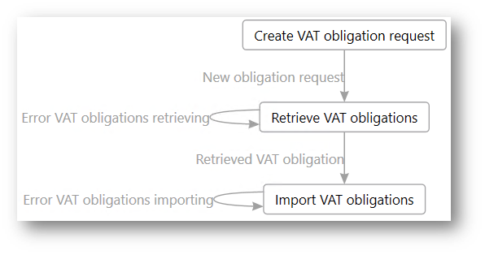
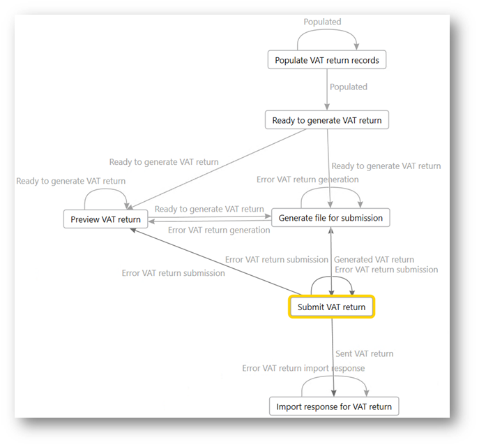
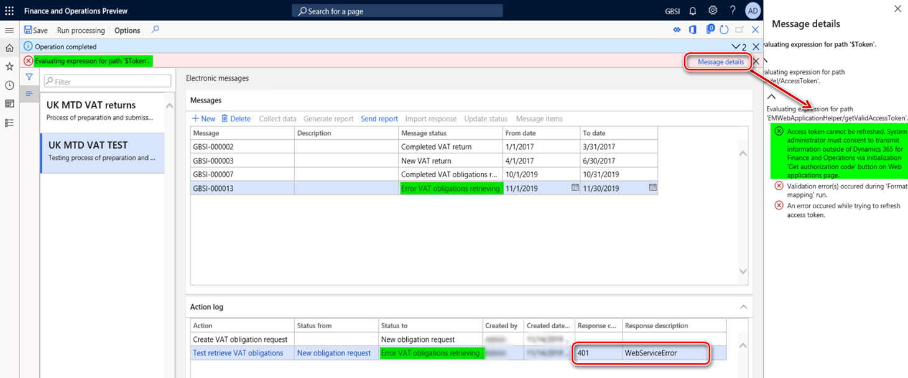

---
# required metadata

title: Submit a VAT return to HMRC's MTD web service
description: This topic explains how to submit a value-added tax (VAT) return to the Making Tax Digital (MTD) web service of Her Majesty's Revenue and Customs (HMRC).
author: liza-golub
ms.date: 08/19/2021
ms.topic: article
ms.prod: 
ms.technology: 

# optional metadata

# ms.search.form: 
# ROBOTS: 
audience: Application User
# ms.devlang: 
ms.reviewer: kfend
# ms.tgt_pltfrm: 
# ms.custom: 
ms.search.region: United Kingdom
# ms.search.industry: 
ms.author: elgolu
ms.search.validFrom: 08/07/2021

---

# Submit a VAT return to HMRC's MTD web service

[!include [banner](../includes/banner.md)]

This topic explains how to submit a value-added tax (VAT) return to the Making Tax Digital (MTD) web service of Her Majesty's Revenue and Customs (HMRC).

The process of submitting a VAT return has two parts:

1. **VAT obligation retrieval**

    The following illustration shows a simplified representation of the processing for VAT obligation retrieval that is implemented in Electronic messages in the scope of the **UK MTD VAT returns** processing.

    

2. **VAT return submission**

    The following illustration shows a simplified representation of the processing for VAT return submission that is implemented in Electronic messages in the scope of the **UK MTD VAT returns** processing.

    

## Retrieve VAT obligations from HMRC

After you successfully obtain an access token for your Microsoft Dynamics 365 Finance environment, the system is ready to interoperate with HMRC's Making Tax Digital for VAT (MTD VAT) application programming interface (API).

Before you submit a VAT return, you must retrieve VAT obligations from HMRC.

1. Go to **Tax** \> **Inquiries and reports** \> **Electronic messages** \> **Electronic messages**, and select the **UK MTD VAT returns** processing.
2. On the **Messages** FastTab, select **New**.
3. In the **Run processing** dialog box, in the **Action** field, select **Create VAT obligation request**. Then select **OK**. A new electronic message is created that has a status of **New obligation request**.
4. Set the following fields.

    | Field       | Description |
    |-------------|-------------|
    | From date   | This field is mandatory for electronic messages that retrieve VAT obligations. Specify the start date of the period for which you want to get information about VAT obligations from HMRC. |
    | To date     | This field is mandatory for electronic messages that retrieve VAT obligations. Specify the end date of the period for which you want to get information about VAT obligations from HMRC. |
    | Description | This field is optional for electronic messages that retrieve VAT obligations. Enter a description of the electronic message. |

    The **Action log** FastTab saves information about the user who created the electronic message, and the date and time when the electronic message was created.

    No additional fields are applicable to this type of electronic message.

5. Select **Send report** to initialize the retrieval of VAT obligation information from HMRC.
6. In the **Run processing** dialog box, the **Retrieve VAT obligations** action is automatically defined, and information is filled in by the system. Select **OK**.
7. In the **Request identification information** dialog box, select the checkbox to consent to providing the information in fraud prevention headers as part of the VAT request to HMRC. Then select **Submit**. Your privacy is important to us. To learn more, read our [privacy notice](emea-gbr-mtd-vat-integration.md#privacy-notice).

    A request in JavaScript Object Notation (JSON) format is created and sent to HMRC. The response that is received from HMRC is attached to the electronic message. Based on the response, either new electronic messages for the VAT return will be created, or existing electronic messages will be updated.

HMRC uniquely identifies each VAT return period by using a **periodKey** parameter. This parameter is stored in Finance. However, according to HMRC requirements, users must not be able to see the **periodKey** value in the user interface (UI). Therefore, the **periodKey** additional field is used to store the **periodKey** value in **UK MTD VAT returns** processing. This field is set up as a hidden field, so that users can't see its value. To ensure compliance with HMRC requirements, don't change this setup for the **periodKey** additional field.

The following illustration shows the lifecycle of electronic message processing for the retrieval of VAT obligations.

The last step of the processing is an **Import VAT obligations** action of the **Electronic reporting import** type. The system defines the following behavior for this step:

- If a VAT obligation from the response doesn't exist in the database, and the status of that VAT obligation in HMRC is **Open**, a new electronic message is created that has a status of **New VAT return**.
- If a VAT obligation from the response doesn't exist in the database, and the status of that VAT obligation in HMRC is **Fulfilled**, a new electronic message is created that has a status of **Completed VAT return**.
- If a VAT obligation from the response does exist in the database, the system verifies the values of the **HMRC status**, **Due date**, and **Received date** additional fields. It then syncs those values with the information from the response.

All the actions that are performed for electronic messages are logged and can be viewed on the **Action log** FastTab.

## Collect data for a VAT return

The process of preparing and submitting a VAT return for a period is based on sales tax payment transactions that were posted during the [Settle and post sales tax](../general-ledger/tasks/create-sales-tax-payment.md) job. For more information about sales tax settlement and reporting, see [Sales tax overview](../general-ledger/indirect-taxes-overview.md).

Before you start to prepare and submit a VAT return to HMRC, complete the regular **Settle and post sales tax** job for the period that you will report to HMRC. When this job is run, new sales tax payment transactions are created. To view these sales tax payments, go to **Tax** \> **Inquiries and reports** \> **Sales tax Inquiries** \> **Sales tax payments**. You can review the resulting values for each sales tax payment transaction on the **VAT 100** report in Excel format.

You can run the **Settle and post sales tax** job several times for the same period before you submit a VAT return to HMRC. All the sales tax payment transactions can be included on the same VAT return report for a period. The transactions that the system fills in for reporting depend on the sales tax settlement period that is defined in the **Populate VAT return records** action for the processing. You can also include sales tax payment transactions from several legal entities in one VAT return that will be reported as a VAT group. For more information, see [Define a sales tax settlement period](emea-gbr-mtd-vat-integration-setup.md#settlement).

> [!IMPORTANT]
> MTD VAT lets you submit a VAT return only one time for each reporting period. As HMRC states on the official website, the current amendment process will remain in place for VAT:
>
> - If the net value of the errors on the VAT return is less than £10,000, the company will amend those errors on the next VAT return.
> - If the net value of the errors exceeds £10,000, the company must complete the VAT 652 form, which is available on the Gov.UK website.

When the **Settle and post sales tax** job is completed, you can prepare a report for electronic submission. The first step of data preparation is to collect sales tax payment transactions that are related to the period.

1. Go to **Tax** \> **Inquiries and reports** \> **Electronic messages** \> **Electronic messages**, and select the **UK MTD VAT returns** processing.
2. On the **Message** FastTab, select the electronic message that is related to the period that you want to submit a VAT return for. Don't update the **Start date** and **End date** fields of the record. Those values are received from HMRC and will be used as criteria for collecting sales tax payment transactions. You can enter a description of the electronic message. VAT data can be collected only for electronic messages that have a status of **New VAT return**.
3. On the **Message** FastTab, select **Collect data** to start to collect sales tax payment transactions.
4. In the **Run processing** dialog box, the **Populate VAT return records** action is predefined. Select **OK**.
5. The system collects the sales tax payment transactions that were posted in the period that is defined by the **From date** and **To date** fields. Next, the system enters those transactions as electronic message items of the message. You can review the transactions on the **Message items** FastTab.
6. If, for some reason, a sales tax payment transaction that the system entered must be excluded from the report, you can delete it. Alternatively, you can update its status to **Excluded** by selecting **Update status** on the **Message items** FastTab. Transactions that have a status of **Excluded** aren't considered for reporting. You can also change the status of a transaction from **Excluded** back to **Populated** by selecting **Update status** on the **Message items** FastTab.
7. You can repeatedly select **Collect data** on the **Message** FastTab until the electronic message is moved to the next status.
8. After data is collected, select **Update status** on the **Messages** FastTab.
9. In the **Update status** dialog box, the **Ready to generate VAT return** status is predefined. Select **OK** to mark the electronic message as ready for report generation. The status of the electronic message items that are linked to the electronic message is updated to **To be reported**.
10. If, for some reason, you must go back to step 3 and continue to collect data or change the status of electronic message items, select **Update status** on the **Messages** FastTab, select **New VAT return** in the **New status** field, and then select **OK**.

The **Action log** FastTab saves information about all the actions that are performed for the electronic message.

After an electronic message has a status of **Ready to generate VAT return**, you can initialize report generation. Two options are available:

- **Preview VAT return** – The file is generated in Excel format and attached to the electronic message. No statuses are changed.
- **Generate file for submission** – The file is generated in JSON format and attached to the electronic message. The status of the electronic message is updated to **Generated VAT return**, and the status of the linked electronic message items is updated to **Reported**.

## Generate a VAT return in Excel format for preview

Follow these steps to generate a VAT return in **VAT 100** report format in Excel.

1. Go to **Tax** \> **Inquiries and reports** \> **Electronic messages** \> **Electronic messages**, and select the **UK MTD VAT returns** processing.
2. On the **Messages** FastTab, select the electronic message record that is related to the period that you want to generate a file for, and then select **Generate report**. The **Generate report** button is available only for electronic messages that have the following statuses:

    - **Ready to generate VAT return** – The user changes the electronic message status to this value by selecting **Update status**.
    - **Error VAT return generation** – If an error occurs during report generation, the electronic message status is changed to this value.
    - **Error VAT return submission** – If an error occurs during report submission, the electronic message status is changed to this value. The response that includes a description of the error is attached to the action log.

3. In the **Run processing** dialog box, select **Preview VAT return**, and then select **OK**. The file is generated in Excel format and attached to the electronic message. No statuses are changed.
4. To view the file, select the electronic message, and then select **Attachments** (the paper clip symbol) in the upper-right corner of the page.
5. On the **Attachments** page for the selected message, select the last attachment (**VAT statement.xlsx**), and then, on the Action Pane, select **Open**. The file is opened in Excel.

You can regenerate the **VAT 100** report several times before you generate the report in JSON format. At that point, the electronic message status is changed to **Generated VAT return**.

## Generate a VAT return in JSON format

HMRC's MTD VAT API accepts VAT returns in JSON format only. Follow these steps to generate a VAT return in JSON format.

1. Go to **Tax** \> **Inquiries and reports** \> **Electronic messages** \> **Electronic messages**, and select the **UK MTD VAT returns** processing.
2. On the **Messages** FastTab, select the electronic message record that is related to the period that you want to generate a file for, and then select **Generate report**.
3. In the **Run processing** dialog box, select **Generate file for submission**, and then select **OK**. The file is generated in JSON format and attached to the electronic message. The electronic message status is updated to **Generated VAT return**, and the status of the electronic message items that are linked to the electronic message are updated to **Reported**.
4. To view the file, select the electronic message, and then select **Attachments** (the paper clip symbol) in the upper-right corner of the page.
5. On the **Attachments** page for the selected message, select the last attachment (**VAT\_return.json**), and then, on the Action Pane, select **Open**.

If, for some reason, you must regenerate a VAT return in JSON format before it's submitted to HMRC, select **Update status** on the **Messages** FastTab to update the status of the related electronic message to either **New VAT return** or **Ready to generate VAT return**, depending on whether you must go back to the data collection step or the file generation step.

## Submit VAT returns to HMRC

When a VAT return in JSON format is generated and ready to be submitted to HMRC, initialize its submission to the MTD VAT web application. The last JSON file that was attached to the electronic message is used for the submission. To help prevent discrepancies, we recommended that you delete any unnecessary JSON files that are attached to the electronic message that you will submit to HMRC. To find and clean up unnecessary attachments, select the electronic message, and then select **Attachments** (the paper clip symbol) in the upper-right corner of the page. The **Attachments** page for the selected message is opened.

Follow these steps to submit a VAT return.

1. Go to **Tax** \> **Inquiries and reports** \> **Electronic messages** \> **Electronic messages**, and select the **UK MTD VAT returns** processing.
2. On the **Messages** FastTab, select the electronic message record that is related to the period that you want to submit the VAT return for, and then select **Send report**. The **Send report** button is available only for electronic messages that have the following statuses:

    - **Generated VAT return** – The electronic message status is automatically updated to this value when a VAT return in JSON format is successfully generated and attached to the electronic message.
    - **Error VAT return submission** – If an error occurs during report submission, the electronic message status is changed to this value. The response that includes a description of the error is attached to the action log.

3. In the **Run processing** dialog box, the **Submit VAT return** action is predefined. Select **OK**.
4. The dialog box that appears contains mandatory declaration text that is required by HMRC. To remain compliant with HMRC requirements, don't modify or delete this declaration text in the setup of the **Submit VAT return** action. By selecting **OK** in this dialog box, you submit VAT information, and you confirm that the information is true and complete. A false declaration can result in prosecution.

    A VAT return can be submitted to HMRC only one time for each period. Therefore, make sure that you want to submit the VAT return before you accept the declaration. If you aren't sure whether the VAT return is ready to be submitted, select **Cancel**.

    When you select **OK**, the VAT return in JSON format that is related to the selected electronic message is submitted to HMRC. If the VAT return is successfully submitted to HMRC, the status of the electronic message is updated to **Sent VAT return**, and the response from HMRC is attached to the electronic message.

5. In the **Request identification information** dialog box, select the checkbox to consent to providing the information in fraud prevention headers as part of the VAT request to HMRC. Then select **Submit**. Your privacy is important to us. To learn more, read our [privacy notice](emea-gbr-mtd-vat-integration.md#privacy-notice).

    The system automatically runs the **Import response for VAT return** action. This action causes the **Processing date** additional field of the electronic message to reflect information from the response. Additionally, the system updates the status of the electronic message to **Completed VAT return** and updates the status of the electronic message items to **Submitted**.

    If, for some reason, the **Import response for VAT return** action isn't automatically run, you can manually initialize it by selecting **Import response** on the **Messages** FastTab. The **Import response** button is available only for electronic messages that have a status of **Sent VAT return**. The electronic message status is automatically updated to this value when a VAT return in JSON format is successfully submitted to the electronic message.

The **Action log** FastTab saves information about all the actions that are performed for the electronic message.

> [!IMPORTANT]
> During a VAT obligations request or a VAT return request to HMRC, you might receive a "401" error that has the following message:
>
> > The access token can’t be refreshed. A system administrator must enable the interoperation with HMRC’s MTD API by selecting the **Get authorization code** button on the **Web applications** page. 
>
> For more information, see [Authorize your Finance environment to interoperate with HMRC's MTD web service](emea-gbr-mtd-vat-integration-authorization.md).
>
> 

[!INCLUDE[footer-include](../../includes/footer-banner.md)]
