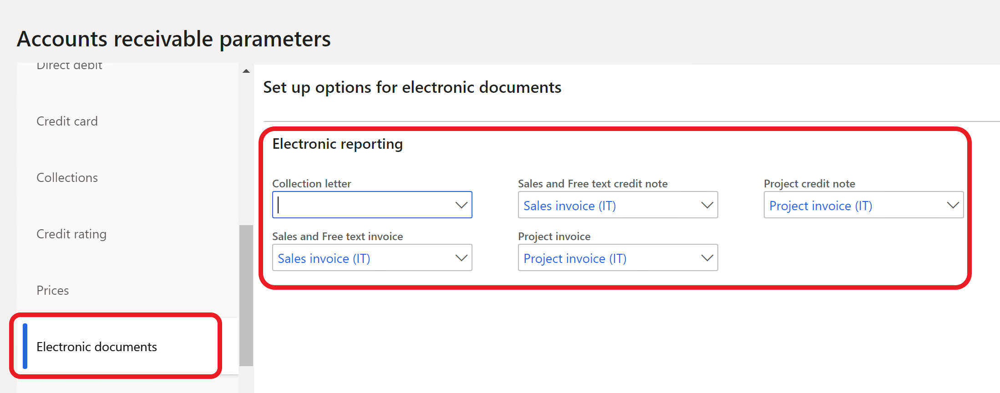
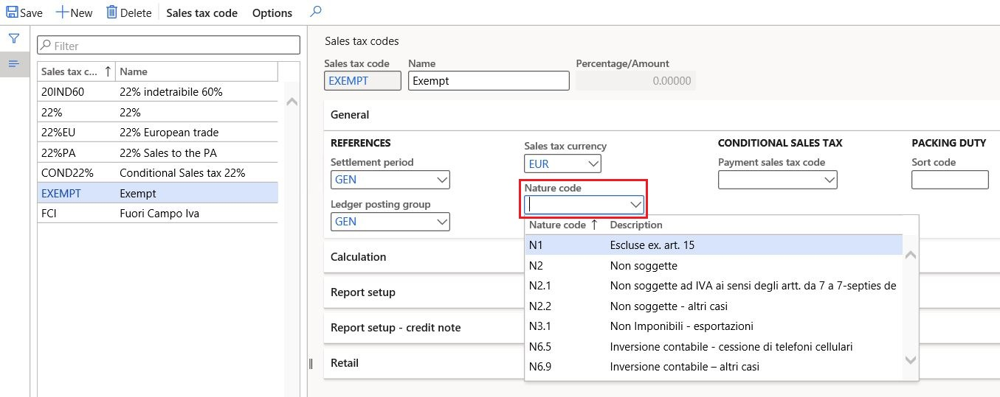
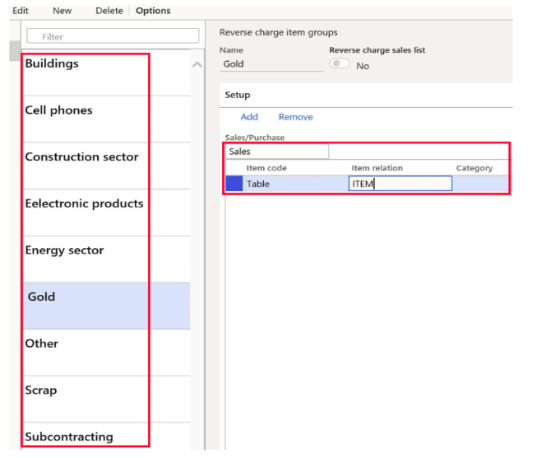
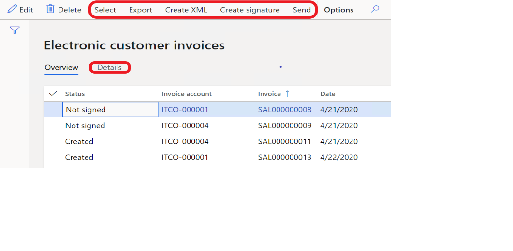

---
# required metadata

title: Customer electronic invoices
description: This topic provides information about the management of customer electronic invoices for Italy.
author: v-oloski
manager: tfehr
ms.date: 02/16/2021
ms.topic: article
ms.: 
ms.service: dynamics-ax-applications
ms.technology: 

# optional metadata

# ms.search.form:
audience: Application User
# ms.devlang: 
ms.reviewer: 
# ms.tgt_pltfrm: 
# ms.custom
ms.search.region: Italy
# ms.search.industry: 
ms.author: v-oloski

---

# Customer electronic invoices

[!include [banner](../includes/banner.md)]

This topic describes how to set up and work with the functionality for creating and sending sales invoices and project invoices in an electronic format (FatturaPA).

Version 1.2 of FatturaPA electronic invoices can be used for all types of businesses. These businesses include public administrations, private companies, and professionals.

> [!NOTE]
> The primary address of the legal entity must be in Italy.

This topic contains the following information:

- [Setup information](#setup)
- [How to fill in data for output of a tender procedure identification code (Codice Identificativo di Gara \[CIG\]) and unique project code (Codice Unico di Progetto \[CUP\])](#relateddoc)
- [Overview of the Electronic invoice register](#einvoiceregister)
- [Additional functionality that affects the XML file](#additionalfunctionality)

## Setup

Before you can begin to work with the electronic invoice functionality, the following data must be set up:

- [Accounts receivable parameters](#arparameters)
- [Electronic invoice currency](#electronicinvoicecurrency)
- [Electronic invoice parameters](#einvoicesparameters)
- [Electronic document properties](#edproperties)
- [Customers](#customers)
- [Items](#items)
- [Maintain **Natura** codes](#Natura)
- [Digital certificates](#digitalcert)
- [Optional: Destination for XML file output](#destination)

### Accounts receivable parameters

Select the configurations that are used to create electronic invoice XML files for sales and free text invoices, sales and free text credit notes, project invoices, and project credit notes. You can find these configurations on the **Electronic document** tab of the **Accounts receivable parameters** page (**Accounts receivable** \> **Setup** \> **Accounts receivable parameters**).

> [!NOTE]
> The configurations must be imported before they can be selected. For more information, see [Download ER configurations from the Global repository of Configuration service](../../fin-ops-core/dev-itpro/analytics/er-download-configurations-global-repo.md).

### Electronic invoice currency

To report invoices in the EUR currency in an XML file, set the **Print amount in currency representing the euro** option to **Yes** on the **General** FastTab of the **Form setup** page in Accounts receivable (**Accounts receivable** \> **Setup** \> **Form setup**) and/or in Project management and accounting (**Project management and accounting** \> **Setup** \> **Form setup**).

> [!NOTE] 
> If the **Print amount in currency representing the euro** option is set to **No**, a related XML file will be generated in the original invoice currency. 

To use this functionality, import the following Electronic reporting (ER) configurations, or later version of them, from Shared asset library in Microsoft Dynamics Lifecycle Services (LCS):

- Invoice model.version.231
- Invoice model mapping.version.231.164
- Sales invoice (IT).version.231.91
- Project invoice (IT).version.231.90

### Electronic invoice parameters

Set these parameters to specify business scenarios and company-specific information.

1. Go to **Accounts receivable** \> **Setup** \> **Electronic invoice parameters**.
2. On the **General** tab, specify the electronic signature requirement.
3. On the **Company information** tab, specify the company information and tax representative, as required. This information overrides the information in the legal entity record.
4. On the **Art. 2250 Civil code registration** tab, provide any required information if the company is registered under the terms of Article 2250 of the Italian Civil Code.
5. On the **Number sequences** tab, fill in number sequences for the **eInvoice unique file number** and **eInvoice transmission number** references.

### Electronic document properties

The functionality for electronic document properties is used to set up the output to XML document blocks for different business cases. Here are some examples:

- A value-added tax (VAT) registration number for customers who aren't in the European Union (EU) and don't have VAT registration codes
- A certified email address (posta elettronica certificata \[PEC\]) for private companies or professionals
- A stamp duty (payable and not payable by the customer)
- Data about a customer's representative

For the functionality to work, the following data must be set up:

- Electronic document property types (**Accounts receivable** \> **Setup** \> **Electronic document property types**) and the table that each document property type is applicable to. For electronic invoice functionality, the **Customers** and **Legal entities** tables are used.

    

- Required values in the specified tables at the customer and legal entity levels:

    - **Customer:** Go to **Accounts receivable** \> **Customers** \> **All customers**, and then, on the Action Pane, on the **Customer** tab, select **Electronic document properties**.
    - **Legal entity:** Go to **Organization administration** \> **Organizations** \> **Legal entities**, and then, on the Action Pane, select **Electronic document properties**.

The specified values are used for output to the XML file blocks. The following table provides information about how and where those values are used.

| Business scenario | Electronic document property type | Electronic document property type description | Applicability (table) | Where to use the values | Element in the XML file |
|-------------------|-----------------------------------|-----------------------------------------------|-----------------------|--------------|-------------------------|
| Customers who are outside the EU and don't have VAT registration codes. For these customers, the VAT registration number should be **00000000000**. | VATnonEU | Example: **Customer, non-EU VAT number** | **CustTable** (Customers) | In customer electronic document properties, set the **Value** field to **00000000000**. | **IdCodice** (**CessionarioCommittente\\DatiAnagrafici\\IdFiscaleIVA** block) |
| Certified email address (PEC) for private companies or professionals | PEC | Example: **Customer, Certified email address** | **CustTable** (Customers) | In customer electronic document properties, set the **Value** field to **\<PEC\>**. | **PECDestinatario** (**DatiTrasmissione** block) |
| Stamp duty that isn't included in the invoice total for sales invoices, and that is or isn't included for project invoices | Bollo
<strong>Note:</strong> This document property type is used for sales order invoices, free text invoices, and project invoices.
 | Example: **Stamp duty, included/not included into invoice totals** | **CompanyInfo** (Legal entities) | In legal entity electronic document properties, set the **Value** field to **\<Charge code/project category that is used for stamp duties\>**:<ul><li>**Charge code** – The debit type for this charge code should be **Ledger**.</li><li>**Project category** – This project category should be billable.</li></ul> | **ImportoBollo** (**DatiBollo** block) |
| Stamp duty that is included in the invoice total | BolloPay
<strong>Note:</strong> This document property type is used only for sales order invoices and free text invoices.
 | Example: **Stamp duty, included into invoice totals** | **CompanyInfo** (Legal entities) | In legal entity electronic document properties, set the **Value** field to **\<Charge code/project category that is used for stamp duties\>**:<ul><li>**Charge code** – The debit type should be **Customer/Vendor**.</li></ul> | **ImportoBollo** (**DatiBollo** block) |
| Representative | TaxRepPaese, TaxRepCodice, TaxRepDenominazione, TaxRepNome, TaxRepCognome | Any description | **CustTable** (Customers) | In customer electronic document properties, set the **Value** field to **IT** for the **TaxRepPaese** document property type. For other types, fill in data for the representative. | **Cognome** (**RappresentanteFiscale** block) |
| Invoice types | DocumentType | Example: **Invoice, document type** | **CustInvoiceJour** (Customer invoice journal), **ProjInvoiceJour** (Project invoice) | Go to **Accounts receivable \> Inquiries and reports \> Invoices \> Invoice journal** or **Project management and accounting \> Project invoices \> Project invoices**, and set the **Value** field to a document type, such as **TD16**. | **TipoDocumento** (**DatiGeneraliDocumento** block) |

> [!NOTE]
> The preceding table uses the following shorthand:
>
> - "Customer electronic document properties" refers to the **Electronic document properties** page that is opened by selecting **Electronic document properties** on the **Customer** tab on the Action Pane of the **All customers** page (**Accounts receivable \> Customers \> All customers**).
> - "Legal entity electronic document properties" refers the **Electronic document properties** page that is opened by selecting **Electronic document properties** on the Action Pane of the **Legal entities** page (**Organization administration \> Organizations \> Legal entities**).
>
> On the **Electronic document property types** list page, the **Description** field is automatically filled in when a user enters information in the **Group description** and **Description** fields.
>
> The electronic document property type must have the same code that is specified in the table.

#### Use project categories for stamp duty

Go to **Project management and accounting** \> **Setup** \> **Categories** \> **Project categories** to set up project categories that have a transaction type of **Fee** or **Expense**. The category ID should equal the value that is defined for the **Bollo** document property type at the legal entity level. For more information, see the previous table.

The project category of the **Fee** transaction type can be used only for stamp duty that is included in the invoice. The project category of the **Expense** transaction type can be used for both stamp duty that is included in a customer invoice and stamp duty that isn't included. In both cases, the **Bollo** document property type is used.

When you create **Fee** or **Expense** journal lines, select the category that was defined for stamp duty, and enter a cost price. The system considers this cost price the stamp duty amount. If you enter a sales price that equals the cost price amount, the system considers this amount included in invoice totals. The sales price amount equals 0 (zero), and the transaction isn't included in invoice totals.

> [!NOTE]
> You can use only one of the journal types (**Fee** or **Expense**) for stamp duty. A company that uses only payable stamp duty can use the **Fee** journal type. If a company uses both payable and non-payable stamp duty, it's better to use the **Expense** journal type.

### Customers

#### Authority office field

You can find the **Authority office** field on the **Sales demographics** FastTab of a customer record (go to **Accounts receivable** \> **Customers** \> **All customers**, and open the customer record in **Edit** mode).

The value of this field is used to define the type of communication (business to government \[B2G\] or business to business \[B2B\]):

- If the length of the value is 6, the customer is considered a public administration (the transmission format equals **FPA12**).
- If the length of the value is 7, the customer is considered a private company or professional (the transmission format equals **FPR12**).

In both cases, the system enters the value of this field in the **CodiceDestinatario** tag in the XML file.

If the **Authority office** field is blank, the system considers the customer a private company or professional (the transmission format equals **FPR12**), and enters **0000000** in the **CodiceDestinatario** tag in the XML file. In this case, a certified email address (PEC) should be set up. For more information, see the table in the [Electronic documents properties](#edproperties) section earlier in this topic.

#### Activate automatic creation of electronic invoices

Go to **Accounts receivable** \> **Customers** \> **All customers**, and open a customer record in **Edit** mode. Then, on the **Invoice and delivery** FastTab, in the **E-invoice** section, find the **eInvoice register** option. If this option is set to **Yes**, the system automatically creates the record on the **Electronic customer invoices** list page. For more information, see the [Electronic invoice register](#einvoiceregister) section later in this topic.

In the **E-invoice** section, you can also set the **eInvoice attachment** option to **Yes**. In this case, after you print an invoice (either during or after posting), the system automatically attaches the PDF file to the invoice and electronic invoice (see the [Electronic invoice register](#einvoiceregister) section), and the file is included in the XML file (**Allegati** block).

### Items

If there are product lines on an invoice, the **CodiceArticolo** block is filled in based on product data. This data includes the product bar code, the internal product number or item number, and the external item description. This information can be found by selecting options in the **Related information** group on the **Sell** tab on the Action Pane of the **Released products** page (**Product information management** \> **Products** \> **Released products**).

The **CodiceTipo** field is set according to the following rules:

- If there is a bar code, this field is set to **EAN**.
- If there isn't a bar code, and the record on the **External item description** page exists for the product and the customer, this field is set to the value from the **Description** field.
- If there isn't a bar code, and the record on the **External item description** page doesn't exist for the product, this field is set to the **Codice Art. fornitore** text.

The **CodiceValore** field is set according to the following rules:

- If there is a bar code, this field is set to the bar code.
- If there isn't a bar code, and the record on the **External item description** page exists for the product and the customer, this field is set to the value from **External item number** field.
- If there isn't a bar code, and the record on the **External item description** page doesn't exist for the product and customer, this field is set to the value from the **Item number** field.

### Maintain "Natura" codes

The system allows users to either manually associate **Natura** codes with related Sales tax codes or let the system automatically determine appropriate **Natura** codes for transactions. Manuall assignment of **Natura** codes has higher priority and will override autimatically idendified  **Natura** codes.

#### Define "Natura" codes

 > [!NOTE]
 > This functionality is available in the system starting from the version 10.0.18.

Complete the following steps to define **Natura** codes

1. Go to **Tax** > **Setuo** > **Sales tax** > **Nature codes**.
2. Create a new record.
3. In the **Code** field
4. Create as many **Natura** codes as you need to cover all the related business operations.

#### Reverse charge groups configuration

The settings in this section are required when a company uses the reverse charge functionality. Additionally, application-specific parameters that have these groups should be set up. For more information about this functionality, see [A country-specific hotfix to support changes in "FatturaPA" format of Italian electronic invoices in Microsoft Dynamics 365 Finance](https://support.microsoft.com/help/4569342/a-country-specific-hotfix-to-support-changes-in-fatturapa-format-of-it).

Go to **Tax** \> **Setup** \> **Reverse charge item groups** to define specific reverse charge groups for specific products or categories.

### Digital certificates

Go to **Accounts receivable** \> **Setup** \> **Electronic signature certificates** to electronically sign electronic invoices by using a certificate of either the **Company** type or the **User** type.

The party that is issuing invoices must use a qualified signature certificate to sign each FatturaPA file that is transmitted to the Sistema di Interscambio (SdI) exchange system. A qualified signature certificate can be obtained from one of the certifiers in the [list of authorized certifiers](http://www.digitpa.gov.it/firma-digitale/certificatori-accreditati).

Microsoft Dynamics 365 Finance supports the **XAdES-BES** signature format. To enable Finance to support FatturaPA, follow these steps.

1. On client computers, in the **Application server machine** field of the **Personal** node, install and configure digital certificates that have private and public keys.

    > [!NOTE]
    > You can complete the installation and configuration by using standard Windows functionality.

2. Define company-level certificates and user-level certificates, as required.

### Destination for XML file output

If XML files must be sent as output to a specific place when invoices are posted (for example, if they must be sent to a SharePoint folder), set up a document type, and then set up a destination. For more information about these steps, see [Configure document management](../../fin-ops-core/fin-ops/organization-administration/configure-document-management.md) and [Electronic reporting (ER) destinations](../../dev-itpro/analytics/electronic-reporting-destinations.md).

> [!NOTE]
> The **Print invoice** option must be set to **Yes**. If the destination is set up, the status of the electronic invoice record for the invoice is automatically set to **Sent**.

## Fill in data for related documents

Companies can report additional information about some base documents that are related to invoices. Here are some examples:

- The **DatiOrdineAcquisto** block contains information that is related to the purchase order.
- The **DatiContratto** block contains information that is related to the contract.
- The **DatiConvenzione** block contains information that is related to the agreement.
- The **DatiRicezione** block contains information that is related to data about the reception phase. This data is present in the management system that is used by the PA (tax agencies).
- The **DatiFattureCollegate** block contains information that is related to invoices that were previously transmitted and that the current document is connected to. This block is used for cases where a credit note and/or invoice is forwarded in accordance with previous advance payment invoices.

To enable the system to enter information in these blocks, set the following fields:

- On the **Sales order** page (**Accounts receivable** \> **Orders** \> **All sales orders**), in the **Header** view, on the **Setup** FastTab, set the fields in the **Base document** section.
- On the **Free text invoice** page (**Accounts receivable** \> **Invoices** \> **All free text invoices**), in the **Header** view, on the **General** FastTab, set the fields in the **Base document** section.
- On the **Project proposal** page (**Project management and accounting** \> **Projects** \> **All projects**), on the Action Pane, on the **Manage** tab, in the **Bill** group, select **Invoice proposal**, and then set the fields in the **Base document** section.

> [!NOTE]
> As the following table shows, data from the fields in the **Base document** section is sent as output from different blocks, depending on the value of the **Base document** field.
> 
> | Value of the Base document field | Block that data is sent from |
> |---|---|
> | Payment order | DatiOrdineAcquisto |
> | Contract | DatiContratto |
> | Agreement | DatiConvenzione |
> | Management system | DatiRicezione |
> | Original invoice | DatiFattureCollegate |

For each base document, users can add details about the document number and date, CUP (unique project code that is managed by the Inter Ministerial Committee for Economic Planning), CIG (tender procedure identification code), and agreement code.

## Electronic invoice register

To view all customer electronic invoices and perform various actions, go to **Accounts receivable** \> **Invoices** \> **E-Invoices** \> **Electronic invoices**.

On the **Electronic customer invoices** page, you can perform any of the following actions:

- Select **Select** to select invoices, based on various criteria. This function is useful if the **eInvoice register** option is set to **No**.
- Select **Create XML**, **Create signature**, and **Send** to create XML files and a digital signature for selected invoices, and send the invoices.
- Select **Export** to export a selected invoice to an XML file.

    > [!NOTE]
    > The system sends a file to the folder that is set up on your computer. (The destination settings aren't used.)

- Select the **Details** tab to view details of the electronic invoice.

> [!NOTE]
> The **Electronic invoices** page (**Project management and accounting** \> **Project invoices** \> **E-invoices** \> **Electronic invoices**) resembles the **Electronic customer invoices** page and has the same functions.

## Additional functionality that affects the XML file

### Tax invoice for goods delivered for free

For information about how to set up and work with this functionality, see [Tax invoice for goods delivered for free](emea-ita-exil-goods-for-free.md).

On the **Distribution** page (**Sales and marketing** \> **Setup** \> **Distribution**), if **Goods for free** is selected in the **Reason for delivery** field, and the **Invoice account** field is blank, the **TipoCessionePrestazione** element is sent as output in the XML file.

### Intent letters – Invoicing of usual exporters

For information about how to set up and work with this functionality, see [Intent letters – Invoicing of usual exporters](emea-ita-exil-intent-letter.md).

If an intent letter is set up for a customer, the **Causale** element (**DatiGeneraliDocumento** block) that has the number of the intent letter is sent as output in the XML file.

### Invoice type configuration

The following types of invoice documents are supported and will automatically be filled in:

- TD01 – Invoice
- TD04 – Credit note
- TD05 – Debit note
- TD20 – Self-invoice

If a required document type isn't covered by the values in the preceding list, you can manually adjust the document type in the invoice journals. To enable manual adjustment, you must complete the following setup:

- Electronic document property definition
- Invoice document type registration

For more information, see [A country-specific hotfix to support changes in "FatturaPA" format of Italian electronic invoices in Microsoft Dynamics 365 Finance](https://support.microsoft.com/help/4569342/a-country-specific-hotfix-to-support-changes-in-fatturapa-format-of-it).

[!INCLUDE[footer-include](../../includes/footer-banner.md)]
