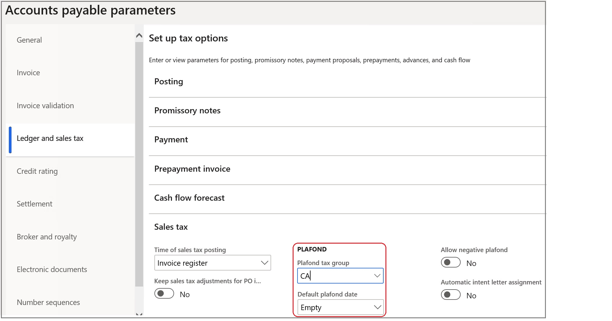
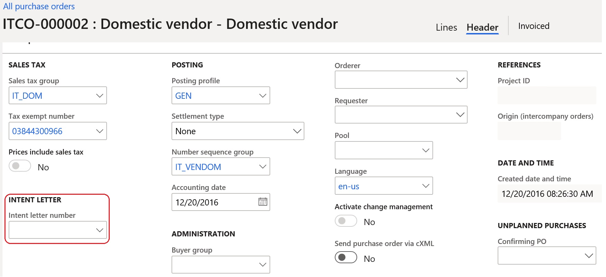

---
# required metadata

title: Tax plafond
description: This topic explains how to set up and work with tax plafond, which is a tax exemption process.
author: ilkond
manager: AnnBe
ms.date: 02/04/2021
ms.topic: article
ms.prod: 
ms.service: dynamics-ax-applications
ms.technology: 

# optional metadata

ms.search.form: 
audience: Application User
# ms.devlang: 
ms.reviewer: kfend
# ms.tgt_pltfrm: 
# ms.custom: 
ms.search.region: Italy
# ms.search.industry: 
ms.author: ilyako
ms.search.validFrom: 2020-06-01
ms.dyn365.ops.version: 10.0.9

---

# Tax plafond

[!include [banner](../includes/banner.md)]

Tax plafond is a tax exemption process available for companies, called *usual exporter*, of purchasing and importing goods and services without paying sales tax, within a limited value of their sales to foreign countries in the previous period. A company is a *usual exporter* if, during the previous year, 10 percent of its revenue value came from selling to a foreign country. The initial plafond amount and its validity dates are established at the beginning of the period. The company can buy without paying sales tax as long as the value of the purchases is less than the initial plafond amount.

This topic describes how to complete these tasks:

- Set up the system to use the **Tax plafond** feature.
- Work with tax plafond and intent letters.
- Report tax payments that include tax plafond information.

## Prerequisites

- The primary address of the legal entity must be in Italy.
- In the **Feature management** workspace, turn on the **Tax plafond** feature. For more information, see [Feature management overview](../../fin-and-ops/get-started/feature-management/feature-management-overview.md).
- There is a sales tax settlement period (**Tax** > **Indirect taxes** > **Sales tax** > **Sales tax settlement periods**) for the period in which you plan to create tax plafond and intent letters, and post tax documents with reference to intent letters.

## Set up parameters

### Set up Accounts payable parameters

1. Go to **Accounts payable** \> **Setup** \> **Accounts payable parameters**.
2. On the **Number sequences** tab, specify number sequences for the following references:

    - Plafond number
    - Intent letter number

3. On the **Intent letters - Telematic model** tab, in the **Intent letter model format mapping** field, specify the reference to the **Intent letter telematic model** configuration.

    

    > [!NOTE]
    > The configuration must be imported by using Electronic reporting (ER). For more information about how to download ER configurations,
see [Download Electronic reporting configurations from Lifecycle Services](../../fin-ops-core/dev-itpro/analytics/download-electronic-reporting-configuration-lcs.md).

4. On the **Ledger and sale tax** tab, on the **Sales tax** FastTab, in the **Plafond** section, set the **Plafond tax group** and **Default plafond date** fields.

    

### Set up General ledger parameters

1. Go to **General ledger** \> **Ledger setup** \> **General ledger parameters**.
2. On the **Number sequences** tab, specify the number sequence for the **Intent letter telematic model ID** reference.

### Set up sales tax codes

1. Go to **Tax** \> **Indirect taxes** \> **Sales tax** \> **Sales tax codes**.
2. On the **General** FastTab, in the **Invoicing** section, set the **Affect intent letters** option to **Yes**.

    

## Create tax plafond

Before you start creating a new tax plafond, verify that there is a sales tax settlement period for the period in which you plan to create tax plafond and intent letters, and post tax documents with reference to the intent letters.

To register a new tax plafond, follow these steps.

1. Go to **Tax** \> **Indirect taxes** \> **Sales tax** \> **Tax plafond**.
2. On the Action Pane, select **Functions** \> **Create new**, and enter information about the tax plafond.

   The following table describes the various fields.

    | Field name                             | Description |
    |----------------------------------------|-------------|
    | Plafond number                         | The number of the tax plafond. This value is automatically filled in according to the number sequence that is specified for the **Plafond number** reference on the **Accounts payable parameters** page. |
    | Description                            | Enter a description of the tax plafond. |
    | From date                              | The start date of the period that the tax plafond is effective during. |
    | To date                                | The end date of the period that the tax plafond is effective during. |
    | Closed date                            | The calculated date when the tax plafond is closed. |
    | Initial plafond amount                 | Enter the amount of the tax plafond. |
    | Initial current amount                 | The calculated amount that is available on the tax plafond. |
    | Plafond warning type, amount, %        | The type of check that is done, and the related amount or percentage at which users will begin to receive warnings about the remaining amount of the tax plafond. |
    | Settlement period                      | Specify the settlement period. |
    | Operations contributing to the plafond | Turn the options for inclusion in the intent letters report on or off. |

To review posted tax transactions for an existing tax plafond, on the **Tax plafond** page, on the Action Pane, select **Plafond transactions**.

## Create intent letters

Before you start creating a new intent letter, verify that there is a sales tax settlement period for the period in which you plan to create tax plafond and intent letters, and post tax documents with reference to intent letters.

To create a new intent letter for a vendor, follow these steps.

1. Go to **Accounts payable** \> **Intent letters** \> **Intent letters**.
2. On the Action Pane, select **New**, and enter the following information about the intent letter.

    | Field name   | Description                                                                      |
    |--------------|----------------------------------------------------------------------------------|
    | Posting date | Specify the posting date for the intent letter.                                  |
    | Letter type  | Select the type of intent letter: **Amount** or **Specific operation**.          |
    | From date    | Specify the start date of the period that the intent letter is effective during. |
    | To date      | Specify the end date of the period that the intent letter is effective during.   |
    | Amount       | Specify the amount for the intent letter.                                        |

3. On **Records to include** FastTab, select **Filter** to select the vendors that intent letters must be created for.
4. Select **OK** to finalize the selection.
5. On the next page, select **Update existing purchase orders** to apply new intent letters to existing purchase orders that haven't yet been invoiced for the selected vendors.
6. Select **Re-confirm purchase orders** to reconfirm the purchase orders that intent letters are applied to, in case they were confirmed.
7. Select **Exclude delivered or partly delivered purchase orders** to exclude purchase orders that were fully or partially delivered from the list of purchase orders that will be updated with intent letters.
8. Select **OK** to create intent letters that are based on the specified parameters.

    > [!NOTE]
    > When intent letters are created, the system automatically numbers them according to the number sequence that is specified for the **Intent letter number** reference on the **Accounts payable parameters** page.

9. For the intent letters that are created, on the **General** tab, you can enter information about the generated telematic model.

    The following table describes the various fields.

    | Field name    | Description |
    |---------------|-------------|
    | Model ID      | The identifier of the telematic model that the intent letter was included in. This value is automatically filled in according to the number sequence that is specified for the **Intent letter telematic model ID** reference on the **General ledger parameters** page. |
    | Purchase type | Select the type of purchase: **Purchase** or **Import**. |

> [!NOTE]
> Intent letters of the **Period** type aren't supported, and you can't create them. The **Period** type is kept for historical data, for those users who previously used this type and the **Automatic intent letter assignment** parameter on the **Ledger and sales tax** tab of the **Accounts payable parameters** page.

## Work with intent letters

Intent letters that are created for vendors can be applied to purchase orders or vendor invoice journals before invoices are posted.

To apply an intent letter to a purchase order or vendor invoice journal, select it in the **Intent letter number** field of the related purchase order or vendor invoice journal. The sales tax group that is specified in the **Plafond tax group** field on the **Accounts payable parameters** page will be automatically filled in for the purchase order or vendor invoice journal.

You can also review the intent letters for a specific vendor from vendor master data.

1. Go to **Accounts payable** \> **Vendors** \> **All vendors**.
2. On the Action Pane, on the **Vendor** tab, in the **Related information** group, select **Intent letters** to view the intent letters that are related to the selected vendor.

## Generate the telematic model for intent letters

To generate the telematic model for an intent letter, follow these steps.

1. Go to **Tax** \> **Declarations** \> **Sales tax** \> **Intent letters – Telematic model**.
2. On the Action Pane, select **New** to create a new record for telematic model reporting. The model ID is automatically filled in according to the number sequence that is specified for the **Intent letter telematic model ID** reference on the **General ledger parameters** page.
3. In the **Internal description** field, specify the internal description for the new telematic model.
4. On the **General** tab, enter any related information about the new telematic model: the signatory, the writer, integrative parameters, and the file name.
5. On the Action Pane, select **Transfer**, and then select the intent letters to include in the current model. The selected intent letters will be shown on the **Intent letters** FastTab.

    > [!NOTE] 
    > Intent letters that are already included in other models can't be selected.

6. On the Action Pane, select **Export** to generate the **Intent letter telematic model** output file.

[!INCLUDE[footer-include](../../includes/footer-banner.md)]