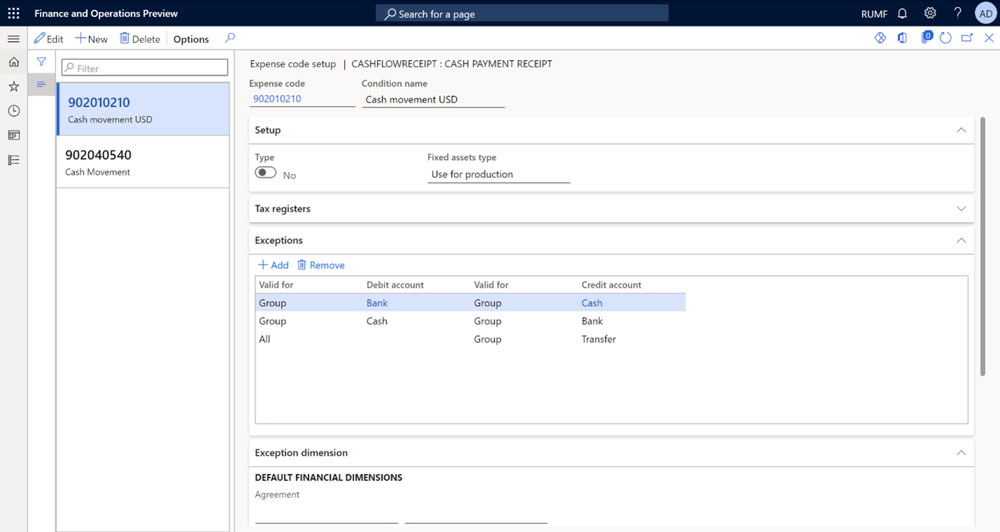
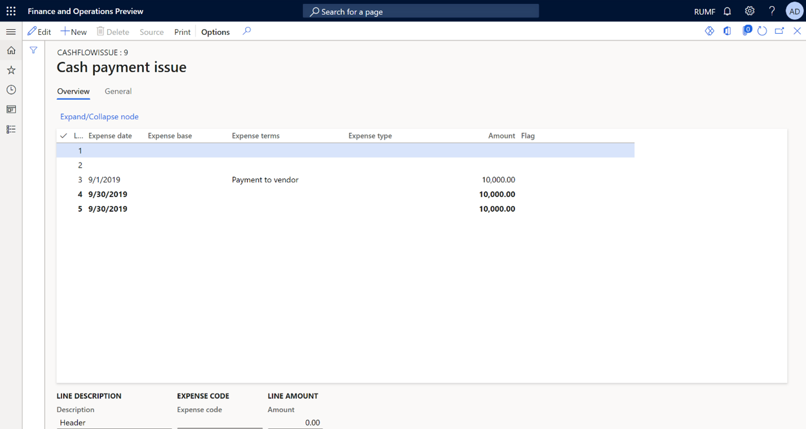

---
# required metadata
title: Cash flow tax registers
description: This topic provides information about cash flow tax registers.
ms.date: 12/22/2020
ms.topic: article
ms.service: dynamics365-financials
author: akroshkina
manager: anayash
---

# Cash flow tax registers

## Overview

Cash flow tax registers are generated based on accounting data from
general ledger transactions. There are two types of tax registers:

- **Cash payment receipt
    (Cash flow = Pay in)** – The cash inflow tax register is designed to
    consolidate cash inflow information to identify either income that
    is related to current and future periods, or transactions that
    determine future expenses.

- **Cash payment issue (Cash flow = Expense)** – The cash outflow tax
    register is designed to consolidate cash outflow information to
    identify either expenses that are related to current and future
    periods, or transactions that determine future income.

Cash accounts include the following types of accounts:

- **Cash** – This type includes the company's cash accounts (ledger
    account **50**).

- **Bank** – This type includes accounts that reflect the balance on
    bank accounts (ledger accounts **51**, **52**, and **55.1** for
    accounting for letters of credit).

- **Other** – This type includes other special cash accounts.

    Accounting transactions where ledger account **57** (**Transfers in
    transit**) is specified as a credit account should be excluded from
    the tax registers. The following types of accounting transactions
    should also be excluded:

<!-- -->

-   Debit ledger account **51** = credit ledger account **50**
    (**Deposited to the bank in cash**)

-   Debit ledger account **50** = credit ledger account **51**
    (**Received from the bank in cash**)

## Set up the tax registers

### Set up account interval groups for the Bank, Cash, and Other account types

1.  Go to **Tax &gt; Setup &gt; Profit tax &gt; Account interval
    groups**.

2.  On the Action Pane, select **New**.

3.  In the **Interval group** field, enter a name for the new account
    interval group. For this example, enter **Bank**.

4.  On the **Account intervals** FastTab, select **Add**.

5.  In the **Account (Interval: From)** field, select a ledger account.
    For this example, select **51.000**.

6.  In the **Account (Interval: To)** field, select a ledger account.
    For this example, select **51.999**.

7.  Repeat steps 2 through 6 to create a second account interval group
    that is named **Cash**, for ledger accounts **50.000** through
 **50.999**, and a third account interval group that is named
 **Transfers in transit**, for ledger accounts **57.000** through
 **57.999**.

### Assign expense codes to tax registers and set up exceptions

Follow these steps to set up expenses for the **Cash payment issue** and
**Cash payment receipt** tax registers.

1.  Go to **Tax &gt; Setup &gt; Profit tax &gt; Registers**.

2.  Select the tax register, and then, on the Action Pane, select
 **Expense codes**.

3.  On the Action Pane, select **New**.

4.  In the **Expense code** field, select the expense code. The tax
    register will reflect transactions that have the selected expense
    code.

5.  In the **Condition name** field, enter a description.

6.  On the **Exceptions** FastTab, create the following exceptions to
    specify that the tax register won't reflect the cash flow between
    cash accounts and bank accounts, or the cash flow for transfer
    accounts:

-   To exclude transactions from cash accounts to bank accounts, select
 **Add**, and then set the following fields:

    - **Debit fields:** Set the first **Valid for** field to **Group**
        and the **Debit account** field to **Bank**.

    - **Credit fields:**
        Set the second **Valid for** field to **Group** and the **Credit
        account** field to **Cash**.

<!-- -->

-   To exclude transactions from bank accounts to cash accounts, select
 **Add**, and then set the following fields:

    - **Debit fields:** Set the first **Valid for** field to **Group**
        and the **Debit account** field to **Cash**.

    - **Credit fields:** Set the second **Valid for** field to
 **Group** and the **Credit account** field to **Bank**.

<!-- -->

-   To exclude transactions for transfers in transit, select **Add**,
    and then set the following fields:

    - **Debit fields:** Set the first **Valid for** field to **All**.

    - **Credit fields:** Set the second **Valid for** field to
 **Group** and the **Credit account** field to **Transfer**.

## Cash payment receipt tax register

Calculate the tax register as described in Profit tax registers journal.

The **Cash payment receipt** tax register shows all cash receipt
transactions, based on the settings that you configured earlier in this
topic. You can view the total for the whole tax register and also the
totals for each **Receive reason** value.

The tax register lines show the following information:

- **Receipt date** – The date when funds were received in the
    organization's current account or the cash account. This date is
    determined based on primary documents, such as the account statement
    or cash receipt order.

- **Receipt reason** – Details of the primary document, such as the
    number of the incoming cash order or bank payment order.

- **Receipt terms** – The conditions for the receipt of funds.

- **Amount** – The amount of the receipt. This value is taken from the
    corresponding source document.

- **Flag** – The amount and currency code, if the funds were received
    in a foreign currency. This value is taken from the corresponding
    source document.

## Cash payment issue tax register

Calculate the tax register as described in Profit tax registers journal.

The **Cash payment issue** tax register shows all cash issue
transactions, based on the settings that you configured earlier in this
topic. You can view the total for the whole tax register and also the
totals for each expense type.

The tax register lines show the following information:

- **Expense date** – The date when funds were withdrawn from the
    company's current account or the cash account. This date is
    determined based on primary documents.

- **Expense base** – Details of the document that funds were withdrawn
    for, such as the number of the outgoing cash order or bank payment
    order.

- **Expense terms** – The conditions for the withdrawal of funds.
    Expense terms can be payment, advance payment, refund of previously
    received advances, or provision of funds on the terms of a refund.

- **Expense type** – The type of expense. Expenses can be
    contributions, deposits and other mandatory payments, voluntary
    insurance contributions, compensation for the use of personal cars,
    payment of lifting special funds, expenditure of special funds, or
    other conditions or types of expenses.

- **Amount** – The amount of the withdrawal. This value is taken from
    the corresponding source document.

- **Flag** – The amount and currency code, if the funds were withdrawn
    in a foreign currency. This value is taken from the corresponding
    source document.

