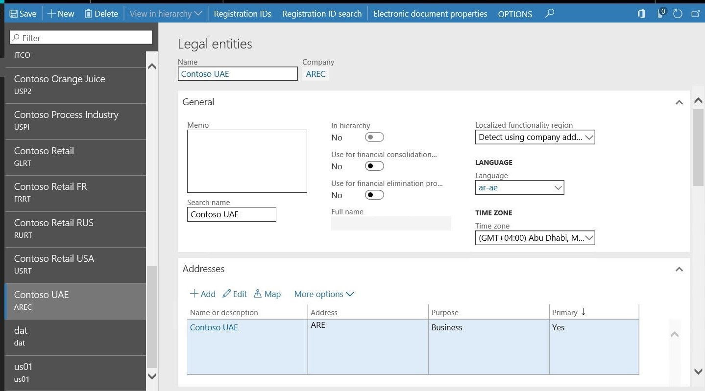
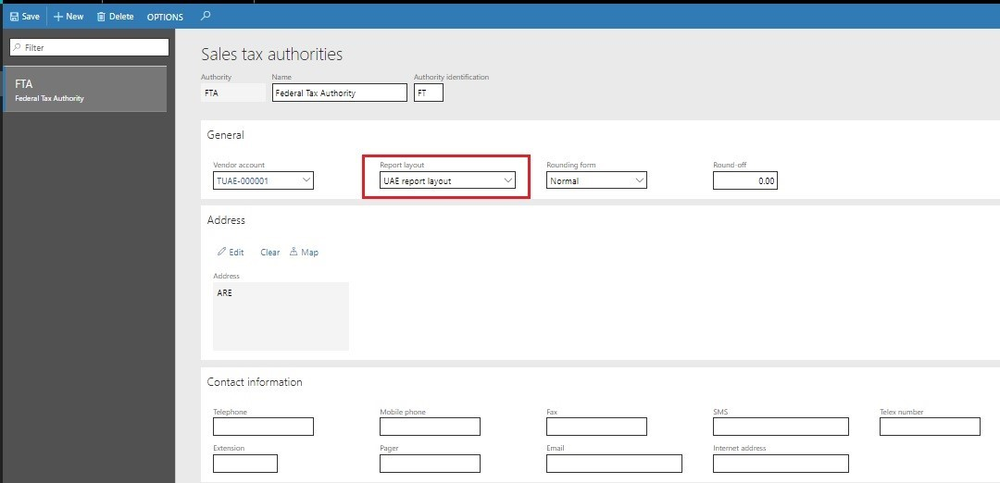
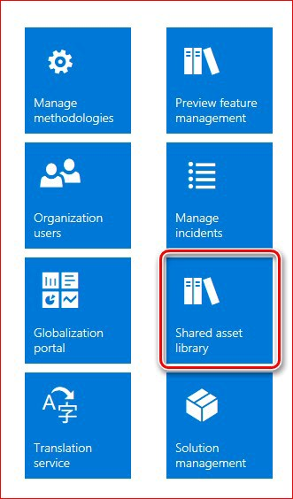
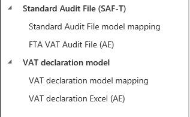
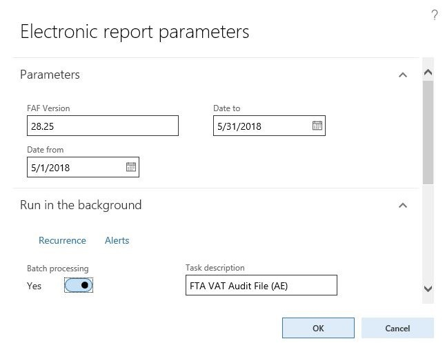

---
# required metadata

title: Set up and report value-added tax (VAT)
description: This topic explains how to set up and report value-added tax (VAT).
author: kfend
manager: AnnBe
ms.date: 01/17/2020
ms.topic: article
ms.prod: 
ms.technology: 

# optional metadata

ms.search.form: 
# ROBOTS: 
audience: Application User
# ms.devlang: 
ms.reviewer: kfend
# ms.tgt_pltfrm: 
ms.custom: 272683
ms.search.region: UAE
# ms.search.industry: 
ms.author: kfend
ms.dyn365.ops.version: Version 1611
ms.search.validFrom: 2019-05-29

---

# Set up and report value-added tax (VAT)

[!include [banner](../includes/banner.md)]

Value-added tax (VAT) was introduced in the United Arab Emirates (UAE) on January 1, 2018. Businesses in the UAE are responsible for carefully documenting their business income, costs, and associated VAT charges.

Registered businesses and traders will charge VAT to all their customers at the current rate, and they will incur VAT on goods and services that they buy from suppliers. The difference between these sums is reclaimed or paid to the government. Federal Decree Law No. (8) of 2017 on Value Added Tax outlines the tax scope, rate, responsibility for tax, and supply of goods and services in all cases, including supply in special cases, supply of more than one component, supply via agent, supply by government entities, and cases of deemed supply. For more detailed information about VAT regulations, see the [Federal Tax Authorities of United Arab Emirates website](https://government.ae/information-and-services/finance-and-investment/taxation/valueaddedtaxvat).

Dynamics 365 Finance is accredited and certified with the UAE Federal Tax Authorities (FTA) as a tax accounting software provider.

## Overview

Standard sales tax functionality in Finance and Operations meets a majority of the legislative requirements of the UAE VAT law. To align the UAE VAT localization with UAE requirements for VAT reporting, the following country-specific enhancements have been added to the localization:

- The legal entity configuration has been extended so that it includes additional fields that are required for VAT reporting.
- VAT reverse charge functionality has been made available for the UAE (**ARE** country/region context) to correctly record taxable domestic operations in Gulf Cooperation Council (GCC) territory.
- Country-specific printout layouts for sales invoices and credit notes for the UAE have been added. These layouts include additional columns and VAT summary information.
- Sales invoices and credit notes for the UAE can be printed in two languages. These languages include the new **ar-AE** Arabic language for the user interface (UI).
- The VAT return declaration report can be printed to an electronic file format that can be uploaded to the FTA e-Tax portal.
- Standard audit file functionality has been shared with the UAE local functionality. Therefore, the FTA VAT audit file (FAF) that is required by FTA can be exported to the required comma-separated values (CSV) file format.

For more detailed information about standard sales tax functionality, see the following topics:

- [Setting up sales tax authorities](../general-ledger/tasks/set-up-sales-tax-authorities.md)
- [Set up a sales tax settlement period](../general-ledger/tasks/set-up-sales-tax-settlement-periods.md)
- [Ledger posting groups](../general-ledger/tasks/set-up-ledger-posting-groups-sales-tax.md)
- [Sales tax exempt codes](https://technet.microsoft.com/library/aa634356.aspx)
- [Sales tax reporting codes](../general-ledger/tasks/set-up-sales-tax-reporting-codes.md)
- [Setting up sales tax codes](../general-ledger/tasks/set-up-sales-tax-codes.md)
- [Setting up sales tax groups and item sales tax groups](../general-ledger/tasks/set-up-sales-tax-groups-item-sales-tax-groups.md)
- [Set up conditional sales taxes](https://technet.microsoft.com/library/aa496600.aspx) (used for cash accounting)
- [Set up a tax registration type](emea-registration-ids.md)

## Activate the UAE functionality

Country-specific functionality for the UAE is activated by using the **Localized functionality region** configuration for legal entities. If the company address is used to detect the **Localized functionality region** configuration, make sure that the country/region code of the legal entity's primary address is set to **ARE** on the **Legal entities** page.

For more information about the patterns that are used in localized solutions, see the [Localization and regulatory features website](../../dev-itpro/lcs-solutions/country-region.md).

## Configure VAT for a legal entity

The VAT declaration and the FAF require that additional information be set up in the configuration of a legal entity. In Finance and Operations, go to **Organization administration** \> **Organizations** \> **Legal entities**, and then, on the **Value added tax** FastTab, set the following fields:

- **Taxable person name** – Electronic VAT reports require the name of the taxable person. Names in English and Arabic will be filled in on reports. If the UI language of the legal entity is set to English, the **Known as** field on the **Global address book** page can be used to store names in another language, such as Arabic.
- **Tax agency name** and **Tax agent name** – The tax agency name, tax agency number, tax agent name, and tax agent approval number are required when electronic VAT reports are prepared by a contracted tax agent or vendor.
- **Declarant name** – The electronic VAT report will include information about the person who is preparing a VAT declaration.
- **VAT refund required (if any)** – Set this option to **Yes** if a VAT refund is due, and the company has requested to receive it.
- **Profit margin scheme** – Set this option to **Yes** if the company operates in a special business scheme by using the Profit Margin scheme.
- **VAT on behalf of customer** – Set this option to **Yes** if the company operates as an agent that pays import VAT on behalf of another taxable person.

For more information about VAT reporting requirements, see the instructions in the [Requirements Document for Tax Accounting Software](https://www.tax.gov.ae/-/media/Files/FTA/Tax-Support/tax-accounting-software-vendors/requirement-document-for-tax-accounting-software.pdf) section of the UAE FTA website.

## Configure the tax authority

The federal tax authority (FTA) must be set up as a sales tax authority. After the vendor account is associated with the tax authority, the system creates automatic payments to vendor payables during the settlement process.

Go to **Tax** \> **Sales tax** \> **Sales tax authorities**, and set up the address information of your FTA office. Be sure to select the UAE-specific report layout that corresponds to the electronic VAT declaration.

When you've finished, you can associate sales tax settlement periods with the tax authority that you just configured and with sales tax codes.

## Configure sales tax codes

The electronic VAT declaration report is based on the configuration of a specific UAE report layout for sales tax. This layout should be selected as the default layout in the setup of the tax authority.

Set up sales tax codes by following the appropriate procedure for the profile of your company's business in [Sales Tax section](../general-ledger/indirect-taxes-overview.md) of the Help documentation.

To run the UAE report layout that includes the electronic VAT declaration, you must first set up the appropriate number of reporting codes that are associated with the amount that is reporting in each VAT declaration.

Go to **Tax** \> **Indirect tax** \> **Sales tax** \> **Sales tax reporting codes**, and create or update sales tax reporting codes according to the information in the following table.

| Sales tax code | VAT reporting code | Report setup                    | Description                                                                             | VAT rate |
|----------------|--------------------|---------------------------------|-----------------------------------------------------------------------------------------|----------|
| SRSAD          | 10                 | Sale \> Taxable sales           | Standard rated supplies in Abu Dhabi                                                    | 5        |
|        -        | 11                 | Sale \> Tax Payable             | Standard rated supplies in Abu Dhabi                                                    | 5        |
| SRSAD-A        | 15                 | Sale \> Tax Payable             | Standard rated supplies in Abu Dhabi – Adjustment                                       | 5        |
| SRSD           | 20                 | Sale \> Taxable sales           | Standard rated supplies in Dubai                                                        | 5        |
|     -           | 21                 | Sale \> Tax Payable             | Standard rated supplies in Dubai                                                        | 5        |
| SRSD-A         | 25                 | Sale \> Tax Payable             | Standard rated supplies in Dubai – Adjustment                                           | 5        |
| SRSS           | 30                 | Sale \> Taxable sales           | Standard rated supplies in Sharjah                                                      | 5        |
|      -          | 31                 | Sale \> Tax Payable             | Standard rated supplies in Sharjah                                                      | 5        |
| SRSS-A         | 35                 | Sale \> Tax Payable             | Standard rated supplies in Sharjah – Adjustment                                         | 5        |
| SRSA           | 40                 | Sale \> Taxable sales           | Standard rated supplies in Ajman                                                        | 5        |
|    -            | 41                 | Sale \> Tax Payable             | Standard rated supplies in Ajman                                                        | 5        |
| SRSA-A         | 45                 | Sale \> Tax Payable             | Standard rated supplies in Ajman – Adjustment                                           | 5        |
| SRSRQ          | 50                 | Sale \> Taxable sales           | Standard rated supplies in Umm Al Quwain                                                | 5        |
|      -          | 51                 | Sale \> Tax payable             | Standard rated supplies in Umm Al Quwain                                                | 5        |
| SRSRQ-A        | 55                 | Sale \> Tax payable             | Standard rated supplies in Umm Al Quwain – Adjustment                                   |    -      |
| SRSRK          | 60                 | Sale \> Taxable sales           | Standard rated supplies in Ras Al Khaimah                                               | 5        |
|      -          | 61                 | Sale \> Tax payable             | Standard rated supplies in Ras Al Khaimah                                               | 5        |
| SRSRK-A        | 65                 | Sale \> Tax payable             | Standard rated supplies in Ras Al Khaimah – Adjustment                                  | 5        |
| SRSF           | 70                 | Sale \> Taxable sales           | Standard rated supplies in Fujairah                                                     | 5        |
|     -           | 71                 | Sale \> Tax Payable             | Standard rated supplies in Fujairah                                                     | 5        |
| SRSF-A         | 75                 | Sale \> Tax payable             | Standard rated supplies in Fujairah – Adjustment                                        | 5        |
| TRPTS          | 80                 | Sale \> Taxable sales           | Tax Refunds provided to Tourists                                                        | 5        |
|       -         | 81                 | Sale \> Tax Payable             | Tax Refunds provided to Tourists                                                        | 5        |
| TRPTS-A        | 85                 | Sale \> Tax payable             | Tax Refunds provided to Tourists – Adjustment                                           | 5        |
| SSRCP-R        | 90                 | Purchases \> Taxable Purchases  | Supplies subject to the reverse charge provisions-Sales                                 | 5        |
|      -          | 91                 | Purchases \> Taxable Receivable | Supplies subject to the reverse charge provisions-Sales                                 | 5        |
| SSRCP-R-A      | 95                 | Purchases \> Taxable Receivable | Supplies subject to the reverse charge provisions-Sales – Adjustment                    | 5        |
| ZRS            | 100                | Sale \> Taxable sales           | Zero rated supplies                                                                     | 0        |
| SOGSRC         | 110                | Sale \> Taxable sales           | Supplies of goods and services to registered customers in other GCC implementing states | 5        |
| ES             | 120                | Sale \> Taxable sales           | Exempt supplies                                                                         | 0        |
| GITUAE         | 170                | Purchases \> Taxable Purchases  | Goods imported into the UAE                                                             | 5        |
|      -          | 171                | Purchases \> Sales tax payable  | Goods imported into the UAE                                                             | 5        |
| GITUAE-R       | 130                | Sale \> Taxable sales           | Goods imported into the UAE reverse charge                                              | -5       |
|      -          | 131                | Sale \> Tax Payable             | Goods imported into the UAE reverse charge                                              | -5       |
| SSRCP-R        | 90                 | Sale \> Taxable sales           | Supplies subject to the reverse charge provisions                                       | -5       |
|      -          | 91                 | Sale \> Tax Payable             | Supplies subject to the reverse charge provisions                                       | -5       |
| SSRCP          | 170                | Sale \> Taxable sales           | Supplies subject to the reverse charge provisions                                       | 5        |
|    -            | 171                | Sale \> Tax Payable             | Supplies subject to the reverse charge provisions                                       | 5        |
| SRE-A          | 160                | Purchases \> Taxable Receivable | Standard rated expenses – Adjustment                                                    | 5        |
| SSRCP          | 170                | Sale \> Taxable sales           | Supplies subject to the reverse charge provisions                                       |  -        |
|     -           | 171                | Sale \> Tax Payable             | Supplies subject to the reverse charge provisions                                       | -5       |
| SSRCP-A        | 175                | Sale \> Tax Payable             | Supplies subject to the reverse charge provisions – Adjustment                          |     -     |
| GTTKOB         | 180                | Sale \> Taxable sales           | Goods transferred to the Kingdom of Bahrain                                             |     -     |
|      -          | 181                | Sale \> Tax Payable             | Goods transferred to the Kingdom of Bahrain                                             | 5        |
| GTTKOB-A       | 185                | Sale \> Tax Payable             | Goods transferred to the Kingdom of Bahrain – Adjustment                                |   -       |
| GTTSOK         | 190                | Sale \> Taxable sales           | Goods transferred to the State of Kuwait                                                |   -       |
|     -           | 191                | Sale \> Tax Payable             | Goods transferred to the State of Kuwait                                                | 5        |
| GTTSOK-A       | 195                | Sale \> Tax Payable             | Goods transferred to the State of Kuwait – Adjustment                                   |    -      |
| GTTSOO         | 200                | Sale \> Taxable sales           | Goods transferred to the Sultanate of Oman                                              |   -       |
|      -          | 201                | Sale \> Tax Payable             | Goods transferred to the Sultanate of Oman                                              | 5        |
| GTTSOO-A       | 205                | Sale \> Tax Payable             | Goods transferred to the Sultanate of Oman – Adjustment                                 |   -       |
| GTTSOQ         | 210                | Sale \> Taxable sales           | Goods transferred to the State of Qatar                                                 | 5        |
|     -           | 211                | Sale \> Tax Payable             | Goods transferred to the State of Qatar                                                 | 5        |
| GTTSOQ-A       | 215                | Sale \> Tax Payable             | Goods transferred to the State of Qatar – Adjustment                                    | 5        |
| GTTKOSA        | 220                | Sale \> Taxable sales           | Goods transferred to the Kingdom of Saudi Arabia                                        |   -       |
|      -          | 221                | Sale \> Tax Payable             | Goods transferred to the Kingdom of Saudi Arabia                                        |     -     |
| GTTKOSA-A      | 225                | Sale \> Tax Payable             | Goods transferred to the Kingdom of Saudi Arabia – Adjustment                           | 5        |
| RVPKOB         | 230                | Purchases \> Taxable Purchases  | Recoverable VAT paid in the Kingdom of Bahrain                                          |    -      |
|        -        | 231                | Purchases \> Taxable Receivable | Recoverable VAT paid in the Kingdom of Bahrain                                          |    -      |
| RVPKOB-A       | 235                | Purchases \> Taxable Receivable | Recoverable VAT paid in the Kingdom of Bahrain – Adjustment                             | 5        |
| RVPSOK         | 240                | Purchases \> Taxable Purchases  | Recoverable VAT paid in the State of Kuwait                                             |    -      |
|       -         | 241                | Purchases \> Taxable Receivable | Recoverable VAT paid in the State of Kuwait                                             |    -      |
| RVPSOK-A       | 245                | Purchases \> Taxable Receivable | Recoverable VAT paid in the State of Kuwait – Adjustment                                | 5        |
| RVPSOO         | 250                | Purchases \> Taxable Purchases  | Recoverable VAT paid in the Sultanate of Oman                                           |     -     |
|      -          | 251                | Purchases \> Taxable Receivable | Recoverable VAT paid in the Sultanate of Oman                                           |    -      |
| RVPSOO-A       | 255                | Purchases \> Taxable Receivable | Recoverable VAT paid in the Sultanate of Oman – Adjustment                              | 5        |
| RVPSOQ         | 260                | Purchases \> Taxable Purchases  | Recoverable VAT paid in the State of Qatar                                              |    -      |
|     -          | 261                | Purchases \> Taxable Receivable | Recoverable VAT paid in the State of Qatar                                              |    -      |
| RVPSOQ-A       | 265                | Purchases \> Taxable Receivable | Recoverable VAT paid in the State of Qatar – Adjustment                                 | 5        |
| RVPKOSA        | 270                | Purchases \> Taxable Purchases  | Recoverable VAT paid in the Kingdom of Saudi Arabia                                     |    -      |
|      -          | 271                | Purchases \> Taxable Receivable | Recoverable VAT paid in the Kingdom of Saudi Arabia                                     |    -      |
| RVPKOSA-A      | 275                | Purchases \> Taxable Purchases  | Recoverable VAT paid in the Kingdom of Saudi Arabia –  Adjustment                     | 5        |

Use the information in the "Report setup" column of the above table to configure sales tax codes and associate them with sales tax reporting codes on the **Report setup** FastTab of each report that is relevant to your company's business.

## Set up a VAT reverse charge

When a taxable customer must pay tax on a supply that is received from a non-resident supplier, VAT should be calculated and paid to tax the authorities, based on a VAT reverse charge. The customer must calculate and report the output tax on the supply and the relevant input tax.

To use the reverse charge functionality, you must set the **Enable reverse charge** option to **Yes** on the **Reverse charge** tab of the **General ledger parameters** page.

Before you set the sales tax group for the reverse charge, you should set up two sales tax codes: one for input sales tax and one for output sales tax. The output sales tax code should be set up so that it has a negative value. For more information, see [Setting up sales tax codes](https://technet.microsoft.com/library/gg230668.aspx).

In the **Reverse charge** sales tax group, you must select the **Reverse charge** check box on the line that has the negative sales tax rate.

When the invoice line is posted with the sales tax group defined as **Reverse charge**, the system will create two sales tax transactions: one that has a sales tax receivable tax direction and one that has a sales tax payable tax direction.

## Download and set up Electronic reporting configurations

The implementation of VAT reporting for the UAE is based on Electronic reporting (ER) configurations. For more information about the capabilities and concepts of configurable reporting, see [Electronic reporting](../../dev-itpro/analytics/general-electronic-reporting.md).

For production and user acceptance testing (UAT) environments, follow the instructions in [Download Electronic reporting configurations from Lifecycle Services](../../dev-itpro/analytics/download-electronic-reporting-configuration-lcs.md) to download ER configurations.

To use the VAT declaration and FAF functionality in UAE localizations, you must install the following configurations. Always use the highest available version number of a configuration file.

| Configuration file name                           | Configuration type                         |
|---------------------------------------------------|--------------------------------------------|
| VAT declaration model.version.4.xml               | Data model                                 |
| VAT declaration model mapping.version.4.4.xml     | Model mapping                              |
| VAT declaration Excel (AE).version.4.1.xml        | UAE-specific Microsoft Excel output format |
| Standard Audit File model mapping.version.6.7.xml | Data model                                 |
| Standard Audit File (SAF-T).version.6.xml         | Model Mapping                              |
| FTA VAT Audit file (AE).version.6.5.xml           | UAE FAF CSV output format                  |

For development and test environments, if direct access to a deployment virtual machine (VM) is available, you can download configurations from [Microsoft Dynamics Lifecycle Services (LCS)](https://lcs.dynamics.com). After you sign in to LCS, select the **Shared asset library** tile.

 

In the Shared asset library, select **GER Configuration**, select the required configurations (see the previous table), and download them to a local disk.

In Finance and Operations, in the **Electronic reporting** workspace, select the **Reporting configurations** tile. Then, on the **Configurations** page, on the Action Pane, select **Exchange** \> **Load from XML file**, and upload all the files in the order in which they are listed in the previous table.

After all the configurations are uploaded, the configuration tree should be present in Finance and Operations.

## VAT declaration electronic reporting file

To generate the VAT declaration report in Excel, use the standard procedure for reporting sales tax for a settlement reporting period, and print the VAT declaration report.

To generate the VAT declaration after a settlement is completed, go to **Tax** \> **Sales tax inquiries** \> **Sales tax payments**, and select the required sales tax payment. Then, on the Action Pane, select **Print report**.

In the **Export VAT file** dialog box, specify the required information.

You're prompted to save the downloaded Excel file for the VAT declaration to your local computer. Save the file, and verify the content of the reported data.

According to the requirements of the FTA accounting systems, an electronic reporting file can't be edited after it's generated from the system. Any corrections that are required must be made in the system. After you've finished making corrections, generate a new reporting file.

After the reporting file is validated, upload it to the FTA e-Tax portal by using procedures that are specific to your company registration with FTA.

## FTA VAT audit file

After you generate the file (**Tax** \> **Declarations** \> **FAF declaration**), if an FAF is requested, specify the required information in the **Electronic report parameters** dialog box. 

FAF declaration can be submitted trough multiple files submission. In case a large volume of transactions included in an auditing period, consider using batch processing to run the job that generates FAF declaration in the background. Also consider dividing the audited period into smaller intervals of months, weeks or days.

## Print a sales invoice in the UAE layout

In the UAE localization package, printouts for sales invoices and credit notes are included in the layout that is specified in the FTA requirements for accounting systems. The following illustration shows an example of the printout for a free text invoice.

The new printouts can be printed in two languages. The system will print one invoice in the language of UI. At the time, a second printout will be generated in the language of the customer, if the two languages differ.

To achieve consistent printout results, other data in the system should be set up so that it has translations. For example, on the **Released product** page, set up the names and descriptions of items in different languages. You should also consider setting up sales tax descriptions and exempt codes so that they have translations.

[!INCLUDE[footer-include](../../includes/footer-banner.md)]