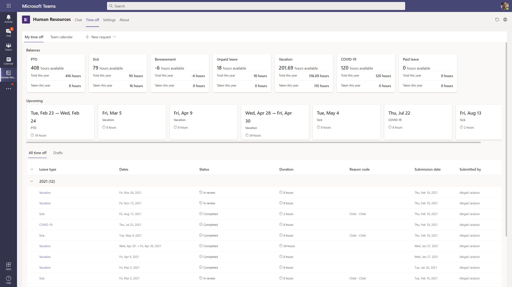

---
# required metadata

title: Human Resources app in Teams
description: This topic introduces the Microsoft Dynamics 365 Human Resources app in Microsoft Teams.
author: andreabichsel
manager: AnnBe
ms.date: 08/06/2020
ms.topic: article
ms.prod: 
ms.service: dynamics-human-resources
ms.technology: 

# optional metadata

ms.search.form: FeatureManagementWorkspace
# ROBOTS: 
audience: Application User
# ms.devlang: 
ms.reviewer: anbichse
ms.search.scope: Human Resources
# ms.tgt_pltfrm: 
ms.custom: 7521
ms.assetid: 
ms.search.region: Global
# ms.search.industry: 
ms.author: anbichse
ms.search.validFrom: 2020-05-18
ms.dyn365.ops.version: Human Resources

---

# Human Resources app in Teams

[!include [banner](includes/preview-feature.md)]

The Microsoft Dynamics 365 Human Resources app in Microsoft Teams lets employees quickly request time off and view their time-off balance information in Microsoft Teams. Employees can interact with a bot to request information. The **Time off** tab provides more detailed information.

## Install and setup

You can find the Human Resources app in the Teams store. For information about installing the Teams app, see [Manage leave requests in Teams](hr-teams-leave-app.md).

For information about managing app permissions in Teams, see [Manage app permission policies in Microsoft Teams](https://docs.microsoft.com/MicrosoftTeams/teams-app-permission-policies).

## Enable notifications for the Human Resources app in Teams

If you want users to receive leave request notifications in the Teams app, you must enable notifications in Human Resources.

>[!NOTE]
>Only users who are signed into Teams and using the Human Resources Teams app will receive notifications.

1. In Human Resources, select **System administration**.

2. Select **Links**.

3. Under **Users**, select **User options**.

4. Select the **Workflow** tab.

5. Set **Enable notifications for Teams app** to **Yes**.

   

6. Select **Save**.

## Known issues

| Issue | Status |
| --- | --- |
| Horizontal scrolling doesn't work on Android phones | Horizontal scrolling isn't an issue on iOS or desktop devices. We're working on a fix for Android. |
| Error: There is an issue finding an environment to connect to. | You might receive this error even if you've verified that the user can access one or more Human Resources environments. Also, you might not see all the environments you expect. Until we fix this issue, delete the user and then import them in again to resolve the problem. |
| The balance is incorrect when submitting time off for a future date. | Forecasting isn't yet available. The balance displays for the current date. |
| When reducing the number of hours taken in an existing request, the **Remaining balance** goes down instead of up. | We'll address this known issue in the future. The display is incorrect, but the correct amounts are adjusted upon submission. |
| Unable to cancel an **In review** request. | This functionality isn't currently supported and will be added in a future release. |
| Balance information is calculated as of today. | The system currently doesn't display balances as of the accrual period, even if it's configured in Leave and absence parameters. |

## Privacy notice

With the Dynamics 365 Human Resources bot in Microsoft Teams, the user’s text inputs are analyzed for understanding the underlying query/intent. The user’s input such as “Search account Contoso” is routed to one of Microsoft’s Cognitive Service called Language Understanding Intelligent Service (LUIS). Read more about LUIS [here](https://www.luis.ai/). The LUIS service disambiguates or understands the intent of user input (in this case, the intent is to find information) and the target entity (in this case, the intended entity is an account named Contoso). This information is then passed on to Microsoft’s [Azure bot framework](https://azure.microsoft.com/services/bot-service/) which interacts with data from Dynamics 365 Human Resources and retrieves the desired information for the user query. 

By installing and allowing access to use of the bot, you agree to allow the LUIS service and Azure bot framework to process the intent behind the input,  which results in an enhanced conversational user experience. The LUIS service and Azure bot framework may have varying levels of compliance compared to Dynamics 365 Human Resources. While the LUIS service has access to only the user queries and is not designed to be connected to the user’s Dynamics 365 Human Resources data or account, a user of the Dynamics 365 Human Resources bot could voluntarily enter a query containing Customer Data, Personal Data, or other data and such query content could get sent to the LUIS service and the Azure bot framework. 

The content of user’s queries and messages is retained in LUIS system for a maximum of 30 days, is encrypted at rest, and is not used for training or service improvement. Read more about Cognitive Services [here](https://azure.microsoft.com/services/cognitive-services/language-understanding-intelligent-service/). 

To manage admin settings for apps in Microsoft Teams, go to the [Microsoft Teams admin center](https://admin.teams.microsoft.com/). 

## See also 

[Download and install Microsoft Teams](https://support.office.com/article/download-and-install-microsoft-teams-422bf3aa-9ae8-46f1-83a2-e65720e1a34d) 
[Microsoft Teams help center](https://support.office.com/teams) 
[Manage leave requests in Teams](hr-teams-leave-app.md)

