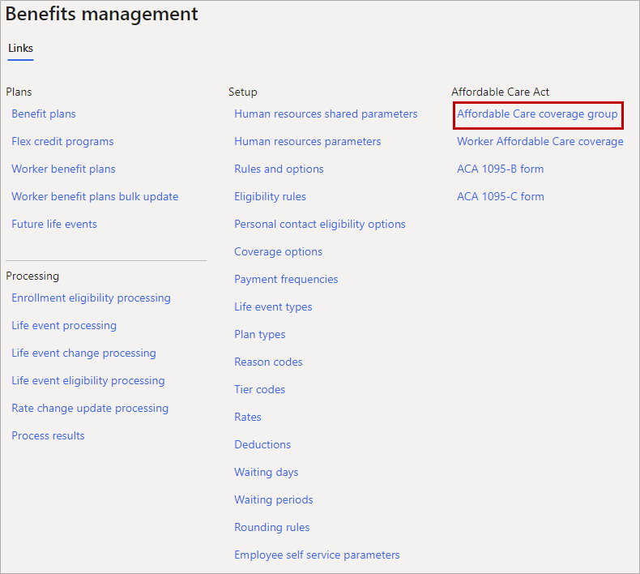
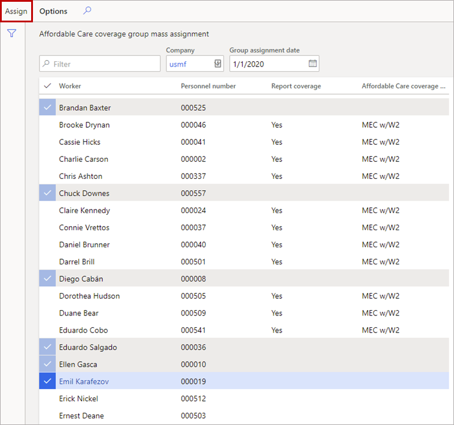
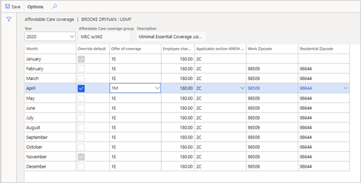
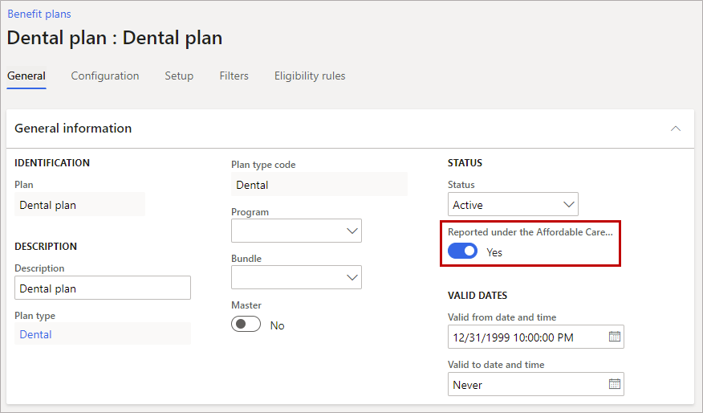
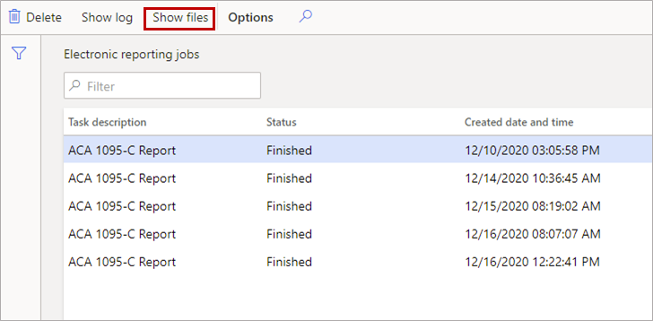
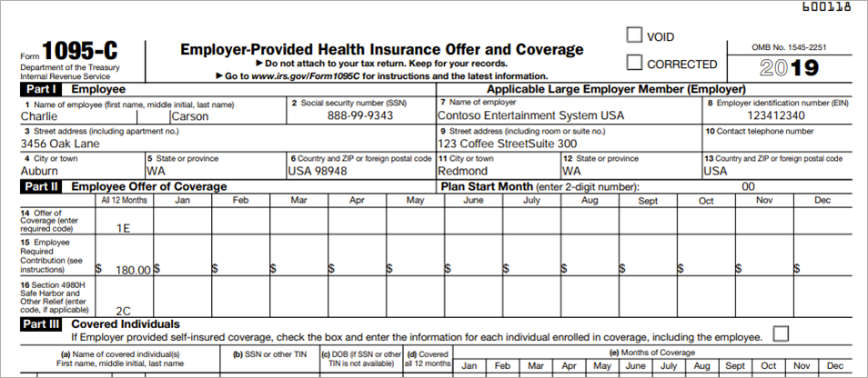
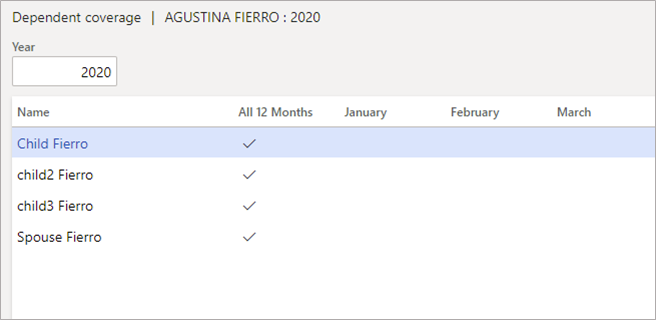

---
# required metadata

title: Generate Affordable Care Act reports in Benefits management
description: Benefits management helps you track information reported on Form 1095-B and Form 1095-C for the Affordable Care Act (ACA) employer mandate.
author: andreabichsel
manager: tfehr
ms.date: 12/28/2020
ms.topic: article
ms.prod: 
ms.service: dynamics-365-human-resources
ms.technology: 

# optional metadata

# ms.search.form: HcmACACoverageGroup, BenefitWorkspace, HcmBenefitSummaryPart
# ROBOTS: 
audience: Application User
# ms.devlang: 
ms.reviewer: anbichse
ms.search.scope: Core, Human Resources
# ms.tgt_pltfrm: 
ms.custom: 7521
ms.assetid: 3b953d5f-6325-4c9e-8b9b-6ab0458a73f8
ms.search.region: Global
# ms.search.industry: 
ms.author: anbichse
ms.search.validFrom: 2020-12-28
ms.dyn365.ops.version: AX 7.0.0, Human Resources

---

# Generate ACA reports in Benefits management

Benefits management helps you track information reported on Form 1095-B and Form 1095-C for the Affordable Care Act (ACA) employer mandate. This functionality applies only to legal entities in the United States, like the ACA reporting capability in the legacy **Benefits** workspace.

To use this feature, you must first enable **Advanced Benefits Management**. For more information, including important caveats about Benefits management, see [Enable or disable Benefits management](hr-admin-manage-features.md#enable-or-disable-benefits-management).

> [!IMPORTANT]
>You can only use ACA reporting either from the Benefits management workspace or from the legacy Benefits workspace, not both. For example, if you switched to Benefits management, ACA reporting is only available from that workspace and not from legacy Benefits.  
>If you're switching to Benefits management during the middle of an enrollment year, you must correctly configure employee data for the entire year in Benefits management. This will ensure you receive accurate reporting information for the whole year.

## Getting started

To track information for 1095 forms, first create one or more Affordable Care coverage groups. These groups indicate:

- The offer of coverage provided to an employee
- The employee's share of the lowest-cost month premium, if the cost is above the federal poverty line
- The safe harbor used by the employer, if applicable

Affordable Care coverage groups help you manage this information for multiple employee records with the same conditions. You can easily assign groups to one or more employees.

### Create or edit an Affordable Care coverage group

1. Select the **Benefits management** workspace, and then select **Affordable Care coverage group**.

   

2. Select **New** to create a new Affordable Care coverage group, or select **Edit** to make changes to an existing group.

   

3. Enter information for each field as follows:

   | Field | Description |
   | --- | --- |
   | **Name** | Enter a name for the group. |
   | **Description** | Enter a description for the group. |
   | **Offer of coverage** | The coverage offered to employees and their spouse or partner and dependents. |
   | **Employee share of cost** | The amount the employee is responsible for. |
   | **Applicable section 4980H safe harbor** | 4980H safe harbor or transition relief code. |
   | **Plan start month** | Select the calendar month for which your benefit plan year begins. |
   | **Group valid from** | The date from which this record is valid. |
   | **Group valid through** | The date up to which this record is valid. If there's no expiration date, enter **Never**. |

   

4. Select **Save**.

### Assign multiple employees to an Affordable Care coverage group

1. Select the **Benefits management** workspace, and then select **Affordable Care coverage group**.

2. Select the group to assign employees to.

3. Select **Mass assignment**.

   

4. Select employees from the list, and then select **Assign**.

   

## Maintain multiple versions of coverage options

You can maintain multiple versions of any coverage group. You can make changes to keep the group’s information current without having to create a new group and reassign employees to it when something changes in your organization or offered benefits. 

After you’ve created Affordable Care coverage groups, you can mass assign employees to groups. You can also individually assign employees to groups and indicate whether ACA information is tracked and reported.

If you don't need to track and report ACA information for an employee, you can set the **Report coverage** field to **No**. For example, you might have part-time employees who don't require ACA reporting.

### Override defaults for an employee

For employees assigned to an Affordable Care coverage group, you can change the following options for any months that need different values:

- **Offer of coverage**
- **Employee share of cost**
- **Applicable section 4980H safe harbor**

> [!NOTE]
> For 2020 ACA reports, you must report both the work and home ZIP Codes in the form 1095-C. These automatically populate in the form based on current active locations. If either location was different during any part of the year, you must override the value. The ZIP Code field (Line 17) in the 1095-C report populates only if the Offer of Coverage code contains 1L through 1Q, as follows:  
> - 1L, 1M, or 1N: primary residence ZIP Code 
> - 1O, 1P, 1Q: primary work ZIP Code

To enter exceptions to any of the Affordable Care coverage group values, follow these steps:

1. In the **Personnel management** workspace, select **Links**, and then select **Workers**.

2. Select the employee from the list.

3. Select the **Employment** tab.

4. Under **MORE INFORMATION**, select **Affordable Care coverage**.

   

5. Select **Edit**.

6. For each month that requires changes, select the **Override default** checkbox and then change the other values as needed.

   

7. Select **Save**.

## Report health care coverage

You must track any employer-sponsored, self-insured health coverage for full- and part-time employees. Include each employee, along with their dependents, on the 1095-C report for the months they were covered.

To indicate whether a benefit plan must be reported:

1. In the **Benefits management** workspace, select **Benefit plans**, and then select the benefit plan to report.

2. Select **Edit**.

3. Change the **Reported under the Affordable Care Act** toggle to **Yes**.

   

4. Select **Save**.

If an employee chooses health care coverage for a dependent, the dependent's coverage period is determined by when the dependent was enrolled or removed. **Coverage dates for dependents** are automatically computed, based on the period the dependent was eligible and active in a plan during the enrollment year.

## Generate 1095-B and 1095-C forms

You can generate ACA forms 1095-B and 1095-C and distribute them to each of your employees. You can also electronically generate form 1095-C and the corresponding 1094-C transmittal files to send to the Internal Revenue Service (IRS).

1. Select the **Benefits management** workspace, and then select **ACA 1095-B form** or **ACA 1095-C form**.

2. Change the parameters as needed and then select **OK**.

   > [!NOTE]
   > If you're printing 1095-C forms for more than 500 employees, you'll receive more than one PDF file. We recommend increasing the **Maximum file size in megabytes** field on the **Document management parameters** page to 150. (You can navigate to that page by using the search bar.)  
   > 

3. To check the status of and view your reports, navigate to the **Electronic reporting jobs** page by using the search bar.

   

4. Select the report to view, and then select **Show files**.

   

5. Select **Open**.

   

6. At the bottom of the page, open the .zip file, and then select the report. You can view or print the PDF file.

   

## View ACA coverage information

You can use the **Worker Affordable Care coverage** page to see:

- Employees assigned to each coverage group
- Employees you don’t need to include on a report
- Unassigned employees

1. In the **Benefits management** workspace, select **Worker Affordable Care coverage**.

2. Select a group from the **Group name dropdown**.

   

If any of the default values from the Affordable Care coverage group have been overridden, an asterisk appears next to the value that was changed. If the values for all 12 months are the same and haven’t been overridden, the value will print in the **All 12 months** column.

You can view employees flagged as not ACA-reportable and who won't need a form 1095-C. In the **Filter by** dropdown, select **Not ACA reportable**.

To view employees not assigned to a group or assigned to an expired group, select **Unassigned or expired group** in the **Filter by** dropdown.

### Export to Excel

To export any of these lists to Excel:

1. Select the **Open in Microsoft Office** button.

2. Select **HCM Human Resources temporary table for internal use**.

3. Select **Download**.

### View ACA-reportable dependents

If you need to report covered individuals because you provide self-insured coverage, you can view dependents covered under benefit plans marked as **ACA reportable**. Select **View Dependent coverage** on the top of the page.

Coverage information for the employee's dependents displays.

> [!NOTE]
> Only benefits plans marked as **ACA reportable** will display on the page.
