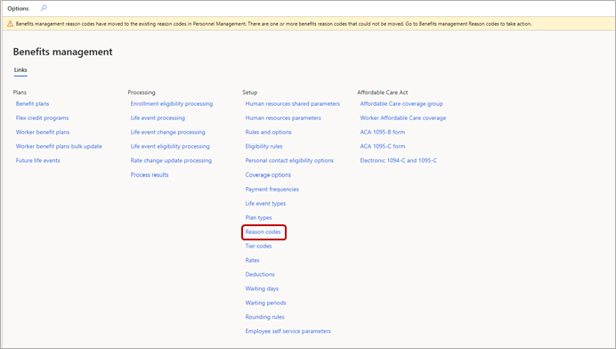

---
# required metadata

title: Set up reason codes
description: Dynamics 365 Human Resources uses reason codes to explain why an employee’s benefits are changing.
author: andreabichsel
manager: AnnBe
ms.date: 01/25/2021
ms.topic: article
ms.prod: 
ms.service: dynamics-human-resources
ms.technology: 

# optional metadata

ms.search.form: BenefitWorkspace, HcmBenefitSummaryPart
# ROBOTS: 
audience: Application User
# ms.devlang: 
ms.reviewer: anbichse
# ms.tgt_pltfrm: 
ms.custom: 7521
ms.assetid: 
ms.search.region: Global
# ms.search.industry: 
ms.author: anbichse
ms.search.validFrom: 2020-02-03
ms.dyn365.ops.version: Human Resources

---

# Set up reason codes

Dynamics 365 Human Resources uses reason codes to explain why an employee’s benefits are changing.

> [!NOTE]
> As of January 2021, reason codes are migrating to the **Personnel management** workspace instead of the **Benefits management** workspace. Most reason code data will automatically migrate in your environment. Some reason code data might not migrate. For example, reason codes now have a 15-character maximum, so any reason codes longer than 15 characters won't migrate automatically.  
> You'll see a banner on the **Links** page of the **Benefits management** workspace informing you about the migration and whether any reason codes didn't migrate. Select **Reason codes** for details about migration status.  
> 

1. In the **Personnel management** workspace (or **Benefits management** workspace if your reason codes haven't yet migrated), select **Links**, and then select **Reason codes**.

2. Select **New**.

3. Specify values for the following fields:

   | Field | Description |
   | --- | --- |
   | **Reason code** | A unique name to identify the reason an employee would change a benefit plan enrollment. |
   | **Description** | A description of the reason code. |

4. Select **Save**.

