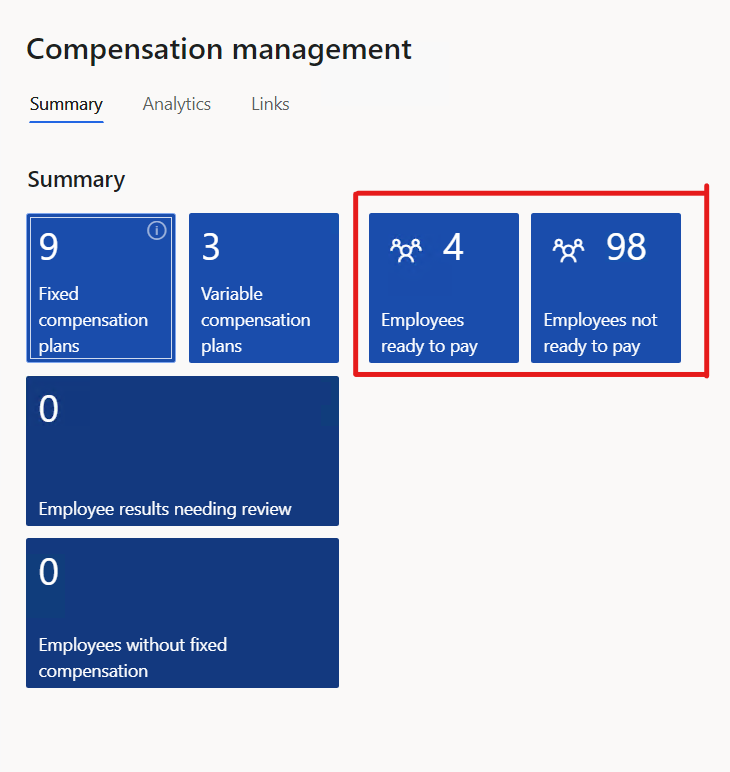
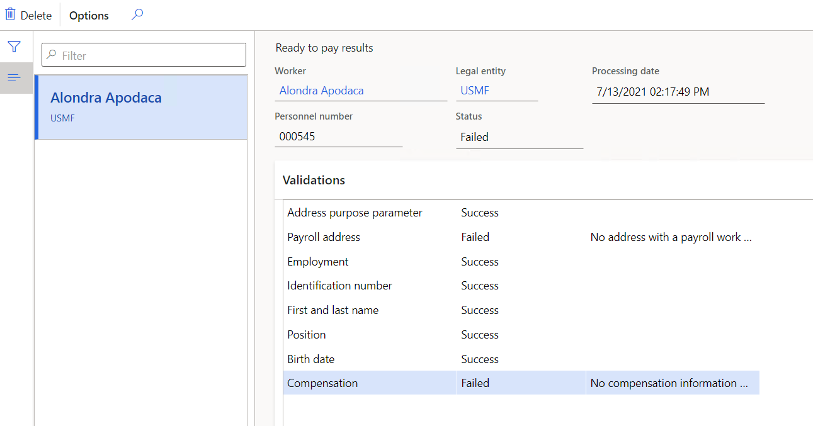

---
# required metadata

title: Ready to pay
description: This topic shows how to mark an employee as ready to pay in Dynamics 365 Human Resources.
author: marcelbf
ms.date: 7/13/2020
ms.topic: article
ms.prod: 
ms.technology: 

# optional metadata

ms.search.form: 
# ROBOTS: 
audience: Application User
# ms.devlang: 
ms.search.scope: Human Resources
# ms.tgt_pltfrm: 
ms.custom: 
ms.assetid: 
ms.search.region: Global
# ms.search.industry: 
ms.author: marcelbf
ms.search.validFrom: 2021-07-13
ms.dyn365.ops.version: Human Resources

---

[!include [Applies to Human Resources](../includes/applies-to-hr.md)]

[!include [preview feature](./includes/preview-feature.md)]

> [!NOTE]
> If you want to mark an employee as ready to pay, you must first enable the **(Preview) payroll integration** functionality in feature management. For more information about enabling preview features, see [Manage features](hr-admin-manage-features.md).

This feature enables human resources professionals to understand which employees are ready for payroll processing and which require action before being consumed by a third-party payroll provider.

# Mark employee as ready to pay

Gathering and validating employee information can be time-consuming and error-prone. By providing a way for human resources professionals to review and easily update employee information, Dynamics 365 Human Resources helps to cut down on the time spent getting ready to process payroll.

To mark an employee as ready to pay:

1. Open **Compensation management**. There are two new tiles in the workspace - **Employees ready to pay** and **Employees not ready to pay**.
    

2. Select the **Employees not ready to pay** tile.

3. Select the employee(s) to be validated. In the **Payroll tab**, **Ready to pay** group, select validate.
    

4. To review the results, in the **Payroll tab**, **Ready to pay** group, select results.

## Validation

Before marking an employee as ready to pay, system will do a basic validation on the profile completeness:

| Validation | Details |
| --- | --- |
| Address purpose parameter | Validates if the parameter **use payroll addresses purpose** is on. |
| Payroll address | Validates if the worker profile has at least one address of the purpose "Payroll residency location" or "Payroll work location", and only one address per purpose. |
| Employment | Verify if the worker has at least one employment (current, previous, or future). |
| Identification number | Validates if the parameter "Use identification types in payroll processing" is yes, and if the identification type indicated in the parameter is filled in the worker profile. |
| First and last name | Validates if the worker profile is valid, checking if the fields **Name** and **Last name** are filled in.|
| Position | Verify if the worker has a position assigned. |
| Birth date | Validates if the worker profile is valid, checking if the field **Birthday** is filled in. |
| Compensation | Verify if the worker is enrolled in a fixed compensation plan. |

If one of these validations failed, you cannot mark the employee as ready to pay.

The field **Ready to pay** = no is an indication that you must perform an action to ensure the worker profile is complete. It will not stop the data to be exposed in any data entity. 

## Know issues

- You must disable the feature **Streamlined employee entry** in feature management. The new tiles in the compensation management workspace won't work properly if you use this feature.
- In the worker form, the **Payroll tab**, **Ready to pay** group is available to any user role. 

## See also

[Payroll integration API introduction](hr-admin-integration-payroll-api-introduction.md) 

[!INCLUDE[footer-include](../includes/footer-banner.md)]
