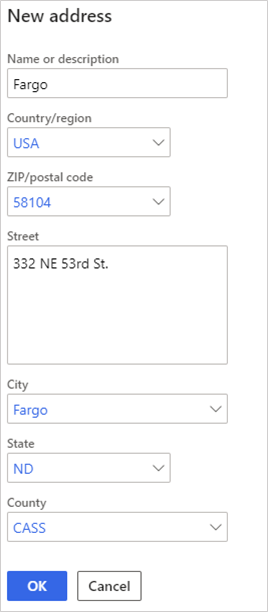
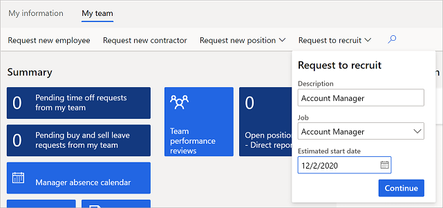
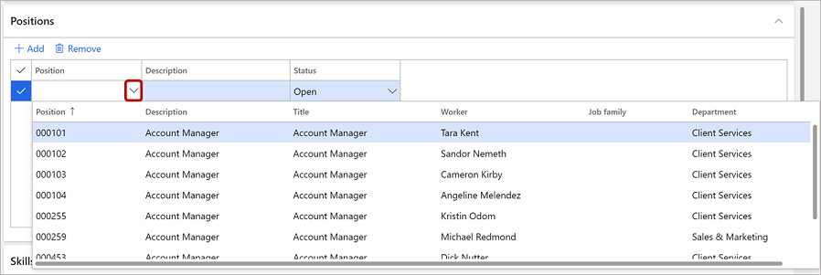
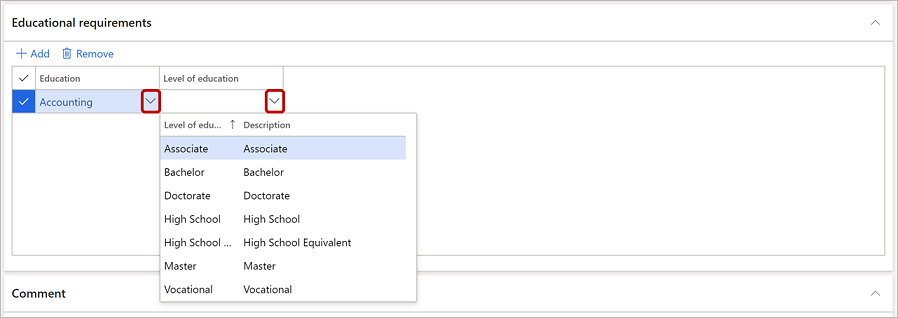
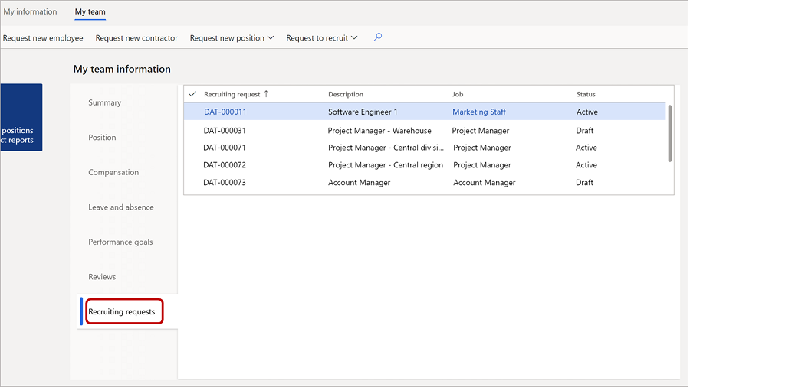
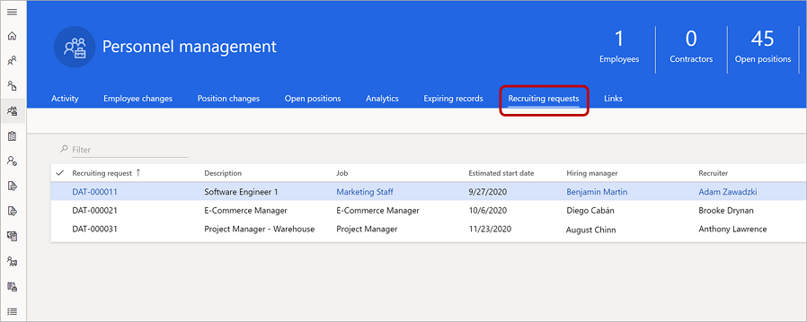
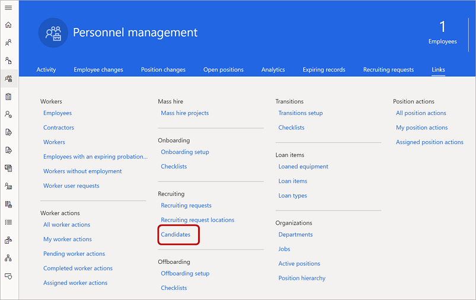
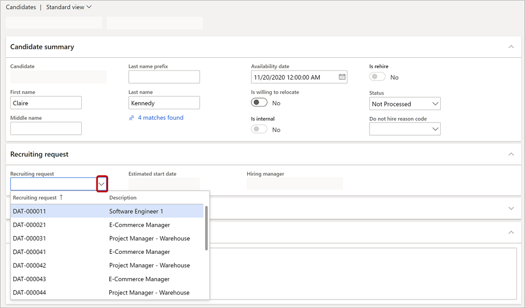
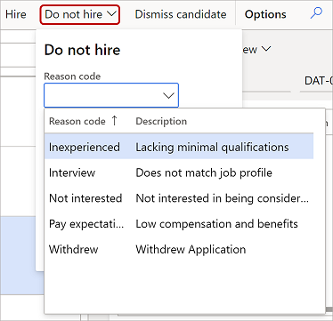

---
# required metadata

title: Recruit job candidates
description: This topic shows how to recruit candidates in Dynamics 365 Human Resources.
author: andreabichsel
manager: tfehr
ms.date: 12/03/2020
ms.topic: article
ms.prod: 
ms.technology: 

# optional metadata

ms.search.form: 
# ROBOTS: 
audience: Application User
# ms.devlang: 
ms.reviewer: anbichse
ms.search.scope: Human Resources
# ms.tgt_pltfrm: 
ms.custom: 7521
ms.assetid: 
ms.search.region: Global
# ms.search.industry: 
ms.author: anbichse
ms.search.validFrom: 2020-12-03
ms.dyn365.ops.version: Human Resources

---

# Recruit job candidates

[!include [Applies to Human Resources](../includes/applies-to-hr.md)]

Dynamics 365 Human Resources helps you to manage recruiting requests. It also helps you seamlessly transition job candidates to employees. If your organization uses a separate recruiting application, your recruiting process might include the following steps:

- Enter your recruiting request in Human Resources.
- Receive candidate referrals in Human Resources from the recruiting application.
- Complete the candidate approval process in Human Resources.

If you aren't using a separate recruiting application, you can also manually manage candidates in Human Resources.

>[!NOTE]
>If you're an admin or developer and want to integrate Human Resources with a third-party recruiting application, see [Configure Dataverse integration](hr-admin-integration-common-data-service.md) and [Configure Dataverse virtual tables](hr-admin-integration-common-data-service-virtual-entities.md)
>
> You can also find recruiting integration apps on [AppSource](https://appsource.microsoft.com/marketplace/apps?search=recruiting%20dynamics).
>
> To try out our preview feature for integrating with LinkedIn Talent Hub, see [Integrate with LinkedIn Talent Hub](hr-admin-integration-linkedin.md).

## Enable recruiting requests

If you want to submit recruiting requests in Human Resources, you must first enable the functionality in **Human resources shared parameters**.

1. In the **Personnel management** workspace, select **Links**.

2. Under **Setup**, select **Human resources shared parameters**.

3. On the **Recruitment** tab, under **RECRUITING**, set **Enable recruiting requests** to **Yes**.

## Add a recruiting request location

If your organization has multiple locations, you can add them so requestors can select a location where the new recruit will be working. The location will be included in the job posting.

1. In the search bar, enter **recruiting request location**.

2. Select **New**.

3. In the **Recruiting request location** field, enter the location name.

   

4. In the **Description**, enter a description for the location.

5. Under **Location**, select **Add**. If the **New address** popout appears, enter the address for the location.

   

6. Under **Contact information**, enter the information for the location's contact.

7. Select **Save**.

## Add a recruiting request

Managers can submit recruiting requests in Human Resources. If you use a separate recruiting application, completing these steps will send a recruiting request and start the recruiting process in that application. Otherwise, complete this procedure to begin the workflow for your own internal recruiting process.

1. Select **Employee self service**.

2. Select the **My team** tab.

3. Select  **Request to recruit**.

   

4. Complete the **Description**, **Job**, and **Estimated start date** fields.

   

5. Select **Continue**. The recruiting request for your position appears.

6. Under **General**, select a recruiter from the **Recruiter** dropdown, and then select a location from the **Recruiting request location** dropdown.

7. Under **Job**, change any information as needed, and then select **Create details from job**.

   

   The rest of the recruiting request will populate with the default information for the job you entered.

8. Under **External description**, enter an external-facing job description.

9. Under **Positions**, select **Add**, and then select a position for this recruiting request.

   

10. Under **Skills**, select **Add**, and then select a skill.

11. Under **Educational requirements**, select **Add**, and then select values from the **Education** and **Level of education** dropdowns.

   

12. Under **Comment**, add comments as necessary.

13. Under **Compensation**, select a level from the **Level** dropdown, and then adjust **Low threshold**, **Control point**, and **High threshold** as necessary.

14. When your recruiting request is complete and you're ready to start the recruiting process, select **Activate** in the menu bar.

   

15. Select **Save**.

## View and edit your recruiting requests

If you're a manager and want to view your own requests:

1. Select **Employee self service**.

2. Select the **My team** tab.

3. Under **My team information**, select the **Recruiting requests** tab.

   

4. To view or edit a recruiting request, select it in the grid.

If you're an HR pro and want to view all recruiting requests:

1. Select **Personnel management**.

2. Select **Recruiting requests**.

   

3. To view or edit a recruiting request, select it in the grid.

## Add or edit a candidate profile

If your organization has integrated with another application to manage recruiting requests, recruiting requests are forwarded to that application. The recruiting application then sends candidate information back to Human Resources. Otherwise, you can follow your own internal recruiting processes and enter candidate information manually.

1. Select **Personnel management**.

2. Select **Links**.

3. Under **Recruiting**, select **Candidates**.

   

4. To add a candidate, select **New**. To edit an existing candidate, select the candidate from the list and then select **Edit**. The candidate profile appears.

5. Under **Candidate summary**, enter or edit the candidate information as necessary.

6. Under **Recruiting request**, select a recruiting request to link the candidate to. Then complete the **Estimated start date**, **Hiring manager**, **Position**, and **Description fields** as appropriate.

   

7. Complete all the information in the following areas that you want to include in the candidate's record:
   - **Comments**
   - **Professional experience**
   - **Contact information**
   - **Education**
   - **Skills**
   - **Certificates**
   - **Screenings**

8. Select **Save**.

## Hire a candidate

When you're ready to hire a candidate, follow this procedure to transition the candidate to an employee.

1. On the candidate form, select **Hire**.

   

2. On the **Hire new worker** form, under **Details**, complete all the fields.

   

3. Under **Position details**, verify and change information as necessary.

4. Under **Onboarding checklists**, select the relevant onboarding checklists for this employee.

5. Select **Continue** to create the employee record.

   >[!NOTE]
   >Depending on your organization's workflows, the candidate record may go through additional approval steps before becoming an employee record.

## Decide not to hire a candidate

If you decide not to hire a candidate, follow this procedure to remove them from the vetting process. 

1. On the candidate form, select **Do not hire**.

   

2. Select a **Reason code** and include any comments.

3. Select **OK**.

## Dismiss a candidate

If needed, you can dismiss a candidate after hiring them. For example, a candidate might reject your offer or not show up on their first day.

- On the candidate form, select **Dismiss candidate**.

  

## See also

[Configure Dataverse virtual tables](hr-admin-integration-common-data-service-virtual-entities.md) 
[Organize your workforce](hr-personnel-departments-jobs-positions.md) 
[Set up the components of a job](hr-personnel-jobs.md)

[!INCLUDE[footer-include](../includes/footer-banner.md)]
