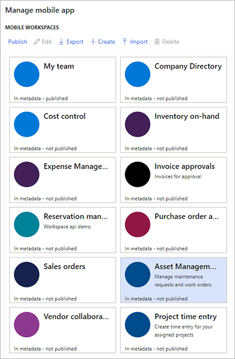
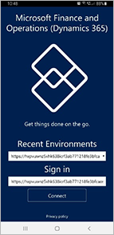
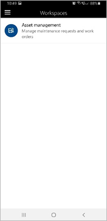
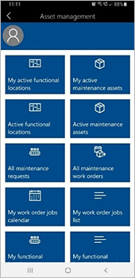

---
# required metadata

title: Set up the Asset management mobile workspace
description: This topic describes how to set up Supply Chain Management and the Finance and Operations (Dynamics 365) mobile app to run an Asset management mobile workspace, which will enable workers to execute asset management tasks using the app.
author: johanhoffmann
manager: tfehr
ms.date: 12/22/2020
ms.topic: article
ms.prod: 
ms.service: dynamics-ax-applications
ms.technology: 

# optional metadata

# ms.search.form:  [Operations AOT form name to tie this topic to]
audience: Application User
# ms.devlang: 
ms.reviewer: kamaybac
ms.search.scope:  Core, Operations
# ms.tgt_pltfrm: 
# ms.custom: [used by loc for topics migrated from the wiki]
ms.search.region: Global
# ms.search.industry: [leave blank for most, retail, public sector]
ms.author: johanho
ms.search.validFrom: 2020-12-22
ms.dyn365.ops.version: Release 10.0.16
---

# Set up the Asset management mobile workspace

[!include [banner](../includes/banner.md)]

This topic describes how to set up Supply Chain Management and the Finance and Operations (Dynamics 365) mobile app to run an Asset management mobile workspace, which will enable workers to execute asset management tasks using the app.

## Set up maintenance worker users in Supply Chain Management

For each user that requires access to the Asset management mobile workspace, do the following:

1. In Supply Chain Management, go to **Human resources \> Workers** and make sure you have a worker record for the user you want to set up. If necessary, create a new worker record.
1. Go to **Asset management \> Setup \> Workers \> Workers** and make sure that the worker record that you identified in the previous step also has a maintenance worker record set up here. If necessary, create a new record and set the worker record you identified in the previous step as the **Worker** for the new maintenance worker.
1. Go to **Asset management \> Setup \> Workers \> Maintenance worker groups** and make sure that the maintenance worker that you identified in the previous step belongs to a maintenance worker group.
1. Go to **System administration \> Users**.
1. Select the relevant user from the grid.
1. On the **User Details** FastTab, set **Person** to the worker account that you want to associate with the current user account. This should be the worker account that you identified in step 1, and which you mapped to maintenance worker in step 2.

> [!NOTE]
> User permissions and security roles apply to the features of the Asset management mobile workspace just as they do in the Supply Chain Management user interface. Therefore, you must make sure that each user that you set up to access the Asset management mobile workspace has the security roles required to do similar operations directly in Supply Chain Management.

## Publish the Asset management mobile workspace

To make asset management features available on the Finance and Operations (Dynamics 365) mobile app, you must publish the Asset management mobile workspace. To do so:

1. In Supply Chain Management, go to open the **Settings** menu (select the gear icon in upper-right corner) and then select **Mobile app** from the menu.

1. The **Manage mobile app** dialog box opens. Find the **Asset Management** workspace. If it shows the text "In metadata - not published", then it isn't yet published. If it shows "In metadata - published", then it's already published and you can skip the rest of this procedure.

    

1. Select the **Asset Management** tile and then select **Publish** on the toolbar. After a few seconds you should see notification that the workspace has been published successfully and the text on tile should change to "In metadata - published".

## Install and set up the Finance and Operations (Dynamics 365) mobile app

To install and set up the Finance and Operations (Dynamics 365) app on a mobile device:

1. Go to one of the following app stores to install the **Microsoft Finance and Operations (Dynamics 365)** app on your mobile device: 
    - [For Android devices](https://go.microsoft.com/fwlink/?linkid=850662)
    - [For iOS devices](https://go.microsoft.com/fwlink/?linkid=850663)

1. Open the Finance and Operations (Dynamics 365) app. You should see the sign-in page. In the **Sign in** field, enter your Supply Chain Management URL (or select a recent URL from the **Recent environments** list) and then tap **Connect**.

    

1. If you're asked to confirm the connection, select the **I understand** check box and tap **Connect.**

1. The **Pick an account** page opens. Use your Microsoft account to sign in to the mobile application.

1. The **Workspaces** page opens. It lists each mobile workspace published by your Supply Chain Management instance.

    

1. If you need to change the legal entity (company) open the menu (the "hamburger menu" at the top-left corner) and select the relevant entry.

     if needed")

1. On the **Workspaces** page, select the workspace you want to work with. The selected workspace opens.

    

## Work with the Asset management mobile workspace

For more information about how to work with the Asset management mobile workspace, see [Use the Asset management mobile workspace](asset-management-mobile-workspace.md).

For more information about the Finance and Operations (Dynamics 365) mobile app, see the [Mobile app home page](../../fin-ops-core/dev-itpro/mobile-apps/Mobile-app-home-page.md).
