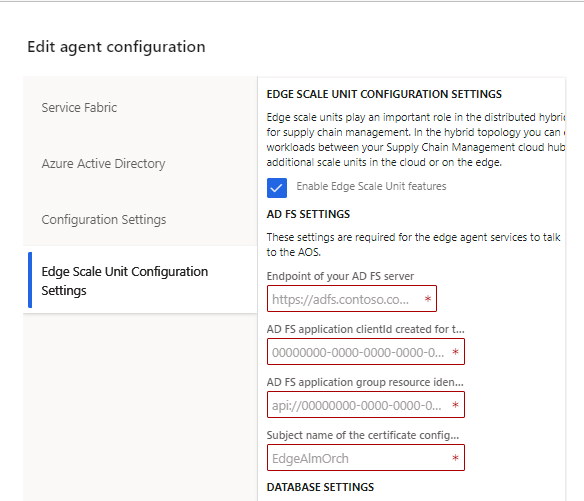
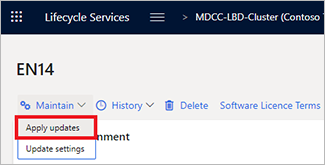
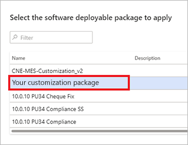

# Deploy edge scale units on custom hardware using LBD

[!include [banner](../includes/banner.md)]

Edge scale units play an important role in the distributed hybrid topology for supply chain management. In the hybrid topology you can distribute workloads between your Supply Chain Management cloud hub and additional scale units in the cloud or on the edge.

Edge scale units can be deployed by creating a local business data (LBD) [on-premises environment](../../fin-ops-core/dev-itpro/deployment/on-premises-deployment-landing-page.md) and then configuring it to function as a scale unit in your distributed hybrid topology for supply chain management. This is achieved by associating the on-premises LBD environment with a Supply Chain Management environment in the cloud, which has been configured to function as a hub.  

This topic describes how to set up an on-premises LBD environment as an edge scale unit and then associate it with a hub.

## Deployment overview

Here is an overview of the deployment steps.

1. **Enable an LBD slot in your LBD project in Microsoft Dynamics Lifecycle Services (LCS).**

1. **Set up and deploy an LBD environment with an *empty* database.**

    Use LCS to deploy the LBD environment with the latest topology and an empty database. For more information, see the [Setup and deploy an LBD environment with empty database](#set-up-deploy) section later in this topic. You must use Supply Chain Management version 10.0.21 or higher across hub and scale unit environments.

1. **Upload target packages into LBD project assets in LCS.**

    Prepare application, platform, and customization packages that you use across the hub and the edge scale unit. For more information, see the [Upload target packages into LBD project assets in LCS](#upload-packages) section later in this topic.

1. **Service the LBD environment with the target packages.**

    This step ensures that the same build and customizations are deployed on the hub and the spoke. For more information, see the [Service the LBD environment with target packages](#service-target-packages) section later in this topic.

1. **Complete the scale unit configuration and workload assignment.**

    For more information, see the [Assign your LBD edge scale unit to a hub](#assign-edge-to-hub) section later in this topic.

The remaining sections of this topic provide more details about how to complete these steps.

## <a name="set-up-deploy"></a>Set up and deploy an LBD environment with an empty database

This step creates a functional LBD environment. However, the environment doesn't necessarily have the same application and platform versions as the hub environment. Additionally, it's still missing the customizations, and it hasn't yet been enabled to work as a scale unit.

1. Follow the instructions in [Setup and deploy on-premises environments (Platform update 41 and later)](../../fin-ops-core/dev-itpro/deployment/setup-deploy-on-premises-pu41.md). You must use Supply Chain Management version 10.0.21 or higher across hub and scale unit environments

    > [!IMPORTANT]
    > Read the rest of this section **before** you complete the steps in that topic.

1. Before you describe your configuration in the infrastructure\\ConfigTemplate.xml file, run the following script:

    ```powershell
    .\Configure-ScriptsForEdgeScaleUnits.ps1 -ConfigurationFilePath .\ConfigTemplate.xml
    ```

    > [!NOTE]
    > This script will remove any configuration that is not needed for deploying edge scale units.

1. Set up a database that contains empty data, as described in [Configure databases](../../fin-ops-core/dev-itpro/deployment/setup-deploy-on-premises-pu41.md#configuredb). Use the empty data.bak file for this step.
1. Once you have completed the [Configure databases](../../fin-ops-core/dev-itpro/deployment/setup-deploy-on-premises-pu41.md#configuredb) step, carry out the following action to configure the Scale Unit Alm Orchestrator database:

    > [!NOTE]
    > Do not configure the Financial Reporting database in the [Configure databases](../../fin-ops-core/dev-itpro/deployment/setup-deploy-on-premises-pu41.md#configuredb) step.

    ```powershell
    .\Initialize-Database.ps1 -ConfigurationFilePath .\ConfigTemplate.xml -ComponentName EdgeScaleUnit
    ```

    The Initialize-Database.ps1 script performs the following actions:

    1. Create an empty database that is named **ScaleUnitAlmDb**.
    2. Map the users to database roles, based on the following table.

        | User            | Type | Database role |
        |-----------------|------|---------------|
        | svc-LocalAgent$ | gMSA | db\_owner     |

1. Continue following the instructions in [Setup and deploy on-premises environments (Platform update 41 and later)](../../fin-ops-core/dev-itpro/deployment/setup-deploy-on-premises-pu41.md)

1. Once you have finished the [Configure AD FS](../../fin-ops-core/dev-itpro/deployment/setup-deploy-on-premises-pu41.md#configuredb) step carry out the following steps:

    1. Create a new AD FS application that will allow the Alm Orchestration service to communicate with your AOS:

        ```powershell
        # Host URL is your DNS record\host name for accessing the AOS
        .\Create-ADFSServerApplicationForEdgeScaleUnits.ps1 -HostUrl 'https://ax.d365ffo.onprem.contoso.com'
        ```
    
    1. Create a new Azure Active Directory application that will allow your scale unit environment to communicate with the cloud hub.

        ```powershell
        # Example .\Create-AADApplication.ps1 -ConfigurationFilePath ..\ConfigTemplate.xml -TenantId '6240a19e-86f1-41af-91ab-dbe29dbcfb95' -ApplicationDisplayName 'EdgeAgent-SUMCommunication-EN01'
        .\Create-AADApplication.ps1 -ConfigurationFilePath '<Path to the ConfigTemplate.xml file>' -TenantId '<Id of the tenant where your cloud hub is deployed>' -ApplicationDisplayName '<Whichever name you want the AAD app to have>'
        ```

1. Continue following the instructions in [Setup and deploy on-premises environments (Platform update 41 and later)](../../fin-ops-core/dev-itpro/deployment/setup-deploy-on-premises-pu41.md). When you have to enter the configuration for the localagent, ensure that you enable the Edge Scale Unit Features and provide all necessary parameters.

    

1. Before deploying your environment from LCS set up the pre-deployment script. For more information, see [Local agent pre-deployment and post-deployment scripts](../../fin-ops-core/dev-itpro/lifecycle-services/pre-post-scripts.md).

    1. Copy the Configure-CloudAndEdge.ps1 script from the **ScaleUnit** folder in **Infrastructure Scripts** to the **Scripts** folder in the agent file storage share that was set up in the environment. A typical path is \\\\lbdiscsi01\\agent\\Scripts.
    2. Create the **PreDeployment.ps1** script that will invoke the scripts by using the required parameters. The pre-deployment script must be put in the **Scripts** folder in the agent file storage share. Otherwise, it can't be run. A typical path is \\\\lbdiscsi01\\agent\\Scripts\\PreDeployment.ps1.

        The contents of the PreDeployment.ps1 script will resemble the following example.

        ```powershell
        $agentShare = '\\lbdiscsi01\agent'
        
        Write-Output "AgentShare is set to $agentShare" 
        . $PSScriptRoot\Configure-CloudAndEdge.ps1 -AgentShare $agentShare -InstanceId '@A'
        ```

        > [!NOTE]
        > The InstanceId parameter should be only two characters. The first character is @ and the second can be any capital letter in the English alphabet.
        >
        > - Valid values:
        >   - @D
        >   - @X
        > - Not valid values:
        >   - @a
        >   - @4
        >   - @#

1. Deploy the environment by using the latest base topology that is available.

## <a name="set-up-deploy"></a>Set up an Azure Keyvault and an Azure Active Directory Application to enable communication between scale units

1. Once your environment is deployed you need to create an additional Azure Active Directory application, create a client secret and save the information to an Azure KeyVault. Additionally, the AAD application that was created must be granted access to retrieve the secrets stored in the Azure KeyVault. For convenience we have created a script that will carry out all the actions automatically:

    ```powershell
    .\Create-AADAppSecrets.ps1 -TenantId '<Id of the tenant where your cloud hub is deployed>' `
                               -SubscriptionName '<Any subscription within your tenant>' `
                               -ResourceGroupName '<Any resource group within your subscription>' `
                               -KeyVaultName '<Any keyvault within your resourcegroup>' `
                               -Location '<Any azure location where Azure Keyvault is available>' `
                               -SpokeToHubCommunicationApplicationDisplayName '<Whichever name you want the AAD app to have>' `
                               -SumCommunicationApplicationDisplayName '<The name of the AAD app that was created previously>' `
                               -SpokeEnvironmentId '<The LCS environment id of your deployed scale unit>' `
    ```

    > [!NOTE]
    > If no KeyVault with the specified KeyVaultName exists, the scripts will automatically create one.

## <a name="upload-packages"></a>Upload target packages into LBD project assets in LCS

This step prepares the application version, platform version, and customizations that will be transitioned to your LBD scale unit environment.

1. Upload the same combined application/platform package that was applied to the hub environment into the asset library of the LCS on-premises project.
1. Get a copy of the custom deployable package that was applied to the hub environment, and upload it into the asset library of the LCS on-premises project.

## <a name="service-target-packages"></a>Service the LBD environment with target packages

This step aligns the application version, platform version, and customizations in your LBD scale unit environment with the hub.

1. Service the LBD environment with the combined application/platform package that you uploaded in the previous step.
1. Service the LBD environment with the custom deployable package that you uploaded in the previous step.

    

    

## <a name="assign-edge-to-hub"></a>Assign your LBD edge scale unit to a hub

1. You may configure and manage your edge scale unit through the Scale Unit Management Portal. For more information see [Manage scale units and workloads by using the Scale Unit Manager portal](./cloud-edge-landing-page.md#scale-unit-manager-portal)

[!INCLUDE [cloud-edge-privacy-notice](../../includes/cloud-edge-privacy-notice.md)]

[!INCLUDE[footer-include](../../includes/footer-banner.md)]
