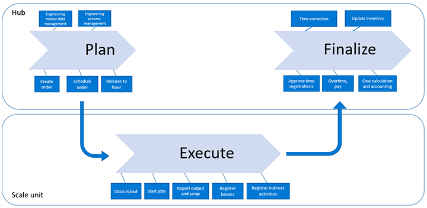
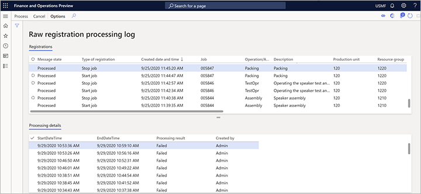

---
# required metadata

title: Manufacturing execution workloads for cloud and edge scale units
description: This topic describes how manufacturing execution workloads function in cloud and edge solutions
author: cabeln
manager: 
ms.date: 10/06/2020
ms.topic: article
ms.prod: 
ms.service: dynamics-ax-applications
ms.technology: 

# optional metadata

ms.search.form:
# ROBOTS: 
audience: Application User
# ms.devlang: 
ms.reviewer: kamaybac
ms.search.scope: Core, Operations
# ms.tgt_pltfrm: 
ms.custom: 
ms.assetid:
ms.search.region: global
ms.search.industry: SCM
ms.author: cabeln
ms.search.validFrom: 2020-10-06
ms.dyn365.ops.version: 10.0.15
---

# Manufacturing execution workloads for cloud and edge scale units

[!include [banner](../includes/banner.md)]
[!include [preview banner](../includes/preview-banner.md)]

> [!WARNING]
> Please note that certain business functionality is not fully supported in the public preview when using workloads scale units.  

Within manufacturing execution, cloud and edge scale units deliver the following capabilities, even when edge units aren't connected to the cloud:

- Enable machine operators and shop floor supervisors to access the operational production plan.
- Enable machine operators to keep the plan current by executing discrete and process manufacturing jobs.
- Enable the shop floor supervisor to adjust the operational plan.
- Enable workers to access time and attendance for clock-in and clock-out on the edge to ensure correct worker pay calculation.

This topic describes how manufacturing execution workloads function in cloud and edge solutions.

## The manufacturing lifecycle

The manufacturing lifecycle is divided into three phases – **Plan, Execute and Finalize**, as shown in the following illustration.

The _plan phase_ includes product definition, planning, order creation and scheduling, and release. The release step of the plan phase indicates the transition from the plan to the _execute phase_. When a production order is released, the production order jobs will be visible on the production floor and ready for execution.

When a production job is marked as complete, it moves from the execute phase to the _finalize phase_. In the finalize phase, the registrations from the execution phase go through an approval workflow, where the registrations are calculated, approved, and transferred. The production order is now complete, thus generating the basis for the workers' pay.

## Splitting the execution phase into a separate workload

In a cloud and edge solution, the execution phase is split out as a separate workload,as shown in the following illustration. 

The model now goes from a one-instance installation to a hub-and-spoke model. The plan and finalize phases run as back-office operations on the hub, and the manufacturing execution workload runs on the spoke. Data is transferred between the hub and spoke asynchronously. When a production order is released on the hub, all necessary data to process production jobs is transferred to the spoke. This is data such as production orders, production routes, bills of material, and products. Data that isn't related to a production order (such as indirect activities, absence codes, and production parameters) is also transferred from the hub to the spoke. As a rule, data originating from the hub and transferred to the spoke can only be created or updated on the hub. It is, for example, not possible to create a new absence code or indirect activity on the spoke—it is only possible to use these for registration. The registrations made on the spoke during execution are then transferred to the hub, where time and attendance approval, inventory, and financial updates are processed.

## Manufacturing execution tasks that can run on workloads

The following manufacturing execution tasks can currently be run on workloads in a cloud and edge solution.

- Clock-in, Log-in, Clock-out, Absence
- Start job
- Bundle jobs
- Report progress
- Report scrap
- Indirect activity
- Break

## Working with manufacturing execution workloads on the hub

Usually, the processes required to run manufacturing execution workloads on a cloud and edge solution run automatically to keep all the scale units in sync as needed. However, if you are having trouble, you can manually trigger the processing of raw registrations received from workloads and/or check the registration processing log.

### Manually process raw registrations

A batch job in Supply Chain Management runs automatically to process all the registrations received from the workloads. This job creates the necessary production journals and logbook entries when processing a registration for a completed job on the workload.

This job usually runs automatically, but you can run it manually at any time by signing in to the hub and going to **Production control \> Periodic tasks \> Backoffice workload management \> Process raw registrations**.

### Check the raw registration processing log

To review the registration processing log, sign in to the hub and go to **Production control \> Periodic tasks \> Backoffice workload management \> Raw registration processing log.** This opens the **Processing log** page, which shows a list of processed raw registrations and the status of each. 

You can operate on any listed registration by selecting it and then selecting one of the following from the Action Pane:

- **Process** - Process the selected registration manually. This can be useful if the process raw registration job has not run or has failed.
- **Cancel** - Cancel the selected registration.

## Working with manufacturing execution workloads on a spoke

Usually, the processes required to run manufacturing execution workloads on a cloud and edge solution run automatically and keep all the scale units in sync as needed. However, if you are having trouble, you can check the history of orders processed on a spoke or run the _Manufacturing hub to scale unit message processor_ job manually.

### View a history of manufacturing jobs processed on a spoke

To review the history of manufacturing jobs processed on a spoke, sign in to the spoke machine and go to **Production control \> Periodic tasks \> Backoffice workload management \> Manufacturing jobs processing history.**

The **Manufacturing jobs processing history** page shows the processing history of the production orders on the spoke. You can operate on any listed production order by selecting it and then selecting one of the following from the Action Pane:

- **Process** - Process the selected production order manually.
- **Cancel** - Cancel the selected production order.

### Manufacturing hub to scale unit message processor

The _Manufacturing hub to scale unit message processor_ job processes data from the hub to the spoke. This job starts automatically when the manufacturing execution workload is deployed, but you can run it manually at any time by going to **Production control \> Periodic tasks \> Backoffice workload management \> Manufacturing hub to scale unit message processor**.
