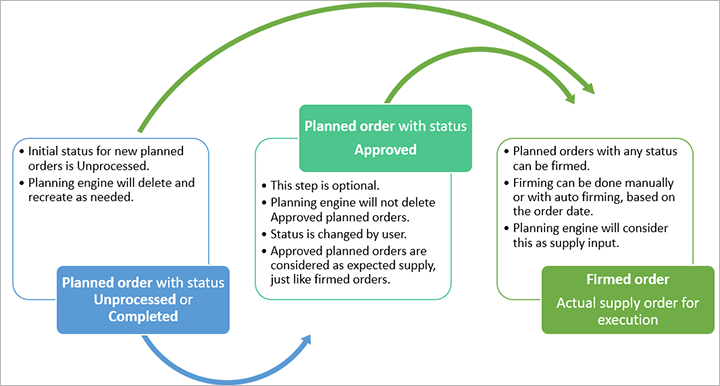

---
# required metadata

title: Planning Optimization extensibility
description: This topic describes approval of planned orders that are supported in Planning Optimization. 
author: ChristianRytt
manager: tfehr
ms.date: 08/21/2020
ms.topic: article
ms.prod: 
ms.service: dynamics-ax-applications
ms.technology: 

# optional metadata

ms.search.form: ReqCreatePlanWorkspace
# ROBOTS: 
audience: Application User
# ms.devlang: 
ms.reviewer: kamaybac
ms.search.scope: Core, Operations
# ms.tgt_pltfrm: 
ms.custom: 
ms.assetid: 
ms.search.region: Global
ms.search.industry: Manufacturing
ms.author: crytt
ms.search.validFrom: 2020-08-21
ms.dyn365.ops.version: 10.0.13

---
# Approve planned orders

[!include [banner](../../includes/banner.md)]

This topic provides information about how to update the status of planned orders.

Note that approval of planned orders is an optional step, on the way to create a firmed order from a planned order. It is recommended to approve modified planned orders, else the edits will be ignored and overwritten by the next planning run.

You can use the  **Status**  field to help track your progress. The following values are available:

- **Unprocessed:** When master planning generates planned orders, the planned orders have a status of Unprocessed. Planned order with this status will be deleted during the next planning run.
- **Completed:** If you decide not to firm a planned order, you can change the status to Completed to indicate that you completed evaluating this planned order. Note that status Unprocessed and Completed are treated the same by the system.
- **Approved:** If you want to keep edits or are planning to firm a planned order, you can change the status to Approved. Planned orders with Approved status are considered as fixed and expected supply by master planning, so they are not modified or deleted during later master planning runs. To achieve this, the planning logic copies the Approved planned orders from the old plan version to the new plan version during master planning.
Note that Approved planned orders are only seen as supply within the specific master plan.

Planned orders can be managed from the  **Master planning**  workspace, the  **Planned order**  list, or the  **Planned production orders**,  **Planned purchase orders**, and  **Planned transfer**  lists.
