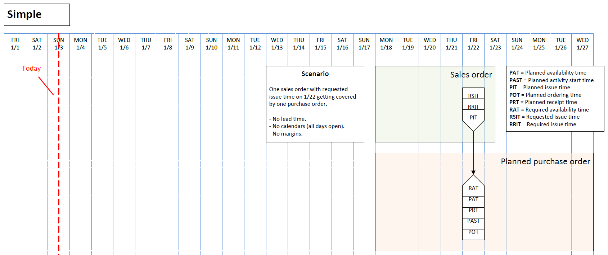
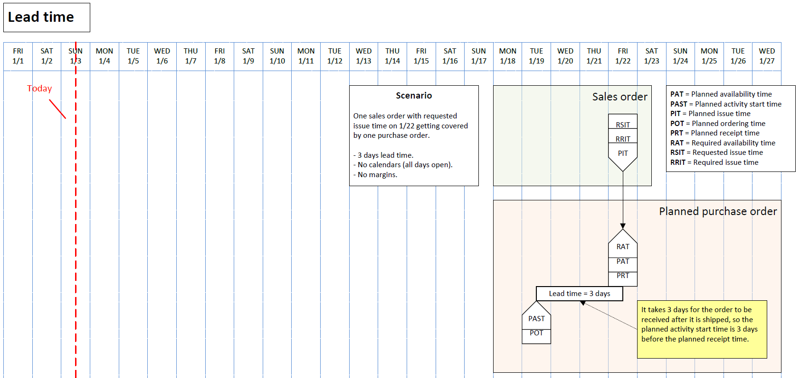
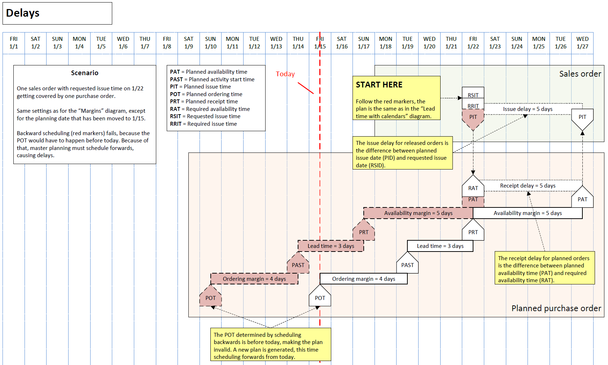
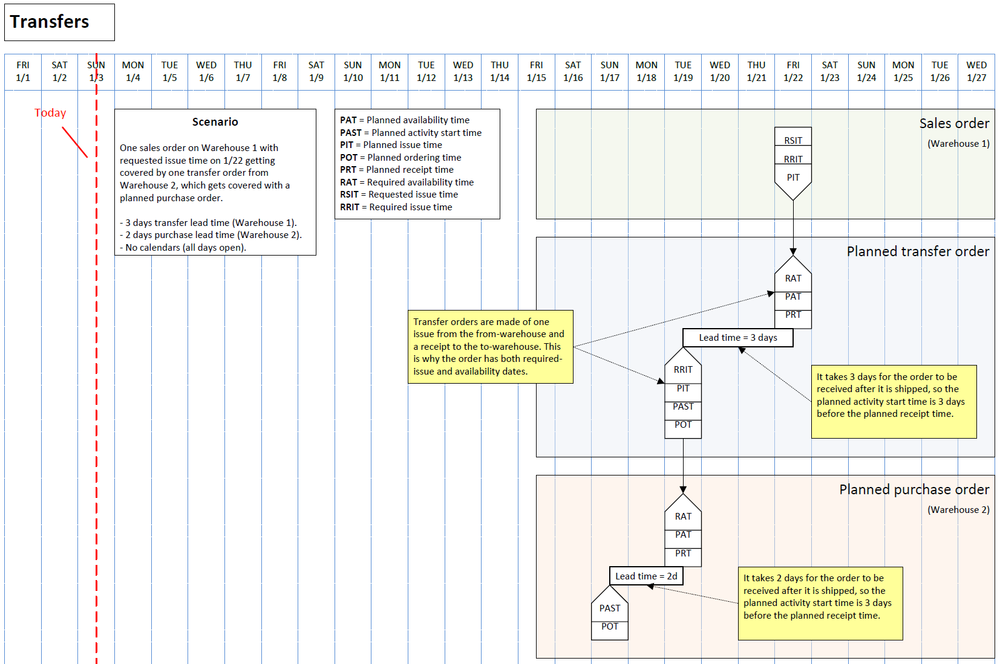
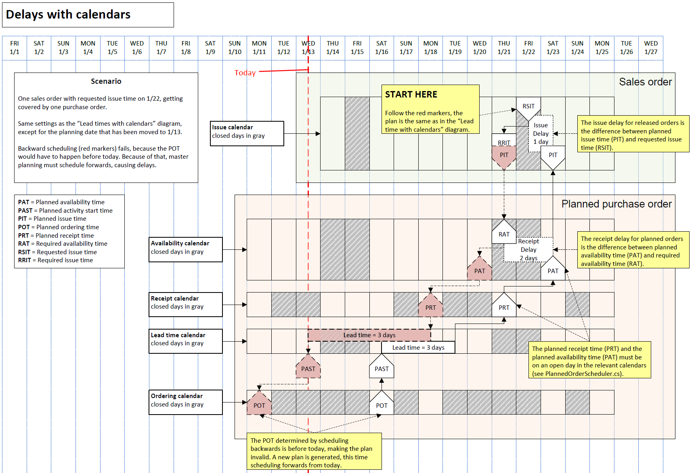

# Date and time parameters used by Planning Optimization

[!include [banner](../../includes/banner.md)]

This topic lists the date and time parameters that Planning Optimization uses during its operation. 

One of the key differences is that while built-in master planning engine uses transaction dates in all of the calculations, the planning optimization service operates with date and time values which are converted to dates afterwards. This could lead to situations such as forecast transactions not considered for master planning run since for the Planning Optimization they were created at midnight on today and technically, before the current date and time when the Planning Optimization service is run.

## Issue transactions

Planning Optimization uses the following parameters during its operation in relation to issue or demand transactions:

| Parameter | Parameter name in Planning Optimization | Description | Equivalent in Dynamics 365 Supply Chain Management (ReqTrans) |
|---|---|---|---|
| Planned issue time | PlannedIssueTime | The date the issue is currently planned for.| To date (FuturesDate), Delayed to time (FuturesTime) |
| Requested issue time | RequestedIssueTime | The date of issue requested by the user and set in Dynamics 365 Supply Chain Management. It is applicable only for released or approved planned orders. Default value for planned orders is blank.| Requested date (ReqDateDlvOrig) |
| Required issue time | RequiredIssueTime | The required issue date adjusted by the Planning Optimization service. If requested issue time is in the past at the time the Planning Optimization is run, the required issue time will be adjusted to the first open day not earlier than today's date. If requested issue time is set on the date unavailable by a calendar, the required issue time will be adjusted to the first open day before that date. | Requirement date (ReqDate), Requirement time (ReqTime) |
| IssueTimeDelay | IssueTimeDelay | Time span between planned issue time and requested issue time for approved and released orders or required issue time. | Delay (days) (FuturesDays) |

## Receipt transactions

Planning Optimization uses the following parameters during its operation in relation to receipt or supply transactions:

| Parameter | Parameter name in Planning Optimization | Description | Equivalent in Dynamics 365 Supply Chain Management (ReqTrans, ReqPO) |
|---|---|---|---|
| Planned availability time | PlannedAvailabilityTime | The date the receipt is actually planned for to be available.| Requirement date (ReqDate), Requirement time (ReqTime) |
| Planned receipt time | PlannedReceiptTime | The date the receipt will arrive at the location.| To date (FuturesDate), Delayed to time (FuturesTime), Delivery date (ReqDateDlv), Requested date (ReqDateDlvOrig) if the order is not released yet. |
| Required availability time | RequiredAvailabilityTime | The required availability date adjusted by the Planning Optimization service. | Requirement date (ReqDate), Requirement time (ReqTime) |
| Expected receipt time | ExpectedReceiptTime | The expected receipt date for a released receipt. It is set by the user in Dynamics 365 Supply Chain Management and is not adjusted by the Planning Optimization service. It only applies to released receipts. | Requested date (ReqDateDlvOrig) |
| Required receipt time | RequiredReceiptTime | The required receipt date adjusted by the Planning Optimization service. | Requirement date (ReqDate), Requirement time (ReqTime) |
| Planned ordering time | PlannedOrderingTime | The ordering date calculated by the Planning Optimization service. | Order date (ReqDateOrder), Order time (ReqTimeOrder) |
| Planned activity start time | PlannedActivityStartTime | The date the activity for this receipt should start.| Start date (SchedFromDate) |
| Receipt time delay | ReceiptTimeDelay | Time span between planned receipt time and required receipt time. | Delay (days) (FuturesDays), Delayed to time (FuturesTime) |

## Examples of date parameters usage by Planning Optimization

The plans in the diagrams below are at a day level, but Planning Optimization is run at a more detailed level (e.g. margins can be in hours; the Planning Ordering Time can be 22/1/2021, 11:35, etc.).

### Scenario 1

One sales order with requested issue time on 22/1 getting covered by one purchase order.

- No lead time.
- No calendars (all days open).
- No margins.

### Scenario 2

One sales order with requested issue time on 22/1 getting covered by one purchase order.

- 3 days lead time.
- No calendars (all days open).
- No margins.

### Scenario 3

One sales order with requested issue time on 22/1 getting covered by one purchase order.

- 3 days lead time.
- 4 days ordering margin.
- 5 days availability margin.
- No calendars (all days open).

### Scenario 4

One sales order with requested issue time on 22/1 getting covered by one purchase order. Same settings as Scenario 3, except for the planning date that has been moved to 15/1. Backward scheduling (red markers) fails, because the POT would have to happen before Today. Because of that, master planning must schedule forwards, causing delays.

### Scenario 5

One sales order on Warehouse1 with requested issue time on 22/1 getting covered by one transfer order from Warehouse2, which gets covered with a planned purchase order.

- 3 days transfer lead time (Warehouse1).
- 2 days purchase lead time (Warehouse2).
- No calendars (all days open).

### Scenario 6

One sales order with requested issue time on 22/1 getting covered by one purchase order. 

- 3 days lead time.
- Issue calendar (closed Friday)
- Availability calendar (closed Thursday, Friday)
- Receipt calendar (closed Tuesday, Wednesday, Sunday)
- Lead time calendar (closed Thursday, Friday)
- Ordering calendar (open Monday, Saturday)

### Scenario 7

One sales order with requested issue time on 22/1 getting covered by one purchase order. Same settings as Scenario 6, except for the planning date that has been moved to 13/1. Backward scheduling (red markers) fails, because the POT would have to happen before Today. Because of that, master planning must schedule forwards, causing delays.

