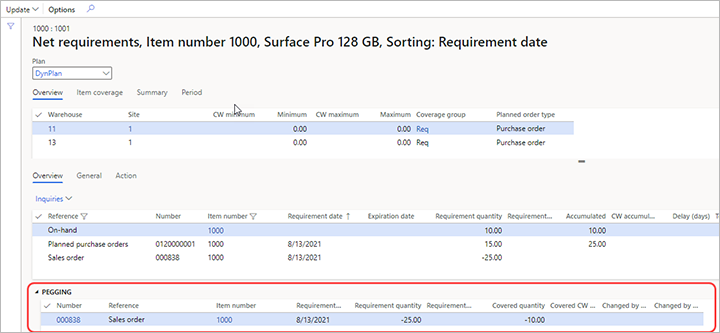

# Net requirements and pegging information in Planning Optimization

[!include [banner](../../includes/banner.md)]

When you run master planning in Planning Optimization it is important to comprehend its output and understand how existing supply covers the demand and why specific supply was generated. You can use **Net requirements** page to better understand the calculated requirements, that are the results of master planning.

**Net requirements** page displays the net requirements calculated for the product during the Planning Optimization. This page also shows the coverage settings that were applied during the master planning run, the breakdown of the requirements totals according to transaction type and pegging information.

**Net requirements** page can be accessed from various locations:

Go to **Product information management > Products > Released products**. Select a product. On the **Plan** tab, in the **Requirement** group, select **Net requirements**.

–or– 
 
Go to **Sales and marketing > Sales orders > All sales orders**. Select a sales order and open it. Under the **Sales order details** section, select **Product and supply > Net requirements**.
 
–or–
 
Go to **Master planning > Master planning > Planned orders**. Select a planned order. On the **View** tab, in the **Requirements** group, select **Requirement profile**.

**Net requirements** page consists of the upper and lower sections, and the **Update** button with options. 

In the upper section of the page, you can review:

- On the **Overview** tab – The item requirements of the product dimensions.
- On the **Item coverage** tab – The coverage settings that were used during requirements calculation.
- On the **Summary** tab – The breakdown of the requirements totals according to transaction type.
- On the **Period** tab – The receipts, issues, and projected available inventory for each of the periods defined by the period template. You can also get a graphical view of the projected available inventory.

In the bottom section of the **Net requirements** page, you can review:

- On the **Overview** tab – The list of the product requirements (by default sorted by the requirement's date) calculated during the master planning together with issue and receipt transactions corresponding to requirements. 
    - When you select a requirement, the **Pegging** FastTab would display either the source of the requirement or the transactions that fulfill the requirement.
- On the **General** tab – The detailed information of the selected requirement.
- On the **Action** tab – The action messages for the requirements.

By selecting the **Update > Master planning** button, you can run master planning directly from the **Net requirements** page.

Before reviewing the net requirements of the product, make sure to select a proper master plan in the **Plan** field at the top of the **Net requirements** page.
 
Let us review an example to see in detail how pegging information is present.

## Example

A product *1000* has the following configuration:

- **Default order type:** *Purchase order*
- **Inventory on-hand:** *10.00*

Perform following prerequisites:
 
- Create a sales order for a quantity of *25.00* of the product *1000*, use the storage dimensions where on-hand is located.
- Run a master planning for *DynPlan* master plan.

Now open the **Net requirements** page for the product *1000* to review how calculated requirements correspond to each other:

1. On the **Net requirements** page, select the *DynPlan* master plan in the **Plan** field.
1. Select the **Overview** tab in the bottom section of the page.
1. Verify following requirements are present on the grid:

    1. **Reference:** *On-hand;* **Requirement quantity:** *10.00;* **Accumulated:** *10.00*
    1. **Reference:** *Planned purchase orders;* **Requirement quantity:** *15.00;* **Accumulated:** *25.00*
    1. **Reference:** *Sales order;* **Requirement quantity:** *-25.00;* **Accumulated:** *blank*

    > [!NOTE]
    > **Requirement quantity** field represents the total quantity required by the requirement (negative sign) or supplied by it (positive sign). **Accumulated** field represents the total receipt and issues quantities accumulated up to the selected period. 

1. Select the *On-hand* requirement line and under the **Pegging** FastTab review the requirements that are covered by this supply:

    1. **Reference:** *Sales order;* **Requirement quantity:** *-25.00;* **Covered quantity:** *-10.00*

    Existing on-hand partially covers the demand that comes from the sales order.

    

1. Select the *Planned purchase orders* requirement line and under the **Pegging** FastTab review the requirements that are covered by this supply:

    1. **Reference:** *Sales order;* **Requirement quantity:** *-25.00;* **Covered quantity:** *-15.00*

    Since the sales order has been already partially covered, the Planning Optimization creates planned purchase order for the remaining uncovered quantity.

    

1. Select the *Sales order* requirement line and under the **Pegging** FastTab review the requirements that cover this demand:

    1. **Reference:** *On-hand;* **Requirement quantity:** *10.00;* **Covered quantity:** *10.00*
    1. **Reference:** *Planned purchase orders;* **Requirement quantity:** *15.00;* **Covered quantity:** *15.00*

    

> [!NOTE]
> Since some features are not yet supported by Planning Optimization, *Safety stock* and *Expired batch* types of the requirements are not present on **Net requirements** page. For more information, see [Planning Optimization fit analysis](planning-optimization-fit-analysis.md). 

[!INCLUDE[footer-include](../../../includes/footer-banner.md)]