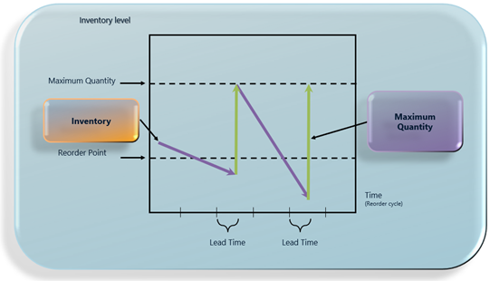

---
# required metadata

title: Replenishment methods and quantity modification
description: This topic provides information about replenishment methods in Planning Optimization and include details on how product multiple order quantity affects the result. 
author: crytt
ms.date: 6/1/2021
ms.topic: article
ms.prod: 
ms.technology: 

# optional metadata

ms.search.form: ReqGroup, ReqItemTable, InventItemOrderSetup
audience: Application User
ms.reviewer: kamaybac
ms.search.region: Global
ms.author: crytt
ms.search.validFrom: 2021-06-01
ms.dyn365.ops.version: AX 7.0.0

---

# Replenishment methods and quantity modification

[!include [banner](../../includes/banner.md)]

This topic provides information about replenishment methods in Planning Optimization and include details on how product multiple order quantity affects the result.

## Coverage codes

Planning Optimization can be configured to use different replenishment methods. The replenishment methods or lot-sizing methods are the techniques used by the system to calculate requirements for the product. Replenishment methods are defined by coverage codes that you can set up on the coverage group or on the product.

Following coverage codes can be used in Planning Optimization:

- **Period** - The coverage method that combines all the demand for a period into one order for the product. The order will be planned for the first day of the period and its quantity will fulfill the net requirements during the established period. The period starts with the first demand of the product and covers the defined length in time. The next period will start with the next requirements of the product. Often used for non-predictable inventory draw, season influenced products, or high-cost products.  
Example:

- **Requirement** - The coverage method in which the system creates a planned purchase, transfer, or production order per requirement for the product. This is generally used for expensive products with intermittent demand. Often used for configurable products or make to order scenarios.  
Example:

- **Min./Max.** - The inventory level-based coverage method that contains the replenishment of inventory up to a certain level when the predicted on-hand is below a threshold. The replenishment quantity will be the difference between the maximum level and the predicted on-hand level. Often used for predictable inventory draw, high runners, or less expensive products.  
Example:

- **Manual** - The coverage method where the system does not suggest purchased, transfer, or production orders for the product. The planner for the product will be in charge of creating the required orders for the replenishment of the product. Often used for products where it’s not desired to get system generated planned orders.

## Impact of order quantity from default order settings

On the **Default order setting** page for a released product, you can specify *Multiple*, *Min. order quantity* and *Max. order quantity*. This can be done for *Purchase quantity*, *Inventory quantity* (used for both transfer and production) and *Sales quantity*.

- **Multiple** - planned orders will be in multiple of this quantity.  
For example, **Multiple** = *5* means that order can be for quantity 5, 10, 15, 20 etc.

- **Min. order quantity** - planned orders will not be less than the value defined.  
For example, **Min. order quantity** = *10* will result in a planned order for 10, even if only 4 is required to fulfill the demand.

- **Max. order quantity** - planned orders will not excite the value entered. For demand higher than Max. order quantity multiple planned orders will be created to cover the demand.

## Examples of replenishment that uses Min./Max. coverage code

When you do not specify **Multiple** parameter for a product on the **Default order setting** page, acording to **Min./Max.** method, Planning Optimization would simply replenish the inventory up to a certain level when the predicted on-hand is below a threshold. 

When you define multiple quantity for a product, **Min./Max.** coverage method changes its behavior and considers **Multiple** parameter value. 
 
To put it another way, Planning Optimization would still replenish the inventory up to defined maximum when the predicted on-hand is below defined minimum but with the deviation that the replenishment quantity must be multiple of the Multiple parameter value.
 
If the replenishment quantity, calculated as difference between maximum and predicted on-hand, is not multiple of the defined multiple quantity, Planning Optimization would use the first possible value that, together with predicted on-hand, would be below maximum. If this sum falls below minimum, Planning Optimization would use the first value that, together with predicted on-hand, would be above the maximum.

Let us review examples that illusrtate how product multiple order quantity affects the result *Min./Max.* replenishment method.

### Example 1

A product is configured in the following manner:
- **Coverage code**: *Min./Max.*  
- **Minimum**: *15*   
- **Maximum**: *22* 
- **Multiple**: *0* 
 
There is inventory on-hand of 10 pieces for the product exist and no other demand or supply.
 
When master planning runs, the planned order for 12 pieces is created to replenish inventory to the maximum quantity.

### Example 2

A product is configured in the following manner:
- **Coverage code**: *Min./Max.*  
- **Minimum**: *15*   
- **Maximum**: *22* 
- **Multiple**: *5* 
 
There is inventory on-hand of 10 pieces for the product exist and no other demand or supply.
 
When master planning runs, the planned order for 10 pieces is created (as 15 pieces of replenishment + 10 pieces of on-hand would be above maximum).

### Example 3

A product is configured in the following manner:
- **Coverage code**: *Min./Max.*  
- **Minimum**: *21*   
- **Maximum**: *24* 
- **Multiple**: *5*
 
There is inventory on-hand of 10 pieces for the product exist and no other demand or supply.
 
When master planning runs, the planned order for 15 pieces is created (as 10 pieces of replenishment + 10 pieces of on-hand would be below minimum).

[!INCLUDE[footer-include](../../../includes/footer-banner.md)]
