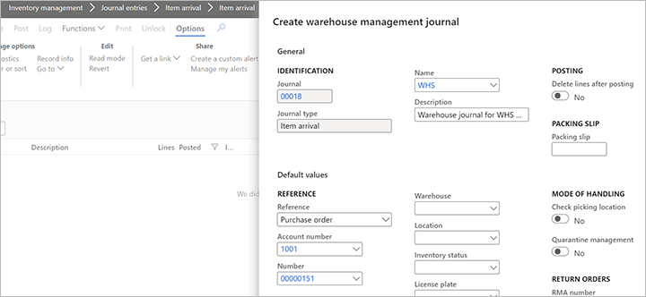

--- 
# required metadata 
 
title: Register items for an advanced warehousing enabled item using an item arrival journal
description: This procedure shows you how to register items using the item arrival journal when you are using advanced warehouse management processes. 
author: ShylaThompson
manager: tfehr 
ms.date: 08/29/2018
ms.topic: business-process 
ms.prod:  
ms.service: dynamics-ax-applications 
ms.technology:  
 
# optional metadata 
 
ms.search.form: WMSJournalTable, WMSJournalCreate, WHSLicensePlate   
audience: Application User 
# ms.devlang:  
ms.reviewer: kamaybac
# ms.tgt_pltfrm:  
# ms.custom:  
ms.search.region: Global
ms.search.industry: Distribution
ms.author: kamaybac
ms.search.validFrom: 2016-06-30 
ms.dyn365.ops.version: Version 7.0.0 
---
# Register items for an advanced warehousing enabled item using an item arrival journal

[!include [banner](../../includes/banner.md)]

This procedure shows you how to register items using the item arrival journal when you are using advanced warehouse management processes. This would usually be done by a receiving clerk. 

You can run this procedure in demo data company USMF, or on your own data. You need to have a confirmed purchase order with an open purchase order line before you start this guide. The item on the line must be stocked, and it must not use product variants, and must not have tracking dimensions. And the item needs to be associated with a warehouse management process enabled storage dimension group. The warehouse that's used must be enabled for warehouse management processes and the location that you use for receiving must be license plate controlled.
The following uses a purchase order in company *USMF*, vendor account *1001*, Warehouse *51*, and item number *M9200* for *10 PL* (10 pallets). 

Make a note of the purchase order number that you use.

## Create an item arrival/warehouse management journal header
1. Go to Item arrival.
2. Click New.
3. In the Name field, type a value.
    * If you are using USMF, you can type WHS. If you're using other data, the journal whose name you choose has to have the following properties: Check picking location must be set to No, and Quarantine management must be set to No.
4. Make sure that the **Reference** equals *Purchase order*
5. Look-up or enter the **Account number** *1001*
6. Look-up or enter the purchase order number in the **Number** field

7. Click the **OK** to create the journal header.

### Add a line

8. In the *Journal lines* section click **Add line** and enter the following data:
    - Item number *M9200* (Site, Warehouse, and Quantity will get defaulted based on the inventory transaction data for the 10 pallets = 1000 Ea) 
    - Location *001* (This specific location does not track license plates)

> [!Note] The Date field determines the date on which the on-hand quantity of this item will be registered in the inventory.  
> The lot ID will be populated by the system if it can be uniquely identified from the information provided. Otherwise you will have to add this manually. This is a mandatory field, which links this registration to a specific source document line.  

### Complete the registration
9. Click **Validate**. This checks that the journal is ready to be posted. If the validation fails you will need to fix the errors before you can post the journal.  
10. Click **OK**. After you clicked OK, check the message. There should be a message saying that the journal is OK.  
11. Click **Post**
12. Click **OK**. After you have clicked OK, check the message bar. There should be a message saying that the operation completed and *1000 Ea* has now been *Registred* on-hand.
13. The purchase order line can now get *Product receipt* updated via **Functions > Product receipt**.

[!INCLUDE[footer-include](../../../includes/footer-banner.md)]